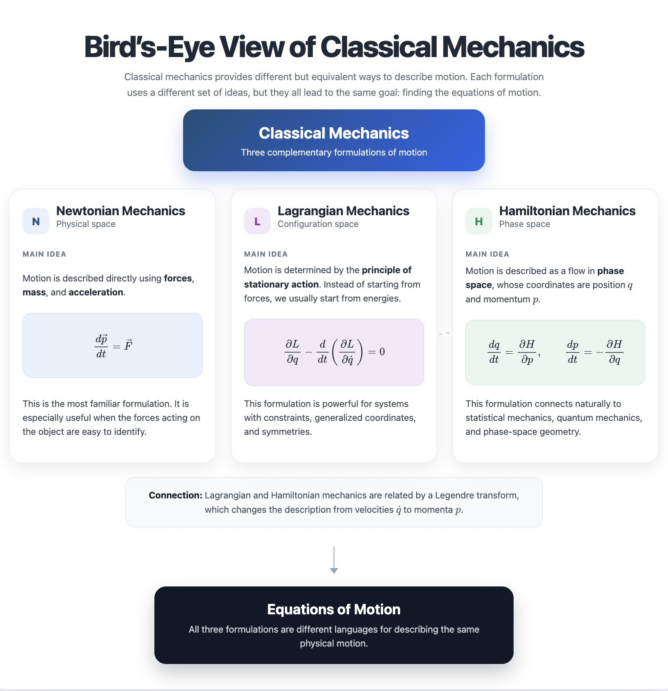

# Overview of Classical Mechanics

## Why should you care about this course?

### 1. It’s very useful!

Quantum mechanics or quantum field theory do **not** help us when we want to describe:

- how a ball rolls down a ramp
- how a rocket flies

Classical mechanics is still the **best theory** for **macroscopic** objects.

> Though it fails for really fast, small, or massive objects.

**Examples of where classical mechanics is indispensable:**

| Domain | Examples |
|--------|----------|
| **Engineering** | Design of bridges, buildings, aircraft, cars, roller coasters |
| **Aerospace** | Orbital mechanics for satellites, rocket trajectories, spacecraft navigation |
| **Sports** | Projectile motion (baseball, golf, basketball), swing dynamics |
| **Biomechanics** | Human movement, joint mechanics, gait analysis |
| **Planetology** | Planetary orbits, asteroid trajectories, comet paths |
| **Robotics** | Motion planning, control of robotic arms, vehicle dynamics |

#### What are macroscopic objects?

**Macroscopic objects** are objects large enough that their motion can usually be described accurately by classical mechanics, without explicitly using quantum mechanics.

- **Size**: often from millimeters to kilometers, such as a grain of sand, a ball, a car, or a planet.
- **Mass**: much larger than atomic mass scales, which are typically around \(10^{-27}\,\mathrm{kg}\).
- **Classical observables**: position, velocity, momentum, and trajectory can often be meaningfully defined and measured with negligible quantum uncertainty.
- **Action scale**: for typical macroscopic motion, such as a rolling ball or a planetary orbit, the action  
  \[
  S=\int L\,dt
  \]
  is enormously larger than Planck’s constant \(\hbar\): \( S \gg \hbar \). This is an important criterion: quantum effects are usually negligible when the characteristic classical action is much larger than \(\hbar\).

In contrast, electrons, atoms, and molecules often require quantum mechanics for an accurate microscopic description.

> ⚠️ **Note**: This is not a rigorous definition. Classical mechanics is an **effective theory**: it works whenever it describes the system with sufficient accuracy for the question being asked. The real criterion is not an absolute size or mass threshold, but whether classical mechanics gives answers accurate enough for the purpose at hand. A good example is **classical molecular dynamics simulations**. Although atoms are microscopic objects, we often treat each atom, more precisely each atomic nucleus, as a classical particle obeying Newton’s laws. The complicated quantum-mechanical interactions between atoms, including the effects of electrons, are not solved explicitly. Instead, they are approximated by a **potential energy function** or a **classical force field**, which is designed to give the correct forces on each atom. In this sense, even atomic-scale systems can sometimes be modeled using classical mechanics, as long as the quantum effects are effectively captured by the chosen potential or force field.

------

### 2. It’s an ideal playground to learn important concepts

Classical mechanics is an ideal playground to learn many of the most important concepts in modern physics. **Key concepts you will learn:**

| Concept | Definition |
|---------|------------|
| **Phase space** | A $2N$-dimensional space spanned by coordinates \[q_i\] and conjugate momenta $p_i$. A system’s state is a single point in phase space. |
| **Generalized momentum** (conjugate momentum) | \[p_i = \frac{\partial L}{\partial \dot{q}_i}\] — the momentum conjugate to coordinate $q_i$. For a free particle, $p = mv$; in an EM field, $p = mv + q\mathbf{A}$. |
| **Hamiltonian** $H$ | \[H = p_i \dot{q}_i - L\] — the Legendre transform of $L$, typically equal to total energy $T + V$. Generates time evolution in phase space. |
| **Action** $S$ | \[S = \int_{t_1}^{t_2} L(q, \dot{q}, t) \, dt\] — the time integral of the Lagrangian. The principle of least action \[\delta S = 0\] yields the Euler–Lagrange equations. |
| **Cyclic coordinate** (ignorable coordinate) | A coordinate $q_i$ absent from $L$ (\[\partial L/\partial q_i = 0\]); its conjugate momentum is conserved. |
| **Symmetry** | A transformation (translation, rotation) that leaves the Lagrangian/Hamiltonian unchanged. Every continuous symmetry corresponds to a conserved quantity (Noether’s theorem). |
| **Canonical transformation** | A coordinate transformation in phase space \[(q, p) \to (Q, P)\] that preserves Hamilton’s equations. Essential for simplifying Hamiltonians. |
| **Poisson bracket** | \[\{A, B\} = \frac{\partial A}{\partial q_i}\frac{\partial B}{\partial p_i} - \frac{\partial A}{\partial p_i}\frac{\partial B}{\partial q_i}\] — fundamental bracket encoding symplectic structure (leads to quantum commutators). |

------

### 3. It’s beautiful and elegant!

Classical mechanics is not just a collection of formulas. It shows that many different physical problems can be understood using a few powerful ideas.

**The principle of least action** is one of the most important ideas. Roughly speaking, a system follows the path that makes the action $S$ stationary. From this idea, we can derive the equations of motion, including Newton’s Second Law. So instead of simply saying “force causes acceleration,” classical mechanics gives us a deeper way to understand why the motion takes the form it does.

**Three formulations, one physics.**  
In this course, you will see that the same physical system can be described in three different but equivalent ways:

- **Newtonian mechanics**: describe motion using forces and acceleration.
- **Lagrangian mechanics**: describe motion using energy (Lagrangian) and the principle of least action.
- **Hamiltonian mechanics**: describe motion using position and momentum in phase space.

Each formulation gives a different point of view. Learning all three helps you understand mechanics more deeply, not just how to solve problems.

**Connections to modern physics.**  
Many ideas in modern physics grow out of classical mechanics:

- **Special relativity**: the action principle can be written in a way that respects the symmetry of spacetime.
- **General relativity**: Einstein’s theory of gravity is also based on an action principle.
- **Quantum mechanics**: the classical action appears in the path integral formulation of quantum mechanics, through the factor $e^{iS/\hbar}$. Classical mechanics appears as the limit where quantum effects become negligible.
- **Statistical mechanics**: Hamiltonian mechanics gives the language of phase space, which is essential for understanding many-particle systems and thermodynamics.
- **Field theory**: the Lagrangian method can be extended from particles to continuous systems, such as waves, fluids, and fields.

In short, classical mechanics is elegant because a small number of principles can explain a huge range of physical phenomena.

------

# Bird’s-Eye View

The **principles** of classical mechanics are remarkably simple and few. However, **specific applications can be extremely complicated** because:

- **Differential equations**: Most interesting systems lead to coupled differential equations that are difficult to solve
- **No analytical solutions**: Only the simplest systems (harmonic oscillator, Kepler problem, etc.) have closed-form solutions
- **Chaos**: Even simple-looking systems can exhibit chaotic behavior — extreme sensitivity to initial conditions
- **Many degrees of freedom**: Real-world problems (rigid body, N-body systems, continuous media) involve many coordinates

This is why we need both analytical techniques *and* numerical methods (computers).

## Goal

To describe how macroscopic objects behave.

That is, to **derive and solve the equations of motion**.

------

# Classical Mechanics

Classical mechanics can be viewed through three main spaces or formulations:

```text
Classical Mechanics
├── Physical space
│   └── Newtonian Mechanics
├── Configuration space
│   └── Lagrangian Mechanics
└── Phase space
    └── Hamiltonian Mechanics
```

------

## 1. Newtonian Mechanics

Newtonian mechanics is formulated in **physical space** — the ordinary 3D Euclidean space we live in, described by Cartesian coordinates $(x, y, z)$ or position vectors $\vec{r}$.

The central equation is Newton’s Second Law:

\[\frac{d\vec{p}}{dt} = \vec{F}\]

This leads to the **equations of motion**.

------

## 2. Lagrangian Mechanics

Lagrangian mechanics is formulated in **configuration space** — an $N$-dimensional space where each point specifies all $N$ generalized coordinates $\{q_1, q_2, ..., q_N\}$ of the system. A path in configuration space represents one possible motion of the system.

The main equation is the **Euler–Lagrange equation**:

\[\frac{\partial L}{\partial q} - \frac{d}{dt} \left( \frac{\partial L}{\partial \dot{q}} \right) = 0\]

This also leads to the **equations of motion**.

The connection between Lagrangian and Hamiltonian mechanics is made through the **Legendre transform**.

------

## 3. Hamiltonian Mechanics

Hamiltonian mechanics is formulated in **phase space**.

Hamilton’s equations are:

\[\frac{dp}{dt} = -\frac{\partial H}{\partial q}\]

\[\frac{dq}{dt} = \frac{\partial H}{\partial p}\]

These equations also give the **equations of motion**.

------

# Summary

Classical mechanics provides several equivalent ways to derive equations of motion:

| Formulation           | Space               | Main equation                                                |
| --------------------- | ------------------- | ------------------------------------------------------------ |
| Newtonian mechanics   | Physical space      | $\frac{d\vec{p}}{dt} = \vec{F}$                              |
| Lagrangian mechanics  | Configuration space | $\frac{\partial L}{\partial q} - \frac{d}{dt}\left(\frac{\partial L}{\partial \dot{q}}\right)=0$ |
| Hamiltonian mechanics | Phase space         | $\frac{dp}{dt}=-\frac{\partial H}{\partial q}$, $\frac{dq}{dt}=\frac{\partial H}{\partial p}$ |

---

 


