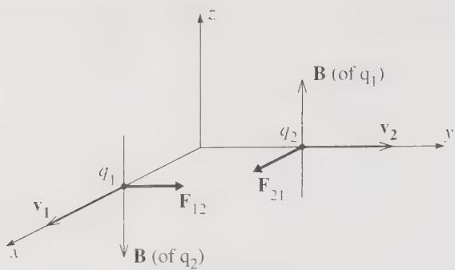

# Fundamental Concepts, Part A

**Reading material:** Chapter 1 of *Classical Mechanics* by John R. Taylor

## Table of Contents

1. [Equations of Motion](#1-equations-of-motion)
2. [Important Concepts](#2-important-concepts)
   - [Position](#21-position)
   - [Velocity](#22-velocity)
   - [Acceleration](#23-acceleration)
3. [Example: Two-Dimensional Circular Motion](#3-example-two-dimensional-circular-motion)
4. [Mass and Energy](#4-mass-and-energy)
   - [Mass](#41-mass)
   - [Energy](#42-energy)
5. [Linear and Angular Momentum](#5-linear-and-angular-momentum)
   - [What Is Momentum?](#51-what-is-momentum)
   - [Angular Momentum](#52-angular-momentum)
6. [Forces](#6-forces)
7. [Initial Conditions](#7-initial-conditions)
   - [Example](#71-example)
8. [Newtonian Framework](#8-newtonian-framework)
9. [Revisit Newton's Laws](#9-revisit-newtons-laws)
   - [Newton's First Law](#91-newtons-first-law-inertial-motion)
   - [Newton's Second Law](#92-newtons-second-law-equation-of-motion)
   - [Newton's Third Law](#93-newtons-third-law-mutual-interactions)
   - [Newton's Third Law as a Constraint on Force Laws](#94-newtons-third-law-as-a-constraint-on-force-laws)
10. [When Newton's Third Law Appears to Fail](#10-when-newtons-third-law-appears-to-fail)
    - [Non-Inertial Reference Frames](#101-non-inertial-reference-frames)
    - [Electromagnetic Interactions](#102-electromagnetic-interactions)
11. [Summary](#11-summary)

---

## 1. Equations of Motion

An **equation of motion** describes how a particular system moves or changes with time.

For example, the height $h(t)$ of an object falling under gravity with air resistance may satisfy

$$
\frac{d^2 h}{dt^2} + \frac{\gamma}{m} \frac{dh}{dt} + g = 0
$$
where:

- $\dfrac{d^2 h}{dt^2}$: acceleration
- $\dfrac{\gamma}{m}\dfrac{dh}{dt}$: air resistance term
- $g$: gravitational acceleration

This equation describes how the height of an object changes as it falls under the influence of both gravity and air resistance.

------

## 2. Important Concepts

The most important kinematic quantities are:

- position
- velocity
- acceleration

### 2.1 Position

The position vector is

$\vec r(t) = \begin{pmatrix} x(t) \\ y(t) \\ z(t) \end{pmatrix}$

### 2.2 Velocity

Velocity is the time derivative of position:

$\vec v(t) = \frac{d\vec r(t)}{dt} = \begin{pmatrix} \dfrac{dx(t)}{dt} \\ \dfrac{dy(t)}{dt} \\ \dfrac{dz(t)}{dt} \end{pmatrix}$

### 2.3 Acceleration

Acceleration is the time derivative of velocity, or the second time derivative of position:

$\vec a(t) = \frac{d\vec v(t)}{dt} = \frac{d^2 \vec r(t)}{dt^2}$

We also use dot notation:

$\vec v(t)=\dot{\vec x}(t)$

$\vec a(t)=\ddot{\vec x}(t)$

------

## 3. Example: Two-Dimensional Circular Motion

For two-dimensional circular motion with radius $R$ and angular speed $\omega$,

$$\vec r(t) = R\cos(\omega t)\hat x + R\sin(\omega t)\hat y$$

Taking the derivative gives the velocity:

$\vec v(t) = -R\omega \sin(\omega t)\hat x + R\omega \cos(\omega t)\hat y$

Taking another derivative gives the acceleration:

$\vec a(t) = -R\omega^2 \cos(\omega t)\hat x - R\omega^2 \sin(\omega t)\hat y$

Thus the acceleration points toward the center of the circle.

------

## 4. Mass and Energy

### 4.1 Mass

Mass $m$ measures the **inertia** of an object — how difficult it is to change its state of motion.

Newton’s second law is $m\vec a = \vec F$. In classical mechanics, mass is usually treated as a constant property of an object. In this sense, it functions like a label attached to the object.

> **A note on rigor:**
> In classical mechanics, mass is not derived from something more fundamental. Instead, it is introduced as a basic measurable property of matter.
>
> We must be careful not to define mass in a circular way. For example, one might say that mass measures an object’s resistance to acceleration under a force. But force itself is often introduced through Newton’s second law. So if we define mass using force, and then define force using mass, the explanation becomes circular: $\text{mass} \longleftrightarrow \text{force}$. To avoid this circularity, we first choose a **standard unit mass**. For example, we define one reference object or standard procedure to represent \(1\,\mathrm{kg}\). Other masses are then measured by comparison with this standard.
>
> There are two common ways to compare masses:
>
> **1. Inertial mass:**
> Inertial mass measures how strongly an object resists acceleration. Suppose two objects interact with each other, for example by pushing apart with a spring. By Newton’s third law, the forces they exert on each other have equal magnitude and opposite direction. If their accelerations are \(a_1\) and \(a_2\), then $m_1 |a_1| = m_2 |a_2|$. Therefore, $\frac{m_2}{m_1} = \frac{|a_1|}{|a_2|}.$ If \(m_1\) is the chosen unit mass, then measuring the two accelerations allows us to determine \(m_2\). The object with larger inertial mass accelerates less under the same interaction.
>
> **2. Gravitational mass:**
> Gravitational mass measures how strongly an object interacts with a gravitational field. In everyday measurements, we often compare gravitational masses using a balance scale. If two objects balance in the same gravitational field, then their weights are equal: $m_1 g = m_2 g$. Since both objects are in the same gravitational field, \(g\) cancels: $m_1=m_2$. Thus a balance scale compares gravitational masses without requiring us to know the value of \(g\).
>
> Experimentally, inertial mass and gravitational mass are equal to extremely high precision. In Newtonian mechanics we usually treat them as the same quantity and simply call it “mass.” Once mass has been operationally established in this way, Newton’s second law can then be used to define or measure force.

------

### 4.2 Energy

The two main forms of mechanical energy are:

- kinetic energy, usually denoted by $T$
- potential energy, usually denoted by $V$

#### Kinetic Energy

Kinetic energy encodes the “amount of motion”:

\[
\boxed{T=\frac{1}{2}mv^2}
\]

#### Potential Energy

Potential energy encodes the “potential of motion.”

It represents the effects of conservative forces.

Potential energy does not have one universal general form. Most often, it is written as $V(\vec r)$

------

## 5. Linear and Angular Momentum

### 5.1 What Is Momentum?

Momentum describes how hard it is to stop an object from moving or rotating.

#### Linear Momentum

The linear momentum is

$$
\boxed{\vec p = m\vec v}
$$

However, this is not the most general definition of momentum. Later, we will learn the idea of **generalized momentum**.

In some contexts, generalized momentum is written as $p$, which may be a scalar.

------

### 5.2 Angular Momentum

Angular momentum is $\vec L = m\vec r \times \vec v$. Since $\vec p = m\vec v$, we can also write

$$
\boxed{\vec L = \vec r \times \vec p}
$$

------

## 6. Forces

In Newtonian mechanics, forces are the central concept in describing motion.

Newton’s second law is

$$
\boxed{\vec F = \frac{d\vec p}{dt}}
$$

------

## 7. Initial Conditions

Equations of motion by themselves are not enough to determine a unique motion. We also need **initial conditions**.
\[
\boxed{\text{Equations of Motion} + \text{Initial Conditions} \Longrightarrow \text{Solution of the system}}
\]
The solution tells us everything we want to know about a system, such as $\vec r(t)$, $\vec v(t)$, and $\vec a(t)$.

Initial conditions are the conditions that the system obeys at the initial time. They are typically encoded in integration constants.

------

### 7.1 Example

Consider the simple equation

$\frac{d^2 x(t)}{dt^2}=0$

Integrating once,

$\int_0^t \frac{d^2 x(t)}{dt^2}\,dt = \int_0^t 0\,dt$

which gives

$\frac{dx(t)}{dt} - \frac{dx(0)}{dt} = 0$

Therefore,

$\frac{dx(t)}{dt}=v_0$

Integrating again,

$\int_0^t \frac{dx(t)}{dt}\,dt = \int_0^t v_0\,dt$

so

$x(t)-x(0)=v_0t$

Thus

$x(t)=v_0t+x_0$

where:

- $x_0=x(0)$ is the initial position
- $v_0=\dot x(0)$ is the initial velocity

------

## 8. Newtonian Framework

The Newtonian framework is based on the concept of forces.

It can be thought of as a practical set of rules.

It is very useful, but it does not necessarily offer much explanation of the deeper structure of nature.

The Newtonian framework proceeds as follows:

1. Specify all the forces acting on the system.
2. Write down Newton’s second law for the system, given all the forces.
3. Simplify and solve the resulting second-order equations of motion.

------

## 9. Revisit Newton’s Laws

Newton’s laws are not just three separate statements. Together, they define the framework of **Newtonian mechanics**: what counts as an inertial frame, how motion changes, and how interactions between bodies are constrained.

------

### 9.1 Newton’s First Law: Inertial Motion

**Statement of Newton’s first law:** An object remains at rest, or moves in a straight line with constant velocity, unless acted on by a **net physical force**.

In other words, if the net physical force on an object is zero, then its momentum does not change:

$\vec F_{\text{net}} = 0 \quad \Longrightarrow \quad \frac{d\vec p}{dt}=0 .$

Therefore,

$\vec p = \text{constant}.$

For an object with constant mass, this also means

$\vec v = \text{constant}.$

So the object either stays at rest or continues moving uniformly in a straight line.

Newton’s first law is **not** merely a special case of Newton’s second law. **It plays an important conceptual role**: it identifies the reference frames in which Newton’s laws take their simplest form. These frames are called **inertial frames**.

An **inertial frame** is a reference frame in which a free particle, meaning a particle with no net physical force acting on it, moves with constant velocity. Thus, in an inertial frame, a **physical force is the only thing that can change an object’s state of motion**.

If a supposedly free particle appears to accelerate, then at least one of the following must be true:

1. there is a real physical interaction acting on the particle, or
2. the reference frame is not inertial.

------

### 9.2 Newton’s Second Law: Equation of Motion

**Statement of Newton’s second law:** The net physical force acting on an object equals the rate of change of its momentum:

$\vec F_{\text{net}} = \frac{d\vec p}{dt}.$

In component form,

$F_x = \frac{dp_x}{dt},$

$F_y = \frac{dp_y}{dt},$

$F_z = \frac{dp_z}{dt}.$

Newton’s second law gives the **equation of motion**. Once we know the force law (the expression of the force), we can predict how the system evolves. Newton’s second law connects **cause** and **change of motion**:

$\text{net physical force} \quad \Longrightarrow \quad \text{change of momentum}.$

------

### 9.3 Newton’s Third Law: Mutual Interactions

**Statement of Newton’s third law:** When two objects interact, the force exerted by object $2$ on object $1$ is equal in magnitude and opposite in direction to the force exerted by object $1$ on object $2$:

$\vec F_{12} = -\vec F_{21}.$

Here,

- $\vec F_{12}$ means the force **on object $1$** due to object $2$,
- $\vec F_{21}$ means the force **on object $2$** due to object $1$.

Newton’s third law says that forces always come in interaction pairs. One object cannot exert a force on another without experiencing a corresponding force in return.

This law is closely connected to conservation of momentum.

For a two-particle isolated system,

$\frac{d\vec p_1}{dt} = \vec F_{12},$

and

$\frac{d\vec p_2}{dt} = \vec F_{21}.$

Adding these equations gives

$\frac{d}{dt}(\vec p_1+\vec p_2) = \vec F_{12}+\vec F_{21}.$

Using Newton’s third law,

$\vec F_{12}+\vec F_{21}=0.$

Therefore,

$\frac{d}{dt}(\vec p_1+\vec p_2)=0.$

Since the total momentum is

$\vec p_{\text{tot}}=\vec p_1+\vec p_2,$

we have

$\frac{d\vec p_{\text{tot}}}{dt}=0.$

Thus,

$\vec p_{\text{tot}} = \text{constant}.$

So Newton’s third law guarantees conservation of total mechanical momentum for an isolated system of particles interacting through ordinary instantaneous pairwise forces. In this sense, Newton’s third law is not just a statement about equal and opposite forces. It also tells us that internal forces within an isolated system cancel in pairs, so they cannot change the total momentum of the system.

------

#### Conservation of Momentum for an N-Particle System

The two-particle result generalizes straightforwardly to a system of $$N$$ particles. Label the particles by $$\alpha = 1, 2, \dots, N$$. The net force on particle $$\alpha$$ is the sum of internal forces from all other particles plus any external force: $$\vec F_\alpha = \sum_{\beta \neq \alpha} \vec F_{\alpha\beta} + \vec F_\alpha^{\text{ext}},$$

where $$\vec F_{\alpha\beta}$$ is the force on particle $$\alpha$$ due to particle $$\beta$$. By Newton's second law, $$\dot{\vec p}_\alpha = \sum_{\beta \neq \alpha} \vec F_{\alpha\beta} + \vec F_\alpha^{\text{ext}}.$$

The total momentum of the system is $$\vec P = \sum_\alpha \vec p_\alpha.$$

Differentiating and substituting the second-law expression for each particle gives $$\dot{\vec P} = \sum_\alpha \sum_{\beta \neq \alpha} \vec F_{\alpha\beta} + \sum_\alpha \vec F_\alpha^{\text{ext}}.$$

The double sum can be grouped into pairs $$(\alpha, \beta)$$ with $$\alpha < \beta$$: $$\sum_\alpha \sum_{\beta \neq \alpha} \vec F_{\alpha\beta} = \sum_{\alpha < \beta} \bigl( \vec F_{\alpha\beta} + \vec F_{\beta\alpha} \bigr).$$

> **Note: Why the double sum can be regrouped.**
>
> The identity we are using is
>
> $$
> \sum_{\alpha=1}^N \sum_{\beta\neq \alpha} \vec F_{\alpha\beta}
> =
> \sum_{\alpha < \beta} \bigl(\vec F_{\alpha\beta}+\vec F_{\beta\alpha}\bigr).
> $$
>
> The left-hand side sums over every ordered pair $$(\alpha,\beta)$$ with $$\alpha\neq\beta$$. The right-hand side sums over every unordered pair $$\{\alpha,\beta\}$$, keeping both forces in the pair.
>
> **Formal proof: split into $$\alpha<\beta$$ and $$\alpha>\beta$$, then relabel.**
>
> Because $$\beta\neq\alpha$$ means either $$\alpha<\beta$$ or $$\alpha>\beta$$, we can split the double sum:
>
> $$
> \sum_{\alpha=1}^N \sum_{\beta\neq \alpha} \vec F_{\alpha\beta}
> =
> \sum_{\alpha<\beta} \vec F_{\alpha\beta}
> +
> \sum_{\alpha>\beta} \vec F_{\alpha\beta}.
> $$
>
> The second sum contains the same ordered pairs as the first, only with the labels exchanged. Renaming the dummy indices $$\alpha\leftrightarrow\beta$$ gives
>
> $$
> \sum_{\alpha>\beta} \vec F_{\alpha\beta}
> =
> \sum_{\beta>\alpha} \vec F_{\beta\alpha}
> =
> \sum_{\alpha<\beta} \vec F_{\beta\alpha}.
> $$
>
> Therefore
>
> $$
> \sum_{\alpha=1}^N \sum_{\beta\neq \alpha} \vec F_{\alpha\beta}
> =
> \sum_{\alpha<\beta} \vec F_{\alpha\beta}
> +
> \sum_{\alpha<\beta} \vec F_{\beta\alpha}
> =
> \sum_{\alpha<\beta} \bigl(\vec F_{\alpha\beta}+\vec F_{\beta\alpha}\bigr).
> $$
>
> **What the compressed notation really means.**
>
> The notation has changed from an explicit double sum to a more compressed form. The key is that $$\sum_{\alpha<\beta} \vec F_{\alpha\beta}$$ is shorthand for a double sum over all pairs $$(\alpha,\beta)$$ satisfying $$\alpha<\beta$$. More explicitly,
>
> $$\sum_{\alpha<\beta} \vec F_{\alpha\beta} = \sum_{\alpha=1}^{N}\sum_{\substack{\beta=1\\ \alpha<\beta}}^{N} \vec F_{\alpha\beta},$$
>
> or equivalently,
>
> $$\sum_{\alpha<\beta} \vec F_{\alpha\beta} = \sum_{\alpha=1}^{N-1}\sum_{\beta=\alpha+1}^{N} \vec F_{\alpha\beta}.$$
>
> Similarly,
>
> $$\sum_{\alpha>\beta} \vec F_{\alpha\beta} = \sum_{\alpha=2}^{N}\sum_{\beta=1}^{\alpha-1} \vec F_{\alpha\beta}.$$
>
> Thus the split
>
> $$\sum_{\alpha=1}^N \sum_{\beta\neq \alpha} \vec F_{\alpha\beta} = \sum_{\alpha<\beta} \vec F_{\alpha\beta} + \sum_{\alpha>\beta} \vec F_{\alpha\beta}$$
>
> really means
>
> $$\sum_{\alpha=1}^N \sum_{\substack{\beta=1\\ \beta\neq \alpha}}^N \vec F_{\alpha\beta} = \sum_{\alpha=1}^{N-1}\sum_{\beta=\alpha+1}^{N} \vec F_{\alpha\beta} + \sum_{\alpha=2}^{N}\sum_{\beta=1}^{\alpha-1} \vec F_{\alpha\beta}.$$
>
> The left-hand side sums over all ordered pairs $$(\alpha,\beta)$$ with $$\alpha\neq\beta$$. These ordered pairs can be divided into two disjoint groups: pairs with $$\alpha<\beta$$, and pairs with $$\alpha>\beta$$. There is no third case, because $$\alpha=\beta$$ is excluded. So the split is just a partition of the original index set:
>
> $$\{(\alpha,\beta): \alpha\neq\beta\} = \{(\alpha,\beta): \alpha<\beta\} \cup \{(\alpha,\beta): \alpha>\beta\}.$$
>
> **Example with $$N=3$$.**
>
> The left-hand side is
>
> $$\sum_{\alpha=1}^3 \sum_{\beta\neq\alpha} \vec F_{\alpha\beta} = \vec F_{12}+\vec F_{13} +\vec F_{21}+\vec F_{23} +\vec F_{31}+\vec F_{32}.$$
>
> Splitting according to whether $$\alpha<\beta$$ or $$\alpha>\beta$$ gives
>
> $$\sum_{\alpha<\beta}\vec F_{\alpha\beta} = \vec F_{12}+\vec F_{13}+\vec F_{23},\qquad
> \sum_{\alpha>\beta}\vec F_{\alpha\beta} = \vec F_{21}+\vec F_{31}+\vec F_{32}.$$
>
> Together they reproduce exactly the original double sum.
>
> **Example with $$N=5$$.**
>
> The double sum $$\sum_\alpha \sum_{\beta \neq \alpha}$$ lists every ordered pair $$(\alpha, \beta)$$ with $$\alpha \neq \beta$$ exactly once:
>
> $$\vec F_{12}, \vec F_{13}, \vec F_{14}, \vec F_{15}, \; \vec F_{21}, \vec F_{23}, \vec F_{24}, \vec F_{25}, \; \vec F_{31}, \vec F_{32}, \vec F_{34}, \vec F_{35}, \; \vec F_{41}, \vec F_{42}, \vec F_{43}, \vec F_{45}, \; \vec F_{51}, \vec F_{52}, \vec F_{53}, \vec F_{54}.$$
>
> The regrouped sum pairs them as
>
> $$(\vec F_{12} + \vec F_{21}),\; (\vec F_{13} + \vec F_{31}),\; (\vec F_{14} + \vec F_{41}),\; (\vec F_{15} + \vec F_{51}),\; (\vec F_{23} + \vec F_{32}),\; (\vec F_{24} + \vec F_{42}),\; (\vec F_{25} + \vec F_{52}),\; (\vec F_{34} + \vec F_{43}),\; (\vec F_{35} + \vec F_{53}),\; (\vec F_{45} + \vec F_{54}).$$
>
> Each pair contains the same two forces as the corresponding ordered terms. Only the order in which we count them is different.

By Newton's third law, each pair sum vanishes: $$\vec F_{\alpha\beta} + \vec F_{\beta\alpha} = 0$$. Therefore the internal forces cancel completely, leaving $$\dot{\vec P} = \sum_\alpha \vec F_\alpha^{\text{ext}} \equiv \vec F^{\text{ext}}.$$

If the net external force is zero, then $$\dot{\vec P} = 0$$, so the total momentum is conserved: $$\vec F^{\text{ext}} = 0 \quad \Longrightarrow \quad \vec P = \text{constant}.$$

Thus Newton's third law is the reason internal forces do not affect the total momentum of a system.

------

### 9.4 Newton’s Third Law as a Constraint on Force Laws

Newton’s third law restricts the possible forms of force laws.

For example, Newtonian gravity between two masses is

$\vec F_{12} = -\frac{Gm_1m_2}{|\vec r_1-\vec r_2|^2}\hat r_{12},$

where $\hat r_{12}$ is the unit vector pointing from object $2$ to object $1$. Equivalently,

$\hat r_{12} = \frac{\vec r_1-\vec r_2}{|\vec r_1-\vec r_2|}.$

The force on object $2$ due to object $1$ is

$\vec F_{21} = -\frac{Gm_1m_2}{|\vec r_2-\vec r_1|^2}\hat r_{21}.$

Since

$\hat r_{21} = -\hat r_{12},$

we get

$\vec F_{21} = -\vec F_{12}.$

Thus Newtonian gravity satisfies Newton’s third law.

There are two useful versions of Newton’s third law:

- **Weak form:** The weak form says that action-reaction forces are equal and opposite: $\vec F_{12} = -\vec F_{21}.$ This is enough to guarantee conservation of total linear momentum.

- **Strong form:** The strong form also requires that the two forces lie along the line connecting the two particles: $\vec F_{12} \parallel (\vec r_1-\vec r_2).$ This stronger condition helps guarantee conservation of angular momentum.

#### Examples

- **Strong form — Newtonian gravity.** As shown above, the gravitational force on particle $$1$$ due to particle $$2$$ is $$\vec F_{12} = -\frac{Gm_1m_2}{|\vec r_1-\vec r_2|^2}\hat r_{12},$$ where $$\hat r_{12}$$ points from particle $$2$$ to particle $$1$$. The force is directed along the line joining the two particles, so Newtonian gravity satisfies both the weak form and the strong form.

- **Strong form — Coulomb's law.** Two static point charges $$q_1$$ and $$q_2$$ exert electrostatic forces $$\vec F_{12} = \frac{kq_1q_2}{|\vec r_1-\vec r_2|^2}\hat r_{12}, \qquad \vec F_{21} = -\vec F_{12}.$$ Like gravity, the Coulomb force is central, so it satisfies the strong form of Newton's third law.

- **Weak form only — a non-central toy interaction.** Consider a hypothetical pairwise force of the form $$\vec F_{12} = k\,\hat n \times (\vec r_1-\vec r_2),$$ where $$\hat n$$ is a fixed unit vector. Then $$\vec F_{21} = k\,\hat n \times (\vec r_2-\vec r_1) = -\vec F_{12},$$ so the weak form is satisfied. However, $$\vec F_{12}$$ is perpendicular to $$\vec r_1-\vec r_2$$, not parallel to it, so the strong form fails.

- **Weak form only — magnetic dipole-dipole interaction.** A physical analogue is the force between two magnetic dipoles. Consider two magnetic dipoles with moments $$\vec\mu_1$$ and $$\vec\mu_2$$, separated by $$\vec r = \vec r_1 - \vec r_2$$. The interaction energy is $$U = \frac{\mu_0}{4\pi r^3}\left[\vec\mu_1\cdot\vec\mu_2 - 3(\vec\mu_1\cdot\hat r)(\vec\mu_2\cdot\hat r)\right].$$ The force on dipole $$1$$ due to dipole $$2$$ is the negative gradient of $$U$$ with respect to $$\vec r_1$$: $$\vec F_{12} = -\nabla_1 U = \frac{3\mu_0}{4\pi r^5} \left[ (\vec\mu_1\cdot\vec r)\vec\mu_2 + (\vec\mu_2\cdot\vec r)\vec\mu_1 + (\vec\mu_1\cdot\vec\mu_2)\vec r - \frac{5(\vec\mu_1\cdot\vec r)(\vec\mu_2\cdot\vec r)}{r^2}\vec r \right].$$ Because $$U$$ depends only on the relative separation $$\vec r = \vec r_1 - \vec r_2$$, the force on dipole $$2$$ is equal and opposite: $$\vec F_{21} = -\nabla_2 U = -\vec F_{12}.$$ Hence the weak form holds. However, $$\vec F_{12}$$ is not generally parallel to $$\vec r$$. For example, if $$\vec\mu_1=\mu\hat z$$, $$\vec\mu_2=\mu\hat x$$, and $$\vec r=r\hat x$$, then $$\vec F_{12} = \frac{3\mu_0\mu^2}{4\pi r^4}\,\hat z,$$ which is perpendicular to $$\vec r$$. Thus the strong form fails.

------

## 10. When Newton’s Third Law Appears to Fail

Newton’s third law is very powerful, but it is not universally valid in its simple particle-particle form.

There are important situations where it appears to fail.

------

### 10.1 Non-Inertial Reference Frames

Newton’s laws are simplest in inertial frames. In a non-inertial frame, such as an accelerating car or a rotating merry-go-round, we introduce **fictitious forces** or **inertial forces**.

Examples include:

- centrifugal force,
- Coriolis force,
- Euler force,
- translational fictitious force.

These forces are not caused by another physical object interacting with the particle. They arise because the reference frame itself is accelerating.

Therefore, fictitious forces generally do not have ordinary Newton’s-third-law partners.

For example, in a rotating frame, a particle may experience a centrifugal force

$\vec F_{\text{cf}} = m\vec\Omega \times (\vec\Omega \times \vec r),$

but there is no second object exerting an equal and opposite centrifugal force on the frame in the same simple pairwise sense.

So in non-inertial frames, Newton’s third law may appear to be violated because we have introduced effective forces that are not physical interactions between two bodies.

------

### 10.2 Electromagnetic Interactions

Electromagnetism provides an important example where the simple particle-particle form of Newton’s third law can fail, especially for **moving charged particles**.

For a charged particle, the electromagnetic force is given by the Lorentz force law:

$\vec F = q(\vec E+\vec v\times \vec B).$

If the charges are at rest, the interaction is purely electric, and Newton’s third law works in the usual way. The forces between the two charges are equal in magnitude and opposite in direction.

However, **when the charges are moving**, the situation becomes more subtle. Moving charges produce magnetic fields, and the electromagnetic interaction is carried by the electric and magnetic fields. These fields do not update everywhere instantly. Changes in the electromagnetic field propagate at the speed of light.

Therefore, the force on particle $1$ at a given instant does not necessarily equal minus the force on particle $2$ at that same instant:

$\vec F_{12} \neq -\vec F_{21}.$

So for moving charged particles, the simple action-reaction form of Newton’s third law can appear to fail.

A simple concrete example is the magnetic force between two moving charges, shown in Figure 1.

**Figure 1.** Each of the positive charges $q_1$ and $q_2$ produces a magnetic field that exerts a force on the other charge. The resulting magnetic forces $\vec F_{12}$ and $\vec F_{21}$ do not obey Newton's third law.

Consider two positive charges, with $q_1$ moving in the $x$ direction and $q_2$ moving in the $y$ direction. The moving charge $q_1$ is equivalent to a current in the $x$ direction, which produces a magnetic field in the $z$ direction near $q_2$. By the right-hand rule, this field exerts a force $\vec F_{21}$ on $q_2$ in the $x$ direction. By the same argument, the magnetic field produced by $q_2$ exerts a force $\vec F_{12}$ on $q_1$ in the $y$ direction. These two forces are not equal and opposite, so Newton's third law is violated.

This violation is only apparent. The resolution is that momentum is not carried only by the particles. The electromagnetic field itself can carry momentum. Therefore, the total momentum must include both particle momentum and field momentum:

$\vec p_{\text{total}} = \vec p_{\text{particles}} + \vec p_{\text{field}}.$

The mechanical momentum of the particles is

$\vec p_{\text{particles}} = \sum_i m_i\vec v_i.$

The electromagnetic field momentum is

$\vec p_{\text{field}} = \epsilon_0 \int \vec E \times \vec B \, d^3x.$

For an isolated system, the total momentum is conserved:

$\frac{d}{dt} \left( \vec p_{\text{particles}} + \vec p_{\text{field}} \right) =0.$

Newton’s third law is not exactly wrong. Rather, its simple particle-particle form is incomplete for moving charges. Momentum can be stored in and transported by the electromagnetic field.

Therefore, the **deeper** conservation principle is not merely conservation of particle momentum, but conservation of **total momentum**, including contributions from fields or from the chosen reference frame.

A good modern viewpoint is:

> Newton’s third law is a simple particle-level expression of a deeper principle: conservation of momentum. In more advanced theories, momentum conservation remains fundamental, but the definition of momentum must sometimes be generalized.

------

## 11. Summary

The three laws play different roles:

1. **Newton’s first law** defines inertial frames.
    It tells us where Newton’s laws take their simplest form.
2. **Newton’s second law** gives the equation of motion.
    It tells us how momentum changes in time.
3. **Newton’s third law** constrains interactions between bodies.
    It explains why internal forces cancel in simple isolated systems and therefore why total mechanical momentum is conserved.
