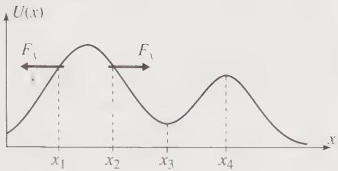
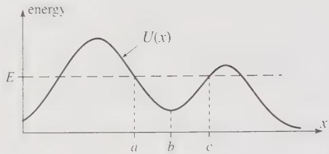
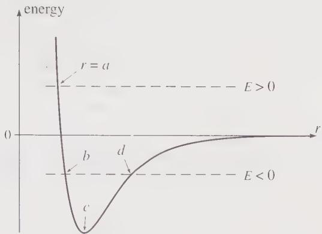
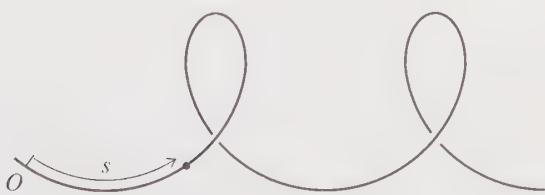
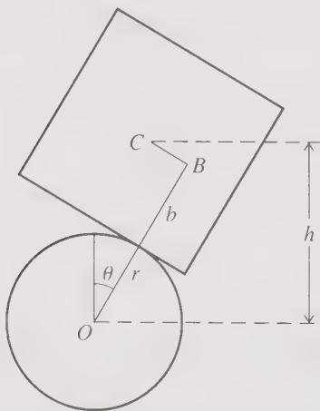

# Fundamental Concepts (Part B)

**Reading material:** Chapter 4 of *Classical Mechanics* by John R. Taylor

## Table of Contents

1. [Polar Coordinates and Time-Dependent Basis Vectors](#1-polar-coordinates-and-time-dependent-basis-vectors)
2. [Velocity and Acceleration in Polar Coordinates](#2-velocity-and-acceleration-in-polar-coordinates)
3. [Newton's Second Law in Polar Coordinates](#3-newtons-second-law-in-polar-coordinates)
4. [Application: Simple Pendulum](#4-application-simple-pendulum)
5. [Kinetic Energy and Work Theorem](#5-kinetic-energy-and-work-theorem)
   - [Kinetic Energy](#51-kinetic-energy)
   - [Work–Kinetic Energy Theorem](#52-workkinetic-energy-theorem)
   - [Work for Finite Displacements](#53-work-for-finite-displacements)
6. [Conservative Forces and Potential Energy](#6-conservative-forces-and-potential-energy)
   - [What is a Conservative Force?](#61-what-is-a-conservative-force)
   - [Potential Energy](#62-potential-energy)
   - [Conservation of Mechanical Energy](#63-conservation-of-mechanical-energy)
   - [Force as the Gradient of Potential Energy](#64-force-as-the-gradient-of-potential-energy)
7. [Criteria for Conservative Forces](#7-criteria-for-conservative-forces)
   - [Two Conditions for a Conservative Force](#71-two-conditions-for-a-conservative-force)
   - [Mathematical Test: Curl](#72-mathematical-test-curl)
   - [Nonconservative Forces and Energy](#73-nonconservative-forces-and-energy)
8. [Time-Dependent Potential Energy](#8-time-dependent-potential-energy)
   - [What is a Time-Dependent Potential?](#81-what-is-a-time-dependent-potential)
   - [What Happens to d(T+U)?](#82-what-happens-to-dtu)
   - [Physical Interpretation](#83-physical-interpretation)
9. [One-Dimensional Systems](#9-one-dimensional-systems)
   - [9.1 Linear One-Dimensional Systems](#91-linear-one-dimensional-systems)
   - [9.2 Graphs of the Potential Energy](#92-graphs-of-the-potential-energy)
      - [Stability of Equilibrium](#stability-of-equilibrium)
      - [Motion and Turning Points](#turning-points-and-bound-motion)
      - [Example: Diatomic Molecule](#example-diatomic-molecule)
   - [9.3 Complete Solution of the Motion](#93-complete-solution-of-the-motion)
   - [9.4 Example: Escape in a Cubic Potential](#94-example-escape-in-a-cubic-potential)
   - [9.5 Curvilinear One-Dimensional Systems](#95-curvilinear-one-dimensional-systems)
   - [9.6 Example: Stability of a Cube on a Cylinder](#96-example-stability-of-a-cube-on-a-cylinder)

------

## 1. Polar Coordinates and Time-Dependent Basis Vectors

### 1.1 Position Vector in Polar Coordinates

In polar coordinates, the position vector can be written as

\[\vec r(t) = r\hat r\]

**The crucial point is that $\hat r$ is not constant.** Its direction changes with time as the particle moves.

  **Figure 1** 2D polar coordinates showing the position vector and the unit vectors $\hat r$ and $\hat\theta$.

### 1.2 Expressing Unit Vectors in Cartesian Components

We can express the polar unit vectors in terms of Cartesian unit vectors:

\[\hat r = \cos\theta\,\hat x + \sin\theta\,\hat y\]

The angular basis vector is

\[\hat\theta = -\sin\theta\,\hat x + \cos\theta\,\hat y\]

These two unit vectors are perpendicular: $\hat r \cdot \hat\theta = 0$.

### 1.3 Time Derivatives of the Basis Vectors

Taking the time derivative of $\hat r$:

\[\frac{d\hat r}{dt} = -\dot\theta\sin\theta\,\hat{x} + \dot\theta\cos\theta\,\hat{y} = \dot\theta\hat\theta\]

Similarly,

\[\frac{d\hat\theta}{dt} = -\dot\theta\hat r\]

Using dot notation:

\[
\boxed{\dot{\hat r} = \dot\theta\hat\theta}
\]

\[
\boxed{\dot{\hat\theta} = -\dot\theta\hat r}
\]

These relationships are fundamental for velocity and acceleration in polar coordinates.

------

## 2. Velocity and Acceleration in Polar Coordinates

### 2.1 Velocity in Polar Coordinates

The position vector is

\[\vec r(t) = r\hat r\]

The velocity is the time derivative:

\[\vec v = \frac{d\vec r}{dt}\]

Using the product rule:

\[\vec v = \dot r\hat r + r\dot{\hat r}\]

Since $\dot{\hat r} = \dot\theta\hat\theta$, we obtain
\[
\boxed{\vec v = \dot r\hat r + r\dot\theta\hat\theta}
\]
The radial component is $\dot r$, and the tangential component is $r\dot\theta$.

### 2.2 Acceleration in Polar Coordinates

Differentiate the velocity to get acceleration:

\[\vec a = \frac{d\vec v}{dt}\]

\[\vec a = \frac{d}{dt}\left(\dot r\hat r + r\dot\theta\hat\theta\right)\]

Carrying out the product rule:

\[\vec a = \left(\ddot r - r\dot\theta^2\right)\hat r + \left(r\ddot\theta + 2\dot r\dot\theta\right)\hat\theta\]

The two terms have physical meanings:

- $\ddot r - r\dot\theta^2$: radial component (includes centripetal acceleration $-r\dot\theta^2$)
- $r\ddot\theta + 2\dot r\dot\theta$: tangential component (includes the Coriolis-like term $2\dot r\dot\theta$)

Thus,
\[
\boxed{\vec a = \left(\ddot r - r\dot\theta^2\right)\hat r + \left(r\ddot\theta + 2\dot r\dot\theta\right)\hat\theta}
\]

------

## 3. Newton's Second Law in Polar Coordinates

Newton's second law in vector form is

\[\vec F = m\vec a\]

Substituting the acceleration expression:

\[\vec F = m\left[\left(\ddot r - r\dot\theta^2\right)\hat r + \left(r\ddot\theta + 2\dot r\dot\theta\right)\hat\theta\right]\]

If the force is expressed in polar components as

\[\vec F = F_r\hat r + F_\theta\hat\theta\]

then the component equations are:
\[
\boxed{F_r = m\left(\ddot r - r\dot\theta^2\right)}
\]

\[
\boxed{F_r = m\left(\ddot r - r\dot\theta^2\right)}
\]

------

## 4. Application: Simple Pendulum

A simple pendulum consists of:

- a bob of mass $m$
- a rod or string of length $\ell$
- angular displacement $\theta$

For motion in a plane, it is convenient to use **polar coordinates** $(r, \theta)$. **Naively writing:**

\[m\frac{d^2r}{dt^2} = F_r\]

\[m\frac{d^2\theta}{dt^2} = F_\theta\]

is **not correct** in polar coordinates. The correct form follows from differentiating the position vector to obtain the acceleration.

### Applying the Equations

For a simple pendulum:

\[r = \ell = \text{constant}\]

Therefore,

\[\dot r = 0\]
\[\ddot r = 0\]

The polar-coordinate equations simplify to:

\[-m\ell\dot\theta^2 = F_r\]

\[m\ell\ddot\theta = F_\theta\]

### Identifying the Forces

The forces acting on the pendulum bob are:

1. **Weight** $mg$ (acting vertically downward)
2. **Tension** $T$ (along the string, pointing toward the pivot)

In polar coordinates:

\[F_r = mg\cos\theta - T\]

\[F_\theta = -mg\sin\theta\]

where $T$ is the tension in the string.

### Equation of Motion

Substituting into the $\theta$-component equation:

\[m\ell\ddot\theta = -mg\sin\theta\]

Dividing by $m\ell$:
\[
\boxed{\ddot\theta = -\frac{g}{\ell}\sin\theta}
\]
This is the equation of motion for the simple pendulum. For small angles ($\sin\theta \approx \theta$), this becomes the **simple harmonic oscillator**: $\ddot\theta \approx -\frac{g}{\ell}\theta$, with period $T = 2\pi\sqrt{\ell/g}$.

------

## 5. Kinetic Energy and Work Theorem

### 5.1 Kinetic Energy

For a single particle of mass $m$ traveling with speed $v$, the **kinetic energy (KE)** is defined as
\[
\boxed{T = \frac{1}{2}mv^2}
\]
This is the energy associated with the particle's motion.

### 5.2 Work–Kinetic Energy Theorem

Let us examine how kinetic energy changes as a particle moves. The time derivative of $T$ is:

\[\frac{dT}{dt} = \frac{1}{2}m\frac{d}{dt}(v \cdot v) = m\dot{\mathbf{v}} \cdot \mathbf{v}\]

By Newton's second law, $m\dot{\mathbf{v}} = \mathbf{F}$ (the net force), so

\[\frac{dT}{dt} = \mathbf{F} \cdot \mathbf{v}\]

Multiplying both sides by $dt$, and noting that $\mathbf{v}\,dt = d\mathbf{r}$ (the displacement),
\[
\boxed{dT = \mathbf{F} \cdot d\mathbf{r}}
\]
The expression $\mathbf{F} \cdot d\mathbf{r}$ is defined as the **work** done by the force $\mathbf{F}$ in the displacement $d\mathbf{r}$. This is the **work–kinetic energy theorem** for an infinitesimal displacement.

### 5.3 Work for Finite Displacements

For a particle moving from point $\mathbf{r}_1$ to $\mathbf{r}_2$, the total change in kinetic energy is

\[\Delta T \equiv T_2 - T_1 = \int_{1}^{2} \mathbf{F} \cdot d\mathbf{r}\]

This integral is called a **line integral**. In general, the value of this integral **depends on the path** taken between points 1 and 2.

We can write:

\[T_2 - T_1 = W(1 \rightarrow 2)\]

where $W(1 \rightarrow 2)$ denotes the work done moving from point 1 to point 2.

If multiple forces act, the net work is the sum of the works done by each force:

\[T_2 - T_1 = \sum_{i} W_i(1 \rightarrow 2).\]

------

## 6. Conservative Forces and Potential Energy

### 6.1 What is a Conservative Force?

Not every force can be associated with a potential energy. Forces that **do** have a corresponding potential energy are called **conservative forces**. The key property of conservative forces is that **the work they do depends only on the initial and final positions, not on the path taken**.

### 6.2 Potential Energy

For a conservative force $\mathbf{F}(\mathbf{r})$, we can define a **potential energy** $U(\mathbf{r})$ as follows:

Choose a reference point $\mathbf{r}_0$ where $U$ is defined to be zero. Then the potential energy at any point $\mathbf{r}$ is
\[
\boxed{U(\mathbf{r}) = -W(\mathbf{r}_0 \rightarrow \mathbf{r}) = -\int_{\mathbf{r}_0}^{\mathbf{r}} \mathbf{F}(\mathbf{r}') \cdot d\mathbf{r}'}
\]
The minus sign is a convention. There are several ways to interpret it:

- If the force associated with the potential does positive work on the object, then the object's potential energy decreases.

- Potential energy measures how much work the force can **still** do. When the force actually does work, it **uses up** potential energy.

- Work done by a conservative force comes at the expense of potential energy.

With this definition, the work done by $\mathbf{F}$ moving from $\mathbf{r}_1$ to $\mathbf{r}_2$ is

\[W(\mathbf{r}_1 \rightarrow \mathbf{r}_2) = -\Delta U = -[U(\mathbf{r}_2) - U(\mathbf{r}_1)]\]

### 6.3 Conservation of Mechanical Energy

Combining the Work–KE theorem with the property of conservative forces:

\[\Delta T = W = -\Delta U\]

which gives
\[
\boxed{\Delta(T + U) = 0}
\]
Thus, the **total mechanical energy**

\[E = T + U\]

is **conserved** when all forces acting on the particle are conservative.

### 6.4 Force as the Gradient of Potential Energy

The relationship between force and potential energy can be written compactly. For a conservative force:
\[
\boxed{\mathbf{F} = -\nabla U}
\]
Or in component form:

\[F_x = -\frac{\partial U}{\partial x}, \quad F_y = -\frac{\partial U}{\partial y}, \quad F_z = -\frac{\partial U}{\partial z}\]

The operator $\nabla$ (called "del" or "grad") is the gradient operator.

------

## 7. Criteria for Conservative Forces

### 7.1 Two Conditions for a Conservative Force

A force $\mathbf{F}$ acting on a particle is **conservative** if and only if it satisfies **two conditions**:

**(i) Position dependence only:** $\mathbf{F}$ depends only on the particle's position $\mathbf{r}$ (and not on velocity $\mathbf{v}$, time $t$, or any other variable). That is, $\mathbf{F} = \mathbf{F}(\mathbf{r})$.

**(ii) Path-independent work:** For any two points 1 and 2, the work $W(1 \rightarrow 2)$ done by $\mathbf{F}$ is the same for all paths connecting 1 and 2.

### 7.2 Mathematical Test: Curl

An equivalent and often easier test is to check the **curl** of the force:
\[
\boxed{\nabla \times \mathbf{F} = 0}
\]
If the curl is zero everywhere, the force is conservative (provided it also satisfies condition (i)).

The curl has components:

\[(\nabla \times \mathbf{F})_x = \frac{\partial F_z}{\partial y} - \frac{\partial F_y}{\partial z}\]
\[(\nabla \times \mathbf{F})_y = \frac{\partial F_x}{\partial z} - \frac{\partial F_z}{\partial x}\]
\[(\nabla \times \mathbf{F})_z = \frac{\partial F_y}{\partial x} - \frac{\partial F_x}{\partial y}\]

### 7.3 Nonconservative Forces and Energy

If some forces are nonconservative, mechanical energy is not conserved. We can still write:

\[\Delta(T + U) = W_{\text{nc}}\]

where $W_{\text{nc}}$ is the work done by nonconservative forces. The change in mechanical energy equals the work done by nonconservative forces.

------

## 8. Time-Dependent Potential Energy

### 8.1 What is a Time-Dependent Potential?

Sometimes we encounter a force $\mathbf{F}(\mathbf{r}, t)$ that **depends explicitly on time**. Even if $\nabla \times \mathbf{F} = 0$ (so the work is path-independent at any fixed time), such a force does **not** satisfy the first condition for conservatism because it depends on time, not just position.

In this case, we can still define a potential energy $U(\mathbf{r}, t)$ such that $\mathbf{F} = -\nabla U$, but **the total mechanical energy $E = T + U$ is not conserved**.

### 8.2 What Happens to d(T+U)?

Let us examine the change in total mechanical energy. As before:

\[dT = \mathbf{F} \cdot d\mathbf{r}\]

For $U(\mathbf{r}, t) = U(x, y, z, t)$, the differential is

\[dU = \frac{\partial U}{\partial x}dx + \frac{\partial U}{\partial y}dy + \frac{\partial U}{\partial z}dz + \frac{\partial U}{\partial t}dt\]

The first three terms equal $\nabla U \cdot d\mathbf{r} = -\mathbf{F} \cdot d\mathbf{r}$, so

\[dU = -\mathbf{F} \cdot d\mathbf{r} + \frac{\partial U}{\partial t}dt\]

Adding $dT$ and $dU$:
\[
\boxed{d(T + U) = \frac{\partial U}{\partial t}dt}
\]
**Key result:** The total mechanical energy changes at a rate given by $\partial U/\partial t$, the explicit time derivative of the potential energy.

- If $U$ is **time-independent** ($\partial U/\partial t = 0$), then $d(T+U) = 0$ and energy is conserved.
- If $U$ **depends explicitly on time** ($\partial U/\partial t \neq 0$), then mechanical energy is **not conserved**.

### 8.3 Physical Interpretation

When $d(T+U) \neq 0$, energy is exchanged with other systems. For example, as a charged sphere slowly loses charge, the potential energy of a nearby test charge changes even if it does not move. Any mechanical energy lost or gained appears as other forms (thermal, radiation, etc.), while total energy remains conserved.

------

## 9. One-Dimensional Systems

Many interesting problems involve an object that is **constrained to move in just one dimension**, and the analysis of such problems is remarkably simpler than the general case.

There is some ambiguity in what a physicist means by a "one-dimensional system." Many introductory physics texts mean an object that is confined to move on a **perfectly straight, or linear, track**. In discussing such linear systems, we naturally take the x axis to coincide with the track, and the position of the object is then specified by the single coordinate x. However, there are much more complicated systems, such as **a roller coaster on its curving track**, that are also one-dimensional, since **their position can be specified by a single parameter** (such as the distance along the track). **Energy conservation for such curvilinear one-dimensional systems is just as straightforward as for a perfectly straight track**.

### 9.1 Linear One-Dimensional Systems

Let us consider an object constrained to move along a straight track, which we take to be the x axis. The only component of any force F that can do work is the x component, and we can simply ignore the other two components. Therefore the work done by F is the one-dimensional integral

\[W(x_1 \rightarrow x_2) = \int_{x_1}^{x_2} F_x(x)\,dx.\]

If the force is to be conservative, $F_x$ must satisfy the two usual conditions:

**(i)** It must depend only on the position $x$.

**(ii)** The work must be independent of path.

In one dimension, condition (i) already implies condition (ii): any path between two points can be reduced to the direct path plus backtracking segments whose work contributions cancel.

Consider two points A and B. The obvious path between points A and B is the direct path (call this path "AB"). Another possibility is to go from A past B to C and then back to B (call this "ABCB"). The work done along this path can be broken up as follows:

\[W(ABCB) = W(AB) + W(BC) + W(CB).\]

Now, provided the force depends only on the position $x$ [condition (i)], each increment of work going from B to C is exactly equal (but of opposite sign) to the corresponding contribution going from C to B. That is, the last two terms on the right cancel, and we conclude that

\[W(ABCB) = W(AB).\]

One can of course construct a path from A to B that doubles back and forth many times, but any such path can be broken into a number of segments some of which together traverse the direct path AB exactly once, and all the rest of which cancel in pairs. Thus the work done on any path between A and B is the same as that on the direct path AB, and we have proved that in one dimension the first condition for a force to be conservative guarantees the second.

### 9.2 Graphs of the Potential Energy

A second useful feature of one-dimensional systems is that with only one independent variable $x$ we can plot the potential energy $U(x)$, and this makes it easy to visualize the behavior of the system. For example, for a mass on the end of a spring obeying Hooke's law, the force is $F_x = -kx$, and if we choose the reference point $x_0 = 0$, we get the celebrated result

\[U = \frac{1}{2}kx^2.\]

Corresponding to the three-dimensional result $\mathbf{F} = -\nabla U$, we have the simpler result in one dimension

\[F_x = -\frac{dU}{dx}.\]

**Figure 2** The graph of potential energy $U(x)$ against x for any one-dimensional system can be thought of as a picture of a roller coaster track. The force $F_x = -dU/dx$ tends to push the object "downhill" as at $x_1$ and $x_2$. At the points $x_3$ and $x_4$, where $U(x)$ is minimum or maximum, $dU/dx = 0$ and the force is zero; such points are therefore points of equilibrium.

#### Stability of Equilibrium {#stability-of-equilibrium}

At points where $dU/dx = 0$ and $U(x)$ is minimum or maximum, the net force is zero, and the object can remain in equilibrium.

- **Stable equilibrium:** At $x_3$, where $d^2U/dx^2 > 0$ and $U(x)$ is minimum, a small displacement from equilibrium causes a force that pushes the object back toward equilibrium (back to the left on the right of $x_3$, back to the right on the left of $x_3$). This is a **point of stable equilibrium**.

- **Unstable equilibrium:** At $x_4$, where $d^2U/dx^2 < 0$ and $U(x)$ is maximum, a small displacement leads to a force away from equilibrium. This is a **point of unstable equilibrium**.

#### Motion and Turning Points {#turning-points-and-bound-motion}

If the object is moving, its total energy $E$ is necessarily greater than $U(x)$. If it starts in a well with $E$ lower than both adjacent crests, it is trapped and oscillates between the two turning points where $U(x) = E$ and the kinetic energy is zero.

If the energy is higher than the crest of one hill but still lower than the other, the object will escape in one direction. Finally, if the energy is higher than both hills, the object can escape in either direction.

**Figure 3** If an object starts out near $x = b$ with the energy E shown, it is trapped in the valley or "well" between the two hills and oscillates between the turning points at $x = a$ and $x = c$ where $U(x) = E$ and the kinetic energy is zero.

#### Example: Diatomic Molecule {#example-diatomic-molecule}

These considerations play an important role in many fields. An example from molecular physics is illustrated in Figure 4.12, which shows the potential energy of a typical diatomic molecule, such as HCl, as a function of the distance between the two atoms.

**Figure 4** The potential energy for a typical diatomic molecule such as HCl, plotted as a function of the distance $r$ between the two atoms. If $E > 0$, the two atoms cannot approach closer than the turning point $r = a$, but they can move apart to infinity. If $E < 0$, they are trapped between the turning points at $b$ and $d$ and form a bound molecule. The equilibrium separation is $r = c$.

- If the energy is **positive** ($E > 0$), the H atom can escape to infinity, since there is no "hill" to trap it; the H atom can come in from infinity, but it will stop at the turning point $r = a$ and (in the absence of any mechanism to take up some of its energy) it will move away to infinity again.

- If the energy is **negative** ($E < 0$), the H atom is trapped and will oscillate in and out between the two turning points shown at $r = b$ and $r = d$. The equilibrium separation of the molecule is at the point shown as $r = c$.

States with $E < 0$ correspond to a bound HCl molecule. To form such a molecule, two separate atoms ($E > 0$) must approach near $r = c$, and **some process such as light emission must remove enough energy to leave them trapped with $E < 0$**.

### 9.3 Complete Solution of the Motion

A third remarkable feature is that energy conservation lets us — in principle — find the complete solution $x(t)$.

Since $E = T + U(x)$ is conserved, with $U(x)$ a known function and E determined by the initial conditions, we can solve for $T = \frac{1}{2}m\dot{x}^2 = E - U(x)$ and hence for the velocity $\dot{x}$ as a function of $x$:

\[\dot{x}(x) = \pm\sqrt{\frac{2}{m}}\sqrt{E - U(x)}.\]

The sign is ambiguous because energy alone does not determine the direction of motion. In one dimension, the sign of $\dot{x}$ can usually be decided by inspection.

Knowing the velocity as a function of $x$, we can now find $x$ as a function of $t$, using **separation of variables**:

\[dt = \frac{dx}{\dot{x}}.\]

Integrating between any initial and final points:

\[t_f - t_i = \int_{x_i}^{x_f} \frac{dx}{\dot{x}}.\]

This gives the travel time between any two positions. If we substitute for $\dot{x}$ (and assume, to be definite, that $\dot{x} > 0$), then the time to go from the initial $x_0$ at time 0 to an arbitrary $x$ at time $t$ is

\[
\boxed{t = \sqrt{\frac{m}{2}}\int_{x_0}^{x} \frac{dx'}{\sqrt{E - U(x')}}}.
\]
This integral depends on the particular form of $U(x)$ in the problem at hand. Assuming we can do the integral (analytically or numerically), it gives us $t$ as a function of $x$. Finally we can solve to give $x$ as a function of $t$, and our solution is complete.

### 9.4 Example: Escape in a Cubic Potential

Consider a particle of mass $m$ moving in one dimension under the potential
\[ V(x)=m(x^3-3x). \]
The total mechanical energy is
\[ E=\frac{1}{2}m\dot{x}^2+V(x). \]
We want to understand, for different initial positions $x_0$, whether the particle remains trapped in the potential well or escapes to infinity.

---

#### 1. Shape of the Potential

The potential is

\[ V(x)=m(x^3-3x).\]

To find its stationary points, compute

\[ \frac{dV}{dx} = m(3x^2-3) = 3m(x^2-1).\]

Setting this equal to zero gives $x=\pm 1$.

At $x=-1$, $\frac{d^2V}{dx^2}=-6m<0$, so $x=-1$ is a local maximum, and $V(-1)=2m$.

At $x=1$, $\frac{d^2V}{dx^2}=6m>0$, so $x=1$ is a local minimum, and $V(1)=-2m$.

**Figure 5** The cubic potential $V(x)=m(x^3-3x)$. The local maximum at $x=-1$ is the top of the barrier, and the local minimum at $x=1$ is the bottom of the well.

---

#### 2. Classification of Motion

##### Case 1: $x_0>2$

If the particle is released from **rest** at $x_0>2$, then $V(x_0)>2m$. Therefore $E>2m$. The particle has enough energy to pass over the barrier at $x=-1$. It can escape to the left.

---

##### Case 2: $x_0=2$

If $x_0=2$, then $E=V(2)=2m$. The particle has exactly the energy of the barrier top at $x=-1$.

It can move leftward toward the barrier, but it reaches $x=-1$ with zero speed. Since $x=-1$ is an unstable equilibrium point, the particle approaches it only **asymptotically** (渐进) in infinite time.

Near the unstable equilibrium point, write $x=-1+\epsilon$, where $0<\epsilon\ll 1$. Then

$x^3-3x = (-1+\epsilon)^3-3(-1+\epsilon).$

Expanding,

$(-1+\epsilon)^3=-1+3\epsilon-3\epsilon^2+\epsilon^3,$

so

 $x^3-3x
=
(-1+3\epsilon-3\epsilon^2+\epsilon^3)+(3-3\epsilon)
=
2-3\epsilon^2+\epsilon^3.$

Therefore,

$E-V(x)
=
2m-m(2-3\epsilon^2+\epsilon^3)
=
m(3\epsilon^2-\epsilon^3).$

The kinetic energy is $\frac{1}{2}m\dot{x}^2
=
m(3\epsilon^2-\epsilon^3).$

Canceling $m$, $\frac{1}{2}\dot{x}^2
=
3\epsilon^2-\epsilon^3.$

Hence $\dot{x}
=
-\sqrt{6\epsilon^2-2\epsilon^3}.$

We choose the negative sign because the particle moves leftward toward $x=-1$.

Since $x=-1+\epsilon$, we have $\dot{x}=\dot{\epsilon}$. Thus $\dot{\epsilon} = -\sqrt{6\epsilon^2-2\epsilon^3}.$

For small $\epsilon$, $\dot{\epsilon} \approx -\sqrt{6}\,\epsilon.$

Therefore, $\frac{d\epsilon}{dt} \approx -\sqrt{6}\,\epsilon.$

Separating variables, $dt \approx -\frac{d\epsilon}{\sqrt{6}\,\epsilon}.$

The time taken to move from $\epsilon_0$ to $\epsilon$ is therefore

\[
t-t_0
\approx
-\frac{1}{\sqrt{6}}
\int_{\epsilon_0}^{\epsilon}
\frac{d\epsilon'}{\epsilon'}.
\]

So

\[
t-t_0
\approx
\frac{1}{\sqrt{6}}
\log\left(\frac{\epsilon_0}{\epsilon}\right).
\]

Hence, as $\epsilon\to 0^+$, we have $t-t_0\to \infty$. This shows that the particle approaches the unstable equilibrium point $x=-1$ only asymptotically. It never reaches $x=-1$ in finite time.

---

##### Case 3: $-1<x_0<2$

If $-1<x_0<2$, $V(x_0)< 2m$. Therefore $E<2m$. The particle does not have enough energy to climb over the barrier at $x=-1$. It remains trapped in the well and oscillates between turning points.

---

##### Case 4: $x_0=-1$

If $x_0=-1$, then $V=2m$. This is the unstable equilibrium point. If the particle is placed exactly at $x=-1$ with zero velocity, it remains there forever in the ideal mathematical model.

However, any tiny perturbation will cause it to roll either into the well or escape to the left.

---

##### Case 5: $x_0<-1$

If $x_0 < -1$, then the particle starts to the left of the barrier. Since the potential decreases without bound as $x\to -\infty$, the particle escapes to the left.

---

#### 5. Summary

| Initial position $x_0$ |    Energy $E=V(x_0)$ | Motion                          |
| ------------------------ | ---------------------: | ------------------------------- |
| $x_0<-1$               | starts left of barrier | escapes to $x\to -\infty$     |
| $x_0=-1$               |               $E=2m$ | unstable equilibrium            |
| $-1<x_0<2$             |               $E<2m$ | trapped in the well             |
| $x_0=2$                |               $E=2m$ | reaches $x=-1$ asymptotically |
| $x_0>2$                |               $E>2m$ | escapes over the barrier        |

---

### 9.5 Curvilinear One-Dimensional Systems

So far we have discussed an object constrained to move along a linear path, with position specified by the coordinate $x$. There are other, more general, systems that can equally be said to be one-dimensional, since their position is specified by a single number. An example is a bead threaded on a curved rigid wire.

**Figure 6** An object constrained to move on a curved track can be considered to be a one-dimensional system, with the position specified by the distance $s$ (measured along the track) of the object from an origin O.

Consider a bead of mass $m$ threaded on a smooth, rigid, curved wire. Since the bead is constrained to remain on the wire, its position can be described by a single coordinate: $s=s(t),$ where $s$ is the arc length measured along the wire from some reference point $O$.

---

#### 1. Position of the Bead

Let the curve of the wire be described parametrically by $$\mathbf r(s)=x(s)\hat{\mathbf i}+y(s)\hat{\mathbf j}+z(s)\hat{\mathbf k}.$$

The bead moves along this curve, so its position at time $$t$$ is $$\mathbf r(t)=\mathbf r(s(t)).$$

Using the chain rule, $$\mathbf v=\frac{d\mathbf r}{dt}=\frac{d\mathbf r}{ds}\frac{ds}{dt}.$$

Since $$s$$ is arc length, the vector $$\frac{d\mathbf r}{ds}$$ is a unit tangent vector to the wire. We denote it by $$\hat{\mathbf t}.$$

Therefore, $$\mathbf v=\dot{s}\,\hat{\mathbf t}.$$

So the bead's velocity points tangent to the wire, and its magnitude is $$v=|\mathbf v|=|\dot{s}|.$$

If $$s$$ is chosen to increase in the direction of motion, then $$v=\dot{s}.$$

---

#### 2. Velocity in Components

To see this explicitly, write the velocity in Cartesian components: $$\mathbf v=\frac{dx}{dt}\hat{\mathbf i}+\frac{dy}{dt}\hat{\mathbf j}+\frac{dz}{dt}\hat{\mathbf k}.$$

Therefore its speed is $$v=\sqrt{\left(\frac{dx}{dt}\right)^2+\left(\frac{dy}{dt}\right)^2+\left(\frac{dz}{dt}\right)^2}.$$

But the differential arc length along the curve is $$ds^2=dx^2+dy^2+dz^2.$$

Dividing by $$dt^2$$, we get $$\left(\frac{ds}{dt}\right)^2=\left(\frac{dx}{dt}\right)^2+\left(\frac{dy}{dt}\right)^2+\left(\frac{dz}{dt}\right)^2.$$

Hence, $$v=\sqrt{\left(\frac{dx}{dt}\right)^2+\left(\frac{dy}{dt}\right)^2+\left(\frac{dz}{dt}\right)^2}=\left|\frac{ds}{dt}\right|.$$

Thus, $$v=|\dot{s}|.$$

If the bead moves in the positive $$s$$-direction, then $$v=\dot{s}.$$

---

#### 3. Acceleration Along the Tangent Direction

From $$\mathbf v=\dot{s}\hat{\mathbf t},$$ differentiate with respect to time:

$$\mathbf a=\frac{d\mathbf v}{dt}=\frac{d}{dt}(\dot{s}\hat{\mathbf t}).$$

Using the product rule, $$\mathbf a=\ddot{s}\hat{\mathbf t}+\dot{s}\frac{d\hat{\mathbf t}}{dt}.$$

The first term, $$\ddot{s}\hat{\mathbf t},$$ is the tangential acceleration.

The second term, $$\dot{s}\frac{d\hat{\mathbf t}}{dt},$$ comes from the change in direction of the tangent vector as the bead moves along the curved wire. This term points normal to the curve and is responsible for centripetal acceleration.

Therefore, the tangential component of acceleration is $$a_{\text{tang}}=\ddot{s}.$$

---

#### 4. Newton's Second Law Along the Wire

Newton's second law is $$m\mathbf a=\mathbf F.$$

Take the component of both sides along the tangent direction $$\hat{\mathbf t}$$:

$$m\mathbf a\cdot \hat{\mathbf t}=\mathbf F\cdot \hat{\mathbf t}.$$

The tangential component of force is $$F_{\text{tang}}=\mathbf F\cdot \hat{\mathbf t}.$$

Also, $$\mathbf a\cdot \hat{\mathbf t}=\ddot{s}.$$

Therefore, $$m\ddot{s}=F_{\text{tang}}.$$

---

#### 5. Interpretation

The wire constrains the bead to follow the curve. The normal force from the wire may change the direction of the bead's velocity, but if the wire is smooth, it does no work along the tangent direction.

Therefore, only the tangential component of the applied force changes the bead's speed along the wire.

Hence the one-dimensional equation of motion along the wire is

\[
\boxed{m\ddot{s}=F_{\text{tang}}}.
\]

The whole discussion of one-dimensional systems can now be applied to the bead on a curved wire (or any other object constrained to move on a one-dimensional path). In particular, those points where $U(s)$ is a minimum are points of stable equilibrium, and those where $U(s)$ is maximum are points of unstable equilibrium.

### 9.6 Example: Stability of a Cube on a Cylinder

A hard rubber cylinder of radius $r$ is held fixed with its axis horizontal, and a wooden cube of mass $m$ and side $2b$ is balanced on top of the cylinder, with its center vertically above the cylinder's axis and four of its sides parallel to the axis. The cube cannot slip on the rubber of the cylinder, but it can rock from side to side, as shown in Figure 7. By examining the cube's potential energy, find out if the equilibrium with the cube centered above the cylinder is stable or unstable.

**Figure 7** A cube, of side $2b$ and center C, is placed on a fixed horizontal cylinder of radius $r$ and center O. It is originally put so that C is centered above O, but it can roll from side to side without slipping.

The system is one-dimensional, since its position as it rocks from side to side can be specified by a single coordinate, for instance the angle $\theta$ through which it has turned. The constraining forces are the normal and frictional forces of the cylinder on the cube; these two forces constrain the cube to move only as shown. Since neither of these does any work, we need not consider them explicitly.

The only other force on the cube is gravity, which is conservative. The gravitational potential energy is $U = mgh$, where $h$ is the height of C above the origin O. The length of the line shown as OB is just $r + b$, while the line BC has length $r\theta$ (the distance the cube has rolled around the cylinder). Therefore

\[h = (r + b)\cos\theta + r\theta\sin\theta\]

and the potential energy is
\[
\boxed{U(\theta) = mg[(r + b)\cos\theta + r\theta\sin\theta]}.
\]
To find the equilibrium positions, we must find the points where $dU/d\theta$ vanishes:

\[\frac{dU}{d\theta} = mg[r\theta\cos\theta - b\sin\theta].\]

This vanishes at $\theta = 0$, confirming the obvious — that $\theta = 0$ is a point of equilibrium. To decide whether this equilibrium is stable, we differentiate again and find the value of $d^2U/d\theta^2$ at the equilibrium position:

\[\frac{d^2U}{d\theta^2}\Big|_{\theta=0} = mg(r - b).\]

- If the cube is **smaller than the cylinder** ($b < r$), then the second derivative is **positive**, which means that $U(\theta)$ has a minimum at $\theta = 0$ and the equilibrium is **stable**. If the cube is balanced on the cylinder, it will remain there indefinitely.

- If the cube is **larger than the cylinder** ($b > r$), then the second derivative is **negative**, and the equilibrium is **unstable**. The smallest disturbance will cause the cube to roll and fall off the cylinder.

This illustrates how the curvature of the potential energy determines equilibrium stability in curvilinear one-dimensional systems.

------
