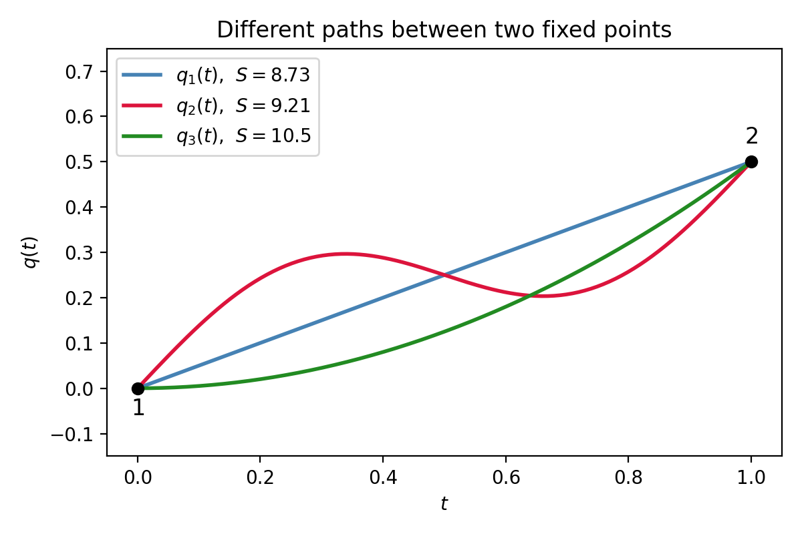

# Lagrangian Mechanics

**Reading material:** Chapter 7 of *Classical Mechanics* by John R. Taylor

## Table of Contents

1. [Mathematical Spaces](#1-mathematical-spaces)
   - [1.1 Physical Space](#11-physical-space)
   - [1.2 Configuration Space](#12-configuration-space)
   - [1.3 Phase Space](#13-phase-space)
2. [Hamilton's Principle](#2-hamiltons-principle)
3. [Action](#3-action)
4. [Derivation of the Euler–Lagrange Equation](#4-derivation-of-the-eulerlagrange-equation)
5. [Comments on the Hamilton's Principle](#5-comments-on-the-hamiltons-principle)
   - [5.1 Fixed but Arbitrary Endpoints](#51-fixed-but-arbitrary-endpoints)
   - [5.2 Euler–Lagrange Equation as a Local Condition](#52-eulerlagrange-equation-as-a-local-condition)
   - [5.3 Why $L=T-V$?](#53-whyltv)
6. [Multi-Dimensional Configuration Space](#6-multi-dimensional-configuration-space)
7. [Examples](#7-examples)
   - [7.1 Polar Coordinates](#71-polar-coordinates)
   - [7.2 Simple Pendulum](#72-simple-pendulum)
   - [7.3 Atwood Machine](#73-atwood-machine)
   - [7.4 Block Sliding on a Movable Wedge](#74-block-sliding-on-a-movable-wedge)
8. [Generalized Coordinates and Constrained Systems](#8-generalized-coordinates-and-constrained-systems)
   - [8.1 Generalized Coordinates](#81-generalized-coordinates)
   - [8.2 Lagrangian in Generalized Coordinates](#82-lagrangian-in-generalized-coordinates)
9. [Generalized Momenta and Ignorable Coordinates](#9-generalized-momenta-and-ignorable-coordinates)
10. [Hamiltonian and Conservation Laws](#10-hamiltonian-and-conservation-laws)
11. [Summary](#11-summary)

---

## 1. Mathematical Spaces

Before we develop the formalism, it is helpful to be clear about the mathematical spaces in which the various quantities live.

------

### 1.1 Physical Space

For ordinary nonrelativistic mechanics, the **physical space** in which particles are located is modeled as three-dimensional Euclidean space $\mathbb{R}^3$.

For a single particle, its **position** is represented by a vector

$$
\mathbf r \in \mathbb{R}^3,
$$

and its **momentum** is represented by another vector

$$
\mathbf p \in \mathbb{R}^3.
$$

Thus, for each particle, position and momentum are separate vector quantities, each with three components.

------

### 1.2 Configuration Space

For a system of $N$ particles, specifying the **configuration** means specifying the position of every particle.

If the particles have positions

$$
\mathbf r_1,\mathbf r_2,\dots,\mathbf r_N \in \mathbb{R}^3,
$$

then a complete configuration is obtained by collecting all of these position vectors together in a single ordered list:

$$
q = (\mathbf r_1,\mathbf r_2,\dots,\mathbf r_N).
$$

What does this mean concretely?  Each position vector $\mathbf r_\alpha$ has three components $(x_\alpha, y_\alpha, z_\alpha)$.  Putting all $N$ particles together gives a grand list of $3N$ numbers:

$$
(x_1, y_1, z_1,\; x_2, y_2, z_2,\; \dots,\; x_N, y_N, z_N).
$$

This is simply the familiar idea of "coordinates," but now we have $3N$ of them instead of just three.  

The collection of all possible such lists forms a $3N$-dimensional space called the **configuration space** of the system.

Each point in configuration space encodes the positions of **all** $N$ particles in physical space.The time evolution of the system is therefore represented by a path

$$
q(t) \in \mathbb{R}^{3N}.
$$

Equivalently,

$$
q(t)=\bigl(\mathbf r_1(t),\mathbf r_2(t),\dots,\mathbf r_N(t)\bigr) = (x_1(t), y_1(t), z_1(t),\; x_2(t), y_2(t), z_2(t),\; \dots,\; x_N(t), y_N(t), z_N(t)).
$$

So instead of tracking $N$ separate position vectors in $\mathbb{R}^3$, we may **track one point moving in the higher-dimensional configuration space**.

At this point, we are still using Cartesian coordinates to label the configuration. For a system without constraints, we may also replace these Cartesian coordinates by a different set of coordinates, called **generalized coordinates**:
\[
q(t) =(q_1,q_2,\dots,q_{3N}).
\]
These generalized coordinates are simply another way of labeling the same $3N$-dimensional configuration space.

>For one unconstrained particle in three dimensions, the generalized coordinates could be chosen as either
>
>$(q_1,q_2,q_3)=(x,y,z)$
>
>or
>
>$(q_1,q_2,q_3)=(r,\theta,\phi).$
>
>The choice of generalized coordinates is often made based on convenience and symmetry.

------

### 1.3 Phase Space

Configuration space records only the positions of the particles.  To specify the complete mechanical state of a system in Hamiltonian mechanics, one must also specify the momenta.

For $N$ particles, the momenta are

$$
\mathbf p_1,\mathbf p_2,\dots,\mathbf p_N \in \mathbb{R}^3.
$$

The complete state is therefore

$$
(q,p) = (\mathbf r_1,\dots,\mathbf r_N,\mathbf p_1,\dots,\mathbf p_N).
$$

This is an element of

$$
\mathbb{R}^{3N}\times \mathbb{R}^{3N} \cong \mathbb{R}^{6N}.
$$

This $6N$-dimensional space is called the **phase space**.

A point in phase space specifies both:

$$
\text{positions} + \text{momenta}.
$$

In Hamiltonian mechanics, $q$ and $p$ are treated as independent coordinates on phase space.  This does not mean that their time evolution is independent; rather, it means that a state is specified by giving both $q$ and $p$, and their evolution is determined by Hamilton's equations.

------

## 2. Hamilton's Principle

Lagrangian mechanics is based on the **principle of stationary action**, also known as **Hamilton's principle**.

Informally, this principle is often summarized as “nature is economical” or “nature minimizes action.” More precisely:

| The actual path followed by a system between two fixed configurations at fixed initial and final times makes the action \(S\) stationary. |
| ------------------------------------------------------------ |

The **action** is defined by

$$
S[q] = \int_{t_i}^{t_f} L(q,\dot q,t)\,dt,
$$

where:

- $q(t)$ is a path in configuration space,
- $\dot q(t)$ is the velocity along that path,
- $L(q,\dot q,t)$ is the **Lagrangian**,
- $t_i$ and $t_f$ are fixed initial and final times.

For many elementary mechanical systems,

$$
L = T - V,
$$

where $T$ is **kinetic energy** and $V$ is **potential energy**.

Hamilton's principle states that the physical path satisfies

$$
\delta S = 0.
$$

This means the action is **stationary**, not necessarily minimal.  A stationary value may be a minimum, a maximum, or a saddle point of the action functional.  In many mechanical situations, especially over sufficiently short time intervals, the stationary action is a local minimum. This is why the principle is often informally called the **principle of least action**, although **principle of stationary action** is the more precise term. 

------

## 3. Action

The action assigns a number to each possible path in configuration space. Therefore, it is a **functional**: a function whose input is itself a function.

A path $q(t)$ is mapped to a real number:

\[
q(t) \longmapsto S[q] \in \mathbb{R}.
\]

Explicitly,

\[
S[q]=\int_{t_i}^{t_f} L(q,\dot q,t)\,dt.
\]

The **units of action are energy multiplied by time**:

\[
[S]=[E][t]=\mathrm{J}\cdot\mathrm{s}
=\frac{\mathrm{kg}\,\mathrm{m}^2}{\mathrm{s}}.
\]

Different paths between the same endpoints generally have different action values. For example,

\[
S[q_1(t)] = 8.73, \qquad
S[q_2(t)] = 9.21, \qquad
S[q_3(t)] = 10.5.
\]

**Figure 1**: Three possible paths connecting the same initial point 1 and final point 2. Each path yields a different value of the action $S[q]$.

To understand how \(S[q]\) is computed in principle, it is useful to think in a **discrete approximation**. Divide the time interval \([t_i,t_f]\) into many small pieces of size \(\Delta t\). Along a proposed path \(q(t)\), evaluate the Lagrangian at each time step:

\[
L_k = L(q_k,\dot q_k,t_k),
\]

where \(q_k=q(t_k)\), and \(\dot q_k\) can be approximated by

\[
\dot q_k \approx \frac{q_{k+1}-q_k}{\Delta t}.
\]

This approximation treats the Lagrangian as approximately constant over each small time interval. In particular, if $L=T-V$,  then we are effectively assuming that $q_k(t)$, $\dot q_k(t)$, and hence $V(q_k)$ do **not** change appreciably within a single time step.  Equivalently, we use the value of the Lagrangian at a representative point in the interval, such as the left endpoint $t_k$.

Then the action is approximated by the sum
\[
S[q] \approx \sum_{k=0}^{N-1} L(q_k,\dot q_k,t_k)\,\Delta t.
\]

Thus, the action is like a **time-sum** of the Lagrangian along the entire path. In the limit where the time intervals become infinitesimally small, this sum becomes the integral

\[
S[q]=\lim_{\Delta t\to 0}\sum_{k=0}^{N-1}L(q_k,\dot q_k,t_k)\,\Delta t
=\int_{t_i}^{t_f}L(q,\dot q,t)\,dt.
\]

This discrete picture helps clarify the meaning of the action: for every possible path, **we sample the path at many times, compute the Lagrangian at each sample, multiply by the small time interval, and add all contributions together.** However, when our goal is to find the actual path, **we usually do not  compute $S[q]$** separately for many trial paths. Instead, we vary the path symbolically and impose the stationary-action condition $\delta S = 0,$ which leads to the Euler-Lagrange equations.

------

## 4. Derivation of the Euler–Lagrange Equation

Consider a system described by a **single configuration variable** $q(t)$; that is, $q(t)$ has only one component. The multidimensional case is obtained by applying the same argument to each generalized coordinate.

Let the physical path be $q(t)$.  We compare it with nearby paths of the form

$$
q_\alpha(t)=q(t)+\alpha \eta(t),
$$

where:

- $\alpha$ is a real parameter,
- $\eta(t)$ is an arbitrary smooth variation,
- the endpoints are fixed, so

$$
\eta(t_i)=\eta(t_f)=0.
$$

The corresponding velocity is

$$
\dot q_\alpha(t)=\dot q(t)+\alpha \dot\eta(t).
$$

The action evaluated on the varied path is

$$
S[\alpha] = \int_{t_i}^{t_f} L(q+\alpha\eta,\dot q+\alpha\dot\eta,t)\,dt.
$$

The physical path makes the action stationary, so

$$
\left.\frac{dS[\alpha]}{d\alpha}\right|_{\alpha=0}=0.
$$

Differentiating under the integral sign gives

$$
\left.\frac{dS[\alpha]}{d\alpha}\right|_{\alpha=0} = \int_{t_i}^{t_f} \left[ \frac{\partial L}{\partial q}\eta + \frac{\partial L}{\partial \dot q}\dot\eta \right]dt.
$$

Therefore, stationarity requires

$$
\int_{t_i}^{t_f} \left[ \frac{\partial L}{\partial q}\eta + \frac{\partial L}{\partial \dot q}\dot\eta \right]dt =0.
$$

Now integrate the second term by parts:

$$
\int_{t_i}^{t_f} \frac{\partial L}{\partial \dot q}\dot\eta\,dt = \left. \eta\frac{\partial L}{\partial \dot q} \right|_{t_i}^{t_f} - \int_{t_i}^{t_f} \eta \frac{d}{dt} \left( \frac{\partial L}{\partial \dot q} \right)dt.
$$

Because $\eta(t_i)=\eta(t_f)=0$, the boundary term vanishes:

$$
\left. \eta\frac{\partial L}{\partial \dot q} \right|_{t_i}^{t_f} =0.
$$

Thus,

$$
\int_{t_i}^{t_f} \frac{\partial L}{\partial \dot q}\dot\eta\,dt = - \int_{t_i}^{t_f} \eta \frac{d}{dt} \left( \frac{\partial L}{\partial \dot q} \right)dt.
$$

Substituting this into the stationarity condition gives

$$
\int_{t_i}^{t_f} \left[ \frac{\partial L}{\partial q} - \frac{d}{dt} \left( \frac{\partial L}{\partial \dot q} \right) \right]\eta(t)\,dt =0.
$$

Since $\eta(t)$ is arbitrary except for vanishing at the endpoints, the fundamental lemma of the calculus of variations implies

$$
\frac{\partial L}{\partial q} - \frac{d}{dt} \left( \frac{\partial L}{\partial \dot q} \right) =0.
$$

Equivalently,

$$
\boxed{ \frac{d}{dt} \left( \frac{\partial L}{\partial \dot q} \right) - \frac{\partial L}{\partial q} =0 }
$$

This is the **Euler–Lagrange equation**.

> **Note.** The two sign conventions are identical up to multiplication by $-1$.  In mechanics one often sees $\partial L/\partial q = \frac{d}{dt}(\partial L/\partial \dot q)$; in field theory the opposite sign is common.  Both are correct.

------

## 5. Comments on the Hamilton's Principle

------

### 5.1 Fixed but Arbitrary Endpoints

At first, Hamilton’s principle can feel confusing. We say that the initial and final configurations are fixed:

$q(t_i)=q_i, \qquad q(t_f)=q_f.$

But then a natural question arises:

> If we already know the configuration at the final time $t_f$, why do we need to derive the equation of motion? Doesn’t knowing the final point already tell us where the system goes?

The key point is that **fixing the endpoints in the variational problem is not the same as knowing the full motion of the system**. The endpoints only specify where the path begins and where it ends. They do not specify how the system moves **between** those two times. 

The endpoints are **fixed** during a particular variational problem.

They are **arbitrary** because their values are not special. We may choose any endpoint configurations $q_i$ and $q_f$, and the same derivation works.

Therefore:

$$
\boxed{
\text{fixed during the variation, arbitrary in their choice}
}
$$

Because the endpoints were arbitrary, the resulting equation of motion is not tied to a particular pair of endpoints.

------

### 5.2 Euler–Lagrange Equation as a Local Condition

Hamilton’s principle leads to the Euler--Lagrange equation: $\frac{d}{dt} \left( \frac{\partial L}{\partial \dot q} \right) - \frac{\partial L}{\partial q} =0$

This is a **local differential equation**: it must hold at each time along the physical path. Therefore, when we use the equation to predict motion, we do **not** need to know the final configuration in advance.

The logical structure is:

$\boxed{ \text{stationary action with fixed endpoints} \Longrightarrow \text{Euler--Lagrange equation} \Longrightarrow \text{initial conditions determine the trajectory} }$

The stationary-action principle is a global statement about an entire segment of the **physical path**. In the variational problem, we choose **two arbitrary points on the physical path** and compare the physical segment between them with nearby trial paths that have the same endpoints. 

**Endpoints that cannot be reached from the chosen initial point under the given physical conditions are not the focus of this variational comparison**. The purpose of fixing endpoints is not to say that we already know the future motion; it is to derive a local equation that must hold along any physical segment. Since the two endpoints can be chosen arbitrarily along the physical trajectory, the resulting Euler-Lagrange equation must hold locally everywhere along the path.

## 5.3 Why $L=T-V$?

### 5.3.1 A Practical Justification: Recovering Newton’s Laws

The question **“Why is the Lagrangian $L=T-V$?”** is actually subtle. At this stage, a practical justification is that this choice gives the correct equations of motion.

More specifically, when $L=T-V$ is substituted into the Euler--Lagrange equations, we recover Newton’s second law for systems with conservative forces: $m\ddot q = F.$

In this sense, **the choice $L=T-V$ is justified because it reproduces known Newtonian physics**.

------

### 5.3.2 A Deeper View: Action and Proper Time

However, this is not the deepest explanation. A more fundamental origin of the action principle appears in **relativity**.

In **special relativity**, the action for a **free massive particle** is proportional to the **proper time** along its worldline:
\[
S \propto \int d\tau.
\]
**The physical path is the path that makes this proper time stationary**.

Proper time is important because it is **Lorentz invariant**:

- different inertial observers may disagree about  time;
- different inertial observers may disagree about distances;
- but **all** inertial observers agree on the proper time along a given worldline.

In the low-speed limit, $v\ll c$, this relativistic proper-time action reduces, up to an irrelevant constant, to the ordinary free-particle Lagrangian: $L=T$.

Thus, the familiar nonrelativistic expression $L=T$ for a free particle can be viewed as the **low-speed limit of a more fundamental relativistic action**.

------

### 5.3.3 Where Does the $-V$ Come From?

To understand the potential-energy term $-V$ more deeply, one can look toward more fundamental theories.

For gravity, **general relativity** provides a deeper interpretation:

- gravity affects spacetime geometry;
- spacetime geometry affects proper time;
- the motion of a particle can again be described by stationary proper time.

In the appropriate limit, this leads to the appearance of a gravitational potential term in the nonrelativistic Lagrangian: $L=T-V$. We will not go into the details here.

------

### 5.3.4 The Main Idea: A Dynamical Balance

For now, the important idea is that the Lagrangian encodes a balance:

- $T$ describes motion and inertia;
- $V$ describes how the environment influences the particle;
- the combination $T-V$ gives the correct dynamical balance.

The actual path is not found by separately minimizing $T$ or $V$. Instead, the actual path makes the action stationary: $\delta S=0.$

------

### 5.3.5 Final Comment: Why Stationary Action?

Our starting point in this course is the **stationary action principle**. If one asks why nature obeys a stationary action principle at all, that is an even deeper question. For now, the most honest answer is:

| The stationary action principle is one of the fundamental organizing principles of physics. |
| ------------------------------------------------------------ |

------

## 6. Multi-Dimensional Configuration Space

In general, the configuration variable has several components. Write
\[
q(t)=\bigl(q_1(t),q_2(t),\dots,q_n(t)\bigr),
\]
where $n$ is the dimension of the configuration space.

For $N$ unconstrained particles in three-dimensional physical space, $n=3N.$

The Lagrangian is then a function $L(q_1,\dots,q_n,\dot q_1,\dots,\dot q_n,t).$

Applying the same variational argument to each coordinate gives one Euler--Lagrange equation for each generalized coordinate:
\[
\boxed{ \frac{d}{dt}\left(\frac{\partial L}{\partial \dot q_k}\right) -\frac{\partial L}{\partial q_k} =0, \qquad k=1,\dots,n. }
\]

Equivalently,
\[
\boxed{ \frac{\partial L}{\partial q_k} -\frac{d}{dt}\left(\frac{\partial L}{\partial \dot q_k}\right) =0, \qquad k=1,\dots,n. }
\]
The two forms are identical up to multiplication by $-1$.

------

## 7. Examples

The following examples illustrate how to apply the Lagrangian formalism to concrete mechanical systems. For now, we will not worry about why the Euler--Lagrange equations are applicable to constrained systems; they are applicable, and we will return to this point more carefully later.

In each example, we will follow the same basic recipe:

1. **Choose a set of generalized coordinates** that describe the configuration of the system, typically chosen so that the constraints are already built in **implicitly**. For example, instead of using Cartesian coordinates, such as $(x,y,z)$, which may **describe more positions than the system can actually access**, we often choose coordinates that automatically incorporate the constraints from the beginning. These are what we will call **generalized coordinates**. For now, we use this idea intuitively; a more formal definition of generalized coordinates will be given later.

2. **Express the kinetic energy** $T$ in terms of these generalized coordinates and their time derivatives.

3. **Express the potential energy** $V$ in terms of the generalized coordinates.

4. **Form the Lagrangian**

   $L=T-V.$

5. **Apply the Euler--Lagrange equation** to each generalized coordinate:

   $\frac{d}{dt} \left( \frac{\partial L}{\partial \dot q_i} \right) - \frac{\partial L}{\partial q_i} = 0.$

This procedure may feel mechanical (机械) at first, but that is part of its power: once the correct coordinates and energies are written down, the equations of motion follow systematically.

------

### 7.1 Polar Coordinates

Consider a particle of mass $m$ moving in a plane, described by polar coordinates $(r, \phi)$.  The velocity components are $v_r = \dot r$ and $v_\phi = r\dot\phi$, so the kinetic energy is

$$
T = \frac{1}{2}m(\dot r^2 + r^2\dot\phi^2).
$$

With potential energy $V(r, \phi)$, the Lagrangian is

$$
L = \frac{1}{2}m(\dot r^2 + r^2\dot\phi^2) - V(r, \phi).
$$

**The $r$ equation:**

$$
\frac{\partial L}{\partial r} = \frac{d}{dt}\frac{\partial L}{\partial \dot r}
\;\Longrightarrow\;
mr\dot\phi^2 - \frac{\partial V}{\partial r} = m\ddot r,
$$

which is the radial component of $\mathbf F = m\mathbf a$.

**The $\phi$ equation:**

$$
\frac{\partial L}{\partial \phi} = \frac{d}{dt}\frac{\partial L}{\partial \dot\phi}
\;\Longrightarrow\;
-\frac{\partial V}{\partial \phi} = \frac{d}{dt}(mr^2\dot\phi).
$$

If $V$ depends only on $r$, then $\partial V/\partial\phi = 0$ and $mr^2\dot\phi$ — the **angular momentum** — is conserved.  This illustrates how choosing natural coordinates leads to equations that automatically reveal conservation laws.

------

### 7.2 Simple Pendulum

A bob of mass $m$ is attached to a massless rod of length $l$ pivoted at a fixed point.  The system has one degree of freedom.

  
**Figure 2** A simple pendulum. The bob of mass $m$ is constrained by the rod to remain at distance $l$ from O.

Using the angle $\phi$ measured from the vertical as generalized coordinate,

$$
x = l\sin\phi, \qquad y = -l\cos\phi,
$$

so the kinetic energy is

$$
T = \frac{1}{2}ml^2\dot\phi^2,
$$

and the potential energy (taking the pivot height as reference) is

$$
V = -mgl\cos\phi.
$$

The Lagrangian is

$$
L = \frac{1}{2}ml^2\dot\phi^2 + mgl\cos\phi.
$$

The Euler–Lagrange equation gives

$$
- mgl\sin\phi = \frac{d}{dt}(ml^2\dot\phi) = ml^2\ddot\phi,
$$

or

$$
\boxed{ \ddot\phi + \frac{g}{l}\sin\phi = 0, }
$$

the familiar pendulum equation.  The tension in the rod never appeared.

------

### 7.3 Atwood Machine

Two masses $m_1$ and $m_2$ are connected by a light inextensible string of fixed length passing over a frictionless pulley.

  
**Figure 3** An Atwood machine consisting of two masses, $m_1$ and $m_2$, suspended by a massless inextensible string that passes over a massless, frictionless pulley of radius $R$. Because the string's length is fixed, the position of the whole system can be specified by a single variable, which we can take to be the distance $x$.

Because the string length is constant,

$$
x + y = \text{const},
$$

where $x$ and $y$ measure the vertical positions of the masses.  Choosing $x$ as the single generalized coordinate gives $\dot y = -\dot x$.

The kinetic energy is

$$
T = \frac{1}{2}m_1\dot x^2 + \frac{1}{2}m_2\dot y^2 = \frac{1}{2}(m_1+m_2)\dot x^2,
$$

and the potential energy is

$$
V = -m_1gx - m_2gy = -(m_1-m_2)gx + \text{const}.
$$

Dropping the constant, the Lagrangian is

$$
L = \frac{1}{2}(m_1+m_2)\dot x^2 + (m_1-m_2)gx.
$$

The Euler–Lagrange equation yields

$$
(m_1-m_2)g = (m_1+m_2)\ddot x,
$$

so

$$
\boxed{ \ddot x = \frac{m_1-m_2}{m_1+m_2}g. }
$$

Again, the unknown tension (a force of constraint) never appears in the Lagrangian derivation.

------

### 7.4 Block Sliding on a Movable Wedge

A block of mass $m$ slides on a frictionless wedge of mass $M$, which itself slides without friction on a horizontal table.  The wedge has angle $\alpha$.

  
*Figure 7.8 A block of mass $m$ slides down a wedge of mass $M$, which is free to slide over the horizontal table.*

Choose $q_1$ as the distance of the block down the slope and $q_2$ as the horizontal position of the wedge.  The velocity of the block relative to the inertial table is the vector sum of its velocity down the wedge and the wedge's horizontal velocity:

$$
\mathbf v_m = (\dot q_1\cos\alpha + \dot q_2,\; \dot q_1\sin\alpha).
$$

The kinetic energies are

$$
T_M = \frac{1}{2}M\dot q_2^2, \qquad
T_m = \frac{1}{2}m(\dot q_1^2 + \dot q_2^2 + 2\dot q_1\dot q_2\cos\alpha).
$$

Total kinetic energy:

$$
T = \frac{1}{2}(M+m)\dot q_2^2 + \frac{1}{2}m(\dot q_1^2 + 2\dot q_1\dot q_2\cos\alpha).
$$

Taking the table level as the reference for potential energy,

$$
V = -mgq_1\sin\alpha.
$$

The Lagrangian is

$$
L = \frac{1}{2}(M+m)\dot q_2^2 + \frac{1}{2}m(\dot q_1^2 + 2\dot q_1\dot q_2\cos\alpha) + mgq_1\sin\alpha.
$$

Because $L$ is independent of $q_2$, the corresponding generalized momentum is conserved:

$$
(M+m)\dot q_2 + m\dot q_1\cos\alpha = \text{const},
$$

which is the total horizontal momentum.  The $q_1$ equation gives

$$
mg\sin\alpha = m(\ddot q_1 + \ddot q_2\cos\alpha).
$$

Differentiating the momentum equation to eliminate $\ddot q_2$ yields

$$
\boxed{ \ddot q_1 = \frac{g\sin\alpha}{1 - \frac{m\cos^2\alpha}{M+m}}. }
$$

------

## 8. Generalized Coordinates and Constrained Systems

For a system of $N$ particles, a complete configuration in Cartesian coordinates requires $3N$ coordinates.  However, many mechanical systems are subject to **constraints** that restrict the motion — for example, a simple pendulum is constrained to move at a fixed distance from its pivot, and the particles in a rigid body are constrained to maintain fixed relative separations.

------

### 8.1 Generalized Coordinates

The parameters $q_1, \dots, q_n$ are called **generalized coordinates** if each particle's position can be expressed as

$$
\mathbf r_\alpha = \mathbf r_\alpha(q_1, \dots, q_n, t), \qquad \alpha = 1, \dots, N,
$$

and conversely each $q_i$ can be expressed in terms of the positions.  The number $n$ is the smallest number of parameters that describes the system completely.

- The **number of degrees of freedom** is the number of coordinates that can be independently varied in a small displacement.
- When $n < 3N$ the system is **constrained**.
- A system is called **holonomic** if the number of degrees of freedom equals the number of generalized coordinates.
- If the transformation between Cartesian coordinates and generalized coordinates does not involve time explicitly, the coordinates are said to be **natural**.

------

### 8.2 Lagrangian in Generalized Coordinates

The Lagrangian is defined as before,

$$
L = T - V,
$$

but now $T$ and $V$ must be expressed in terms of the chosen generalized coordinates and their velocities:

$$
L = L(q_1, \dots, q_n, \dot q_1, \dots, \dot q_n, t).
$$

One of the principal advantages of the Lagrangian formulation is that the Euler–Lagrange equations retain exactly the same form in any choice of generalized coordinates:

$$
\boxed{ \frac{d}{dt}\left(\frac{\partial L}{\partial \dot q_i}\right) - \frac{\partial L}{\partial q_i} = 0, \qquad i = 1, \dots, n. }
$$

Moreover, the forces of constraint — such as tension in a string or the normal force from a surface — do not appear in these equations, provided the constraints are holonomic and the non-constraint forces are derivable from a potential energy $V$.

## 9. Generalized Momenta and Ignorable Coordinates

For each generalized coordinate $q_i$, define the **generalized momentum**

$$
p_i = \frac{\partial L}{\partial \dot q_i}.
$$

The Euler–Lagrange equation can then be written as

$$
\dot p_i = \frac{\partial L}{\partial q_i},
$$

so $\partial L/\partial q_i$ plays the role of a generalized force.

If the Lagrangian does not depend explicitly on a particular coordinate $q_i$, that coordinate is called **ignorable** (or **cyclic**).  In that case $\partial L/\partial q_i = 0$ and

$$
p_i = \text{const}.
$$

Therefore, each ignorable coordinate yields a conserved quantity.

- In **Section 7.1** above, when $V$ depends only on $r$, the coordinate $\phi$ is ignorable and $p_\phi = mr^2\dot\phi$ (angular momentum) is conserved.
- In **Section 7.4**, $q_2$ was ignorable and the conserved momentum was the total horizontal momentum.

This profound connection between symmetry (invariance of $L$ under a coordinate transformation) and conservation laws is the essential content of **Noether's theorem (诺特定理)**.

> **Physical interpretation.**  The generalized momentum $p_i$ need not have the dimensions of ordinary momentum.  In polar coordinates, $p_\phi$ is angular momentum.  The generalized force $\partial L/\partial q_i$ need not have the dimensions of force either — in polar coordinates, $\partial L/\partial\phi$ is torque.  Nevertheless, the equation $\dot p_i = \partial L/\partial q_i$ is always the correct equation of motion.

------

## 10. Hamiltonian and Conservation Laws

Having defined the generalized momenta, we can introduce the **Hamiltonian**

$$
\mathcal H = \sum_{i=1}^n p_i\dot q_i - L.
$$

Using the chain rule and the Euler–Lagrange equations, one finds

$$
\frac{d\mathcal H}{dt} = -\frac{\partial L}{\partial t}.
$$

Consequently, **if the Lagrangian does not depend explicitly on time, the Hamiltonian is conserved:**

$$
\boxed{ \frac{\partial L}{\partial t} = 0 \quad\Longrightarrow\quad \frac{d\mathcal H}{dt} = 0. }
$$

When the transformation between Cartesian and generalized coordinates is time-independent (**natural coordinates**), the kinetic energy is a homogeneous quadratic function of the generalized velocities:

$$
T = \frac{1}{2}\sum_{j,k} A_{jk}(q)\,\dot q_j\dot q_k.
$$

Under these conditions, $\sum_i p_i\dot q_i = 2T$, and

$$
\mathcal H = 2T - (T - V) = T + V.
$$

Thus, for natural coordinates, the Hamiltonian equals the total mechanical energy of the system, and its conservation is equivalent to **energy conservation**.

Similarly:
- Translational invariance of $L$ implies conservation of total linear momentum.
- Rotational invariance of $L$ implies conservation of total angular momentum.

These results are all instances of **Noether's theorem**.

------

## 11. Summary

The main results of Lagrangian mechanics are summarized below.

1. **Spaces:**
   - Physical space: $\mathbb{R}^3$.
   - Configuration space for $N$ particles: $\mathbb{R}^{3N}$.
   - Phase space: $\mathbb{R}^{6N}$ (positions + momenta).

2. **Action:**
   - The action is a functional,
     $$
     S[q] = \int_{t_i}^{t_f} L(q,\dot q,t)\,dt.
     $$
   - Hamilton's principle: $\delta S = 0$.

3. **Euler–Lagrange equations:**
   - Stationarity implies
     $$
     \boxed{ \frac{d}{dt} \left( \frac{\partial L}{\partial \dot q^k} \right) - \frac{\partial L}{\partial q^k} =0, \qquad k=1,\dots,n. }
     $$

4. **Newton recovery:**
   - For $L=\frac{1}{2}m\dot q^2 - V(q)$, this reduces to Newton's second law:
     $$
     \boxed{ F = \frac{dp}{dt} = m\ddot q. }
     $$

5. **Generalized coordinates:**
   - $q_1,\dots,q_n$ reduce constrained problems to the same standard Euler–Lagrange form.
   - Constraint forces never appear explicitly.

6. **Generalized momenta:**
   - $p_i = \partial L/\partial \dot q_i$.
   - Ignorable coordinates yield conserved momenta (Noether's theorem).

7. **Hamiltonian:**
   - $\displaystyle\mathcal H = \sum p_i\dot q_i - L$.
   - Conserved when $\partial L/\partial t = 0$.
   - For natural coordinates, $\mathcal H = T + V$.
