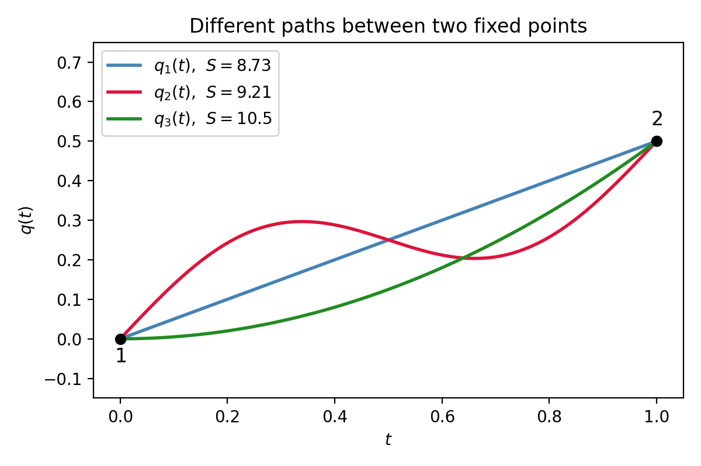
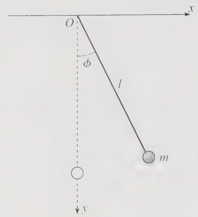
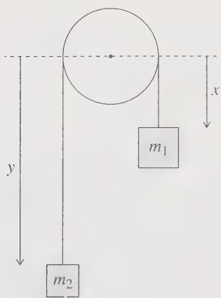
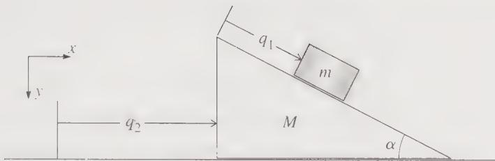

# Lagrangian Mechanics

**Reading material:** Chapter 7 of *Classical Mechanics* by John R. Taylor

## Table of Contents

1. [Mathematical Spaces](#1-mathematical-spaces)
   - [1.1 Physical Space](#11-physical-space)
   - [1.2 Configuration Space](#12-configuration-space)
   - [1.3 Phase Space](#13-phase-space)
2. [Hamilton's Principle](#2-hamiltons-principle)
3. [Action](#3-action)
4. [Derivation of the Euler–Lagrange Equation](#4-derivation-of-the-eulerlagrange-equation)
5. [Comments on the Hamilton's Principle](#5-comments-on-the-hamiltons-principle)
   - [5.1 Fixed but Arbitrary Endpoints](#51-fixed-but-arbitrary-endpoints)
   - [5.2 Euler–Lagrange Equation as a Local Condition](#52-eulerlagrange-equation-as-a-local-condition)
   - [5.3 Global vs. Local Uniqueness](#53-global-vs-local-uniqueness)
   - [5.4 Why $L=T-V$?](#54-whyltv)
6. [Multi-Dimensional Configuration Space](#6-multi-dimensional-configuration-space)
7. [Examples](#7-examples)
   - [7.1 Polar Coordinates](#71-polar-coordinates)
   - [7.2 Simple Pendulum](#72-simple-pendulum)
   - [7.3 Atwood Machine](#73-atwood-machine)
   - [7.4 Block Sliding on a Movable Wedge](#74-block-sliding-on-a-movable-wedge)

---

## 1. Mathematical Spaces

Before we develop the formalism, it is helpful to be clear about the mathematical spaces in which the various quantities live.

------

### 1.1 Physical Space

For ordinary nonrelativistic mechanics, the **physical space** in which particles are located is modeled as three-dimensional Euclidean space $\mathbb{R}^3$.

For a single particle, its **position** is represented by a vector

$$
\mathbf r \in \mathbb{R}^3,
$$

and its **momentum** is represented by another vector

$$
\mathbf p \in \mathbb{R}^3.
$$

Thus, for each particle, position and momentum are separate vector quantities, each with three components.

------

### 1.2 Configuration Space

For a system of $N$ particles, specifying the **configuration** means specifying **the position of every particle**.

If the particles have positions

$$
\mathbf r_1,\mathbf r_2,\dots,\mathbf r_N \in \mathbb{R}^3,
$$

then a complete configuration is obtained by collecting all of these position vectors together in a single ordered list:

$$
q = (\mathbf r_1,\mathbf r_2,\dots,\mathbf r_N).
$$

Each position vector $\mathbf r_\alpha$ has three components $(x_\alpha, y_\alpha, z_\alpha)$.  Putting all $N$ particles together gives a grand list of $3N$ numbers:

$$
(x_1, y_1, z_1,\; x_2, y_2, z_2,\; \dots,\; x_N, y_N, z_N).
$$

This is simply the familiar idea of "coordinates," but now we have $3N$ of them instead of just three.  

The collection of all possible such lists forms a $3N$-dimensional space called the **configuration space** of the system.

Each point in configuration space encodes the positions of **all** $N$ particles in physical space.The time evolution of the system is therefore represented by a path

$$
q(t) \in \mathbb{R}^{3N}.
$$

Equivalently,

$$
q(t)=\bigl(\mathbf r_1(t),\mathbf r_2(t),\dots,\mathbf r_N(t)\bigr) = (x_1(t), y_1(t), z_1(t),\; x_2(t), y_2(t), z_2(t),\; \dots,\; x_N(t), y_N(t), z_N(t)).
$$

So instead of tracking $N$ separate position vectors in $\mathbb{R}^3$, we may **track one point moving in the higher-dimensional configuration space**.

At this point, we are still using Cartesian coordinates to label the configuration. We may also replace these Cartesian coordinates by a different set of coordinates, called **generalized coordinates**:
\[
q(t) =(q_1,q_2,\dots,q_{3N}).
\]
These generalized coordinates are simply another way of labeling the same $3N$-dimensional configuration space.

>For one unconstrained particle in three dimensions, the generalized coordinates could be chosen as either
>
>$(q_1,q_2,q_3)=(x,y,z)$
>
>or
>
>$(q_1,q_2,q_3)=(r,\theta,\phi).$
>
>The choice of generalized coordinates is often made based on convenience and symmetry.

------

### 1.3 Phase Space

Configuration space records only the positions of the particles.  To specify the **complete mechanical state** of a system in Hamiltonian mechanics, one must also specify the momenta.

For $N$ particles, the momenta are

$$
\mathbf p_1,\mathbf p_2,\dots,\mathbf p_N \in \mathbb{R}^3.
$$

The complete state is therefore

$$
(q,p) = (\mathbf r_1,\dots,\mathbf r_N,\mathbf p_1,\dots,\mathbf p_N).
$$

This is an element of

$$
\mathbb{R}^{3N}\times \mathbb{R}^{3N} \cong \mathbb{R}^{6N}.
$$

This $6N$-dimensional space is called the **phase space**.

A point in phase space specifies both:

$$
\text{positions} + \text{momenta}.
$$

In Hamiltonian mechanics, $q$ and $p$ are treated as independent coordinates on phase space.  

------

## 2. Hamilton's Principle

Lagrangian mechanics is based on the **principle of stationary action**, also known as **Hamilton's principle**.

Informally, this principle is often summarized as “nature is economical” or “nature minimizes action.” More precisely:

| The actual path followed by a system between two fixed configurations at fixed initial and final times makes the action \(S\) stationary. |
| ------------------------------------------------------------ |

The **action** is defined by

$$
S[q] = \int_{t_i}^{t_f} L(q,\dot q,t)\,dt,
$$

where:

- $q(t)$ is a path in configuration space, $q(t) =(q_1(t),q_2(t),\dots,q_{3N}(t))$
- $\dot q(t)$ is the generalized velocity along that path, $\dot q(t) =(\dot q_1(t),\dot q_2(t),\dots,\dot q_{3N}(t))$
- $L(q,\dot q,t)$ is the **Lagrangian**,
- $t_i$ and $t_f$ are fixed initial and final times.

For many elementary mechanical systems,

$$
L = T - V,
$$

where $T$ is **kinetic energy** and $V$ is **potential energy**.

Hamilton's principle states that the physical path satisfies

$$
\delta S = 0.
$$

This means the action is **stationary**, not necessarily minimal.  A stationary value may be a minimum, a maximum, or a saddle point of the action functional.  In many mechanical situations, especially over sufficiently short time intervals, the stationary action is a local minimum. This is why the principle is often informally called the **principle of least action**.

------

## 3. Action

The action assigns a number to each possible path (represented by a function) in configuration space. Therefore, it is a **functional**.

A path $q(t)$ is mapped to a real number:

\[
q(t) \longmapsto S[q] \in \mathbb{R}.
\]

Explicitly,

\[
S[q]=\int_{t_i}^{t_f} L(q,\dot q,t)\,dt.
\]

The **units of action are energy multiplied by time**:

\[
[S]=[E][t]=\mathrm{J}\cdot\mathrm{s}
=\frac{\mathrm{kg}\,\mathrm{m}^2}{\mathrm{s}}.
\]

Different paths between the same endpoints generally have different action values. For example,

\[
S[q_1(t)] = 8.73, \qquad
S[q_2(t)] = 9.21, \qquad
S[q_3(t)] = 10.5.
\]

**Figure 1**: Three possible paths connecting the same initial point 1 and final point 2. Each path yields a different value of the action $S[q]$.

To understand how $S[q]$ is computed in principle, it is useful to use a **discrete approximation**. Divide the time interval $[t_i,t_f]$ into small intervals of size $\Delta t$, with $t_k=t_i+k\Delta t$. Along a proposed path $q(t)$, define $q_k=q(t_k).$

We approximate the velocity on the interval $[t_k,t_{k+1}]$ by
\[
\dot q_k \approx \frac{q_{k+1}-q_k}{\Delta t}.
\]
This does **not** mean that the true velocity is exactly constant during the interval. We use $\dot q_k$ as a representative value for the velocity over the $k$-th interval. Then the Lagrangian on that interval is approximated by a representative value, for example
\[
L_k = L(q_k,\dot q_k,t_k).
\]
Therefore the action is approximated by
\[
S[q]\approx \sum_k L(q_k,\dot q_k,t_k)\Delta t.
\]
As $\Delta t$ becomes smaller, this approximation becomes more accurate.  In the limit where the time intervals become infinitesimally small, this sum becomes the integral
\[
S[q]=\lim_{\Delta t\to 0}\sum_{k=0}^{N-1}L(q_k,\dot q_k,t_k)\,\Delta t
=\int_{t_i}^{t_f}L(q,\dot q,t)\,dt.
\]

This discrete picture helps clarify the meaning of the action: for every possible path, **we sample the path at many times, compute the Lagrangian at each sample, multiply by the small time interval, and add all contributions together.** However, when our goal is to find the actual path, **we usually do not  compute $S[q]$** separately for many trial paths. Instead, we vary the path symbolically and impose the stationary-action condition $\delta S = 0,$ which leads to the Euler-Lagrange equations.

------

## 4. Derivation of the Euler–Lagrange Equation

Consider a system described by a **single configuration variable** $q(t)$; that is, $q(t)$ has only one component. The multidimensional case is obtained by applying the same argument to each generalized coordinate.

Let the physical path be $q(t)$.  We compare it with nearby paths of the form

$$
q_\alpha(t)=q(t)+\alpha \eta(t),
$$

where:

- $\alpha$ is a real parameter,
- $\eta(t)$ is an arbitrary smooth variation,
- the endpoints are fixed, so

$$
\eta(t_i)=\eta(t_f)=0.
$$

The corresponding velocity is

$$
\dot q_\alpha(t)=\dot q(t)+\alpha \dot\eta(t).
$$

The action evaluated on the varied path is

$$
S[\alpha] = \int_{t_i}^{t_f} L(q+\alpha\eta,\dot q+\alpha\dot\eta,t)\,dt.
$$

The physical path makes the action stationary, so

$$
\left.\frac{dS[\alpha]}{d\alpha}\right|_{\alpha=0}=0.
$$

Differentiating under the integral sign gives

$$
\left.\frac{dS[\alpha]}{d\alpha}\right|_{\alpha=0} = \int_{t_i}^{t_f} \left[ \frac{\partial L}{\partial q}\eta + \frac{\partial L}{\partial \dot q}\dot\eta \right]dt.
$$

Therefore, stationarity requires

$$
\int_{t_i}^{t_f} \left[ \frac{\partial L}{\partial q}\eta + \frac{\partial L}{\partial \dot q}\dot\eta \right]dt =0.
$$

Now integrate the second term by parts:

$$
\int_{t_i}^{t_f} \frac{\partial L}{\partial \dot q}\dot\eta\,dt = \left. \eta\frac{\partial L}{\partial \dot q} \right|_{t_i}^{t_f} - \int_{t_i}^{t_f} \eta \frac{d}{dt} \left( \frac{\partial L}{\partial \dot q} \right)dt.
$$

Because $\eta(t_i)=\eta(t_f)=0$, the boundary term vanishes:

$$
\left. \eta\frac{\partial L}{\partial \dot q} \right|_{t_i}^{t_f} =0.
$$

Thus,

$$
\int_{t_i}^{t_f} \frac{\partial L}{\partial \dot q}\dot\eta\,dt = - \int_{t_i}^{t_f} \eta \frac{d}{dt} \left( \frac{\partial L}{\partial \dot q} \right)dt.
$$

Substituting this into the stationarity condition gives

$$
\int_{t_i}^{t_f} \left[ \frac{\partial L}{\partial q} - \frac{d}{dt} \left( \frac{\partial L}{\partial \dot q} \right) \right]\eta(t)\,dt =0.
$$

Since $\eta(t)$ is arbitrary except for vanishing at the endpoints, the fundamental lemma of the calculus of variations implies

$$
\frac{\partial L}{\partial q} - \frac{d}{dt} \left( \frac{\partial L}{\partial \dot q} \right) =0.
$$

Equivalently,

$$
\boxed{ \frac{d}{dt} \left( \frac{\partial L}{\partial \dot q} \right) - \frac{\partial L}{\partial q} =0 }
$$

This is the **Euler–Lagrange equation**.

> **Note.** The two sign conventions are identical up to multiplication by $-1$.  In mechanics one often sees $\partial L/\partial q = \frac{d}{dt}(\partial L/\partial \dot q)$; in field theory the opposite sign is common.  Both are correct.

------

## 5. Comments on the Hamilton's Principle

------

### 5.1 Fixed but Arbitrary Endpoints

At first, Hamilton’s principle can feel confusing. We say that the initial and final configurations are fixed:

$q(t_i)=q_i, \qquad q(t_f)=q_f.$

But then a natural question arises:

> If we already know the configuration at the final time $t_f$, why do we need to derive the equation of motion? Doesn’t knowing the final point already tell us where the system goes?

The key point is that fixing the endpoints in the variational problem is not the same as knowing the full motion of the system. The endpoints only specify where the path begins and where it ends. They do not specify how the system moves **between** those two times. 

The endpoints are **fixed** during a particular variational problem.

They are **arbitrary** because their values are not special. We may choose any endpoint configurations $q_i$ and $q_f$, and the same derivation works.

Therefore:

$$
\boxed{
\text{fixed during the variation, arbitrary in their choice}
}
$$

Because the endpoints were arbitrary, the resulting equation of motion is not tied to a particular pair of endpoints.

------

### 5.2 Euler–Lagrange Equation as a Local Condition

Hamilton’s principle leads to the Euler--Lagrange equation: $\frac{d}{dt} \left( \frac{\partial L}{\partial \dot q} \right) - \frac{\partial L}{\partial q} =0$

This is a **local differential equation**: it must hold at each time along the physical path. Therefore, when we use the equation to predict motion, we do **not** need to know the final configuration in advance.

The logical structure is:

$\boxed{ \text{stationary action with fixed endpoints} \Longrightarrow \text{Euler--Lagrange equation} \Longrightarrow \text{initial conditions determine the trajectory} }$

> **Endpoints unreachable from the chosen initial point under the given physical conditions are generally excluded**. Fixing endpoints does not mean the future motion is known; it is a **device** for deriving a local equation along a physical segment. 

------

### 5.3 Global vs. Local Uniqueness

Does Hamilton’s principle imply that there is  **only one** path between two given endpoints? 

The answer depends on whether the problem is formulated **locally** as an **initial-value problem**, or **globally** as a **boundary-value problem** over a finite time interval.

#### Initial conditions guarantee local uniqueness

The Euler–Lagrange equation is a second-order ordinary differential equation for $q(t)$. Under standard regularity conditions on the Lagrangian, for example, smoothness of $L$ and non-degeneracy of the Hessian $\partial^2 L/\partial \dot q^2$, the standard existence and uniqueness theorem for ODEs applies. Thus,

$\boxed{ \text{given } q(t_i) \text{ and } \dot q(t_i), \text{ there exists a unique solution locally in time.} }$

This is the **initial-value problem**. The state at one instant, specified by position and velocity, determines a unique trajectory, at least for a **sufficiently short time interval**. In this sense, **a given initial condition selects a unique physical path locally in time**.

#### Fixed endpoints do not necessarily guarantee global uniqueness

Hamilton’s principle is formulated as a **boundary-value problem**: we fix $q(t_i)$ and $q(t_f)$, and ask for paths connecting these endpoints that make the action stationary. 

**The endpoint velocities are not fixed**. Therefore, different stationary paths, if they exist, may correspond to different initial velocities and hence to different conserved energies.

We can use the harmonic oscillator to illustrate the difference between initial-value and boundary-value formulations. For a harmonic oscillator with angular frequency $\omega$, the general solution is

$q(t)=A\cos\omega(t-t_i)+B\sin\omega(t-t_i).$

The initial position fixes $A=q(t_i)$, while the final position gives

$q(t_f)=q(t_i)\cos\omega\tau+B\sin\omega\tau, \qquad \tau=t_f-t_i.$

If $\sin\omega\tau\neq 0$, this equation uniquely determines $B$, and hence uniquely determines the trajectory. 

But if $\sin\omega\tau=0$ (for example, $\tau=nT=n\frac{2\pi}{\omega}$), the final position is constrained to be

$q(t_f)=q(t_i)\cos\omega\tau = \pm q(t_i) .$ 

In this special case,  there can be a one-parameter family of solutions, because $B$, equivalently the initial velocity, remains undetermined.  

> For example, take
>
> $q(t_i)=0, \qquad q(t_f)=0, \qquad \tau = t_f-t_i = T=\frac{2\pi}{\omega}.$
>
> Then a solution of the form
>
> $q(t)=B\sin\omega(t-t_i)$
>
> satisfies
>
> $q(t_f)=B\sin\omega(t_f-t_i)=B\sin(2\pi)=0.$
>
> Thus the endpoint condition $q(t_f)=0$ holds for any value of $B$. Therefore, infinitely many classical paths connect the same two endpoints.

If we decide to choose two endpoints arbitrarily, Hamilton’s principle does not guarantee that a classical solution connecting them exists.

> For example, for the harmonic oscillator, the following endpoint conditions are incompatible:
>
> $q(t_i)=0, \qquad q(t_f)=1, \qquad \tau=t_f-t_i=T=\frac{2\pi}{\omega}.$
>
> Indeed, after one full period $T$, any harmonic-oscillator trajectory must return to its initial position. Hence $q(t_f)=q(t_i)$, so the above boundary conditions cannot be satisfied.

In summary, the Euler–Lagrange equation is a **local differential equation** for the physical path. Once the initial position and initial velocity, $(q(t_i),\dot q(t_i))$, are specified, the trajectory is **locally unique** under standard regularity assumptions.

Hamilton’s principle is naturally formulated as a **boundary-value problem**: the endpoints $(q(t_i),q(t_f))$ are fixed, and one searches for stationary paths connecting them. Such paths may be unique, multiple, or nonexistent, especially over long time intervals or for special choices of the elapsed time. This is not a flaw; it reflects that knowing only the initial and final positions does not, in general, uniquely determine the full dynamical history.

------

## 5.4 Why $L=T-V$?

### 5.4.1 A Practical Justification: Recovering Newton’s Laws

The question **“Why is the Lagrangian $L=T-V$?”** is actually subtle. At this stage, a practical justification is that **this choice gives the correct equations of motion**.

More specifically, when $L=T-V$ is substituted into the Euler--Lagrange equations, we recover Newton’s second law for systems with conservative forces: $m\ddot q = F.$

In this sense, the choice $L=T-V$ is justified because it reproduces known Newtonian physics.

------

### 5.4.2 A Deeper View: Action and Proper Time

However, this is not the deepest explanation. A more fundamental origin of the action principle appears in **relativity**.

In **special relativity**, the action for a **free massive particle** is proportional to the **proper time** (固有时间) along its worldline (世界线):
\[
S \propto \int d\tau.
\]
**The physical path is the path that makes this proper time stationary**.

Proper time is important because it is **Lorentz invariant**:

- different inertial observers may disagree about  time;
- different inertial observers may disagree about distances;
- but **all** inertial observers agree on the proper time along a given worldline.

In the low-speed limit, $v\ll c$, this relativistic proper-time action reduces, up to an irrelevant constant, to the ordinary free-particle Lagrangian: $L=T$.

Thus, the familiar nonrelativistic expression $L=T$ for a free particle can be viewed as the **low-speed limit of a more fundamental relativistic action**.

------

### 5.4.3 Where Does the $-V$ Come From?

To understand the potential-energy term $-V$ more deeply, one can look toward more fundamental theories.

For gravity, **general relativity** provides a deeper interpretation:

- gravity affects spacetime geometry;
- spacetime geometry affects proper time;
- the motion of a particle can again be described by stationary proper time.

In the appropriate limit, this leads to the appearance of a gravitational potential term in the nonrelativistic Lagrangian: $L=T-V$. We will not go into the details here.

------

### 5.4.4 The Main Idea: A Dynamical Balance

For now, the important idea is that the Lagrangian encodes a balance:

- $T$ describes motion and inertia;
- $V$ describes how the environment influences the particle;
- the combination $T-V$ gives the correct dynamical balance.

The actual path is not found by separately minimizing $T$ or $V$. Instead, the actual path makes the action stationary: $\delta S=0.$

------

### 5.4.5 Final Comment: Why Stationary Action?

Our starting point in this course is the **principle of stationary action**. If one asks why nature obeys this principle at all, that is an even deeper question. For now, the most honest answer is:

| The stationary action principle is one of the fundamental organizing principles of physics, and we build physical theories based on it. |
| ------------------------------------------------------------ |

------

## 6. Multi-Dimensional Configuration Space

In general, the configuration variable has several components. Write
\[
q(t)=\bigl(q_1(t),q_2(t),\dots,q_n(t)\bigr),
\]
where $n$ is the dimension of the configuration space.

For $N$ unconstrained particles in three-dimensional physical space, $n=3N.$

The Lagrangian is then a function $L(q_1,\dots,q_n,\dot q_1,\dots,\dot q_n,t).$

Applying the same variational argument to each coordinate gives one Euler--Lagrange equation for each generalized coordinate:
\[
\boxed{ \frac{d}{dt}\left(\frac{\partial L}{\partial \dot q_k}\right) -\frac{\partial L}{\partial q_k} =0, \qquad k=1,\dots,n. }
\]

Equivalently,
\[
\boxed{ \frac{\partial L}{\partial q_k} -\frac{d}{dt}\left(\frac{\partial L}{\partial \dot q_k}\right) =0, \qquad k=1,\dots,n. }
\]
The two forms are identical up to multiplication by $-1$.

------

## 7. Examples

The following examples illustrate how to apply the Lagrangian formalism to concrete mechanical systems. **For now, we will not focus on why the Euler–Lagrange equations are applicable to constrained systems.** We will simply use the fact that they are applicable and return to the theoretical justification more carefully later.

The reason for presenting these examples **before** developing the full theoretical foundation is to **build intuition and confidence**. By working through several systems explicitly, we will see that the Euler–Lagrange equations not only reproduce the correct equations of motion, but also provide a powerful and systematic way to handle constrained motion.

In each example, we will follow the same basic recipe:

1. **Choose a set of generalized coordinates** that describe the configuration of the system, typically chosen so that the constraints are already built in **implicitly**. For example, instead of using Cartesian coordinates, such as $(x,y,z)$, which may **describe more positions than the system can actually access**, we often choose coordinates that automatically incorporate the constraints from the beginning. These are what we will call **generalized coordinates**. For now, we use this idea intuitively; a more formal definition of generalized coordinates will be given later.

2. **Express the kinetic energy** $T$ in terms of these generalized coordinates and their time derivatives.

3. **Express the potential energy** $V$ in terms of the generalized coordinates.

4. **Form the Lagrangian**

   $L=T-V.$

5. **Apply the Euler--Lagrange equation** to each generalized coordinate:

   $\frac{d}{dt} \left( \frac{\partial L}{\partial \dot q_i} \right) - \frac{\partial L}{\partial q_i} = 0.$

This procedure may feel mechanical (机械) at first, but that is part of its power: once the correct coordinates and energies are written down, the equations of motion follow systematically.

------

### 7.1 Particle moving in a plane

Consider a particle of mass $m$ moving in a plane. We can describe its position using Cartesian coordinates $(x, y)$ or polar coordinates $(r, \phi)$. **The Lagrangian formalism applies in exactly the same way to either choice: the *form* of the Euler–Lagrange equation does not depend on which coordinates we use**.

**Cartesian coordinates**

In Cartesian coordinates $(x, y)$, the kinetic energy is

$$
T = \frac{1}{2}m(\dot x^2 + \dot y^2).
$$

With potential energy $V(x, y)$, the Lagrangian is

$$
L(x, y, \dot x, \dot y) = \frac{1}{2}m(\dot x^2 + \dot y^2) - V(x, y).
$$

Applying the Euler–Lagrange equation to each coordinate gives

$$
\frac{d}{dt}\left(\frac{\partial L}{\partial \dot x}\right) - \frac{\partial L}{\partial x} = 0
\;\Longrightarrow\;
m\ddot x = -\frac{\partial V}{\partial x},
$$

and

$$
\frac{d}{dt}\left(\frac{\partial L}{\partial \dot y}\right) - \frac{\partial L}{\partial y} = 0
\;\Longrightarrow\;
m\ddot y = -\frac{\partial V}{\partial y}.
$$

These are simply Newton's second law in component form.  Notice that the *template* is identical for both coordinates:

$$
\boxed{ \frac{d}{dt}\left(\frac{\partial L}{\partial \dot q_k}\right) - \frac{\partial L}{\partial q_k} = 0, \qquad q_k \in \{x, y\}. }
$$

**Polar coordinates**

Now use polar coordinates $(r, \phi)$, related to $(x, y)$ by $x = r\cos\phi$ and $y = r\sin\phi$.  The kinetic energy becomes

$$
T = \frac{1}{2}m(\dot r^2 + r^2\dot\phi^2),
$$

and the Lagrangian is

$$
L(r, \phi, \dot r, \dot\phi) = \frac{1}{2}m(\dot r^2 + r^2\dot\phi^2) - V(r, \phi).
$$

We apply the *same* Euler–Lagrange template, now with $q_k \in \{r, \phi\}$.

**The $r$ equation:**

$$
\frac{d}{dt}\left(\frac{\partial L}{\partial \dot r}\right) - \frac{\partial L}{\partial r} = 0
\;\Longrightarrow\;
m\ddot r = mr\dot\phi^2 - \frac{\partial V}{\partial r},
$$

which is the radial component of $\mathbf F = m\mathbf a$.

**The $\phi$ equation:**

$$
\frac{d}{dt}\left(\frac{\partial L}{\partial \dot\phi}\right) - \frac{\partial L}{\partial \phi} = 0
\;\Longrightarrow\;
\frac{d}{dt}(mr^2\dot\phi) = m(2r\dot r\dot\phi+r^2\ddot\phi) = -\frac{\partial V}{\partial \phi}.
$$

If $V$ depends only on $r$, then $\partial V/\partial\phi = 0$ and $mr^2\dot\phi$ — the **angular momentum** — is conserved.

**Recover the tangential component of acceleration in polar coordinates:**

It is important to note that

$$
-\frac{\partial V}{\partial \phi}=\tau = rF_\phi,
$$

which is the **torque $\tau$** about the origin. Therefore, from the $\phi$-equation,

$$
rF_\phi
=
m\left(2r\dot r\dot\phi+r^2\ddot\phi\right).
$$

Dividing both sides by $r$, we get

$$
F_\phi
=
m\left(2\dot r\dot\phi+r\ddot\phi\right).
$$

Since $F_\phi=ma_\phi$, it follows that

$$
ma_\phi
=
m\left(2\dot r\dot\phi+r\ddot\phi\right).
$$

Canceling $m$,

$$
a_\phi
=
2\dot r\dot\phi+r\ddot\phi.
$$

Thus we recover the tangential component of acceleration in polar coordinates:

$$
\boxed{
a_\phi
=
r\ddot\phi+2\dot r\dot\phi
}
$$

> The reason $-\partial V/\partial \phi$ gives torque instead of force is that $\phi$ is an angular coordinate. A small angular displacement $d\phi$ corresponds to a physical arc length $ds = r\,d\phi$. The work done by the tangential force is
>
> $$
> dW = F_\phi ds = F_\phi r\,d\phi.
> $$
>
> But for a conservative force,
>
> $$
> dW = -dV.
> $$
>
> If only $\phi$ changes, then
>
> $$
> dV = \frac{\partial V}{\partial \phi}d\phi.
> $$
>
> Therefore,
>
> $$
> F_\phi r\,d\phi
> =
> -\frac{\partial V}{\partial \phi}d\phi.
> $$
>
> Canceling $d\phi$,
>
> $$
> \boxed{
> rF_\phi = -\frac{\partial V}{\partial \phi}
> }
> $$
>
> so the generalized force conjugate to the angular coordinate $\phi$ is the torque, not the force itself.

> **Key observation.** Whether we use $(x, y)$ or $(r, \phi)$, the Euler–Lagrange equations keep exactly the same form:
> $$
> \frac{d}{dt}\left(\frac{\partial L}{\partial \dot q_k}\right) - \frac{\partial L}{\partial q_k} = 0.
> $$
> The only thing that changes is the set of generalized coordinates $q_k$.  The equations look more complicated in polar coordinates because the kinetic energy has a more involved dependence on $r$ and $\dot\phi$, but the underlying machinery is unchanged.  This **form invariance** is one of the central strengths of the Lagrangian formalism; we will discuss it more systematically later.

------

### 7.2 Simple Pendulum

A bob of mass $m$ is attached to a massless rod of length $l$ pivoted at a fixed point.  The system has one degree of freedom.

  
**Figure 2** A simple pendulum. The bob of mass $m$ is constrained by the rod to remain at distance $l$ from O.

Using the angle $\phi$ measured from the vertical as generalized coordinate,

$$
x = l\sin\phi, \qquad y = -l\cos\phi,
$$

so the kinetic energy is

$$
T = \frac{1}{2}ml^2\dot\phi^2,
$$

and the potential energy (taking the pivot height as reference) is

$$
V = -mgl\cos\phi.
$$

The Lagrangian is

$$
L = \frac{1}{2}ml^2\dot\phi^2 + mgl\cos\phi.
$$

The Euler–Lagrange equation gives

$$
- mgl\sin\phi = \frac{d}{dt}(ml^2\dot\phi) = ml^2\ddot\phi,
$$

or

$$
\boxed{ \ddot\phi + \frac{g}{l}\sin\phi = 0, }
$$

the familiar pendulum equation.  The tension in the rod never appeared.

------

### 7.3 Atwood Machine

Two masses $m_1$ and $m_2$ are connected by a light inextensible string of fixed length passing over a frictionless pulley.

  
**Figure 3** An Atwood machine consisting of two masses, $m_1$ and $m_2$, suspended by a massless inextensible string that passes over a massless, frictionless pulley of radius $R$. Because the string's length is fixed, the position of the whole system can be specified by a single variable, which we can take to be the distance $x$.

Because the string length is constant,

$$
x + y = \text{const},
$$

where $x$ and $y$ measure the vertical positions of the masses.  Choosing $x$ as the single generalized coordinate gives $\dot y = -\dot x$.

The kinetic energy is

$$
T = \frac{1}{2}m_1\dot x^2 + \frac{1}{2}m_2\dot y^2 = \frac{1}{2}(m_1+m_2)\dot x^2,
$$

and the potential energy is

$$
V = -m_1gx - m_2gy = -(m_1-m_2)gx + \text{const}.
$$

Dropping the constant, the Lagrangian is

$$
L = \frac{1}{2}(m_1+m_2)\dot x^2 + (m_1-m_2)gx.
$$

The Euler–Lagrange equation yields

$$
(m_1-m_2)g = (m_1+m_2)\ddot x,
$$

so

$$
\boxed{ \ddot x = \frac{m_1-m_2}{m_1+m_2}g. }
$$

Again, the unknown tension (a force of constraint) never appears in the Lagrangian derivation.

------

### 7.4 Block Sliding on a Movable Wedge

A block of mass $m$ slides on a frictionless wedge of mass $M$, which itself slides without friction on a horizontal table.  The wedge has angle $\alpha$.

  
*Figure 7.8 A block of mass $m$ slides down a wedge of mass $M$, which is free to slide over the horizontal table.*

Choose $q_1$ as the distance of the block down the slope and $q_2$ as the horizontal position of the wedge.  The velocity of the block relative to the inertial table is the vector sum of its velocity down the wedge and the wedge's horizontal velocity:

$$
\mathbf v_m = (\dot q_1\cos\alpha + \dot q_2,\; \dot q_1\sin\alpha).
$$

The kinetic energies are

$$
T_M = \frac{1}{2}M\dot q_2^2, \qquad
T_m = \frac{1}{2}m(\dot q_1^2 + \dot q_2^2 + 2\dot q_1\dot q_2\cos\alpha).
$$

Total kinetic energy:

$$
T = \frac{1}{2}(M+m)\dot q_2^2 + \frac{1}{2}m(\dot q_1^2 + 2\dot q_1\dot q_2\cos\alpha).
$$

Taking the table level as the reference for potential energy,

$$
V = -mgq_1\sin\alpha.
$$

The Lagrangian is

$$
L = \frac{1}{2}(M+m)\dot q_2^2 + \frac{1}{2}m(\dot q_1^2 + 2\dot q_1\dot q_2\cos\alpha) + mgq_1\sin\alpha.
$$

Because $L$ is independent of $q_2$, the corresponding generalized momentum is conserved:

$$
(M+m)\dot q_2 + m\dot q_1\cos\alpha = \text{const},
$$

which is the total horizontal momentum.  The $q_1$ equation gives

$$
mg\sin\alpha = m(\ddot q_1 + \ddot q_2\cos\alpha).
$$

Differentiating the momentum equation to eliminate $\ddot q_2$ yields

$$
\boxed{ \ddot q_1 = \frac{g\sin\alpha}{1 - \frac{m\cos^2\alpha}{M+m}}. }
$$

------

