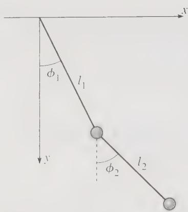
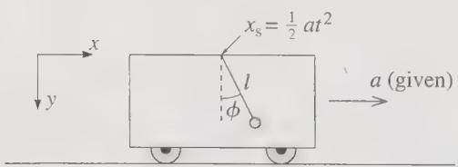

# Lagrangian Mechanics (Part B)

**Reading material:** Chapter 7 of *Classical Mechanics* by John R. Taylor; Chapters 1–2 of *Classical Mechanics* by Goldstein, Poole, Safko

## Table of Contents

1. [Generalized Coordinates and Constrained Systems](#8-generalized-coordinates-and-constrained-systems)
   - [8.1 Classification of Constraints](#81-classification-of-constraints)
   - [8.2 Generalized Coordinates](#82-generalized-coordinates)
   - [8.3 The Lagrangian in Generalized Coordinates](#83-the-lagrangian-in-generalized-coordinates)
   - [8.4 Form Invariance of the Euler–Lagrange Equations](#84-form-invariance-of-the-eulerlagrange-equations)
   - [8.5 Lagrange Multipliers](#85-lagrange-multipliers)

---

## 8. Generalized Coordinates and Constrained Systems

Perhaps the greatest advantage of the Lagrangian approach is that it can handle systems that are **constrained**. 

A familiar example is a bead threaded on a wire: the bead can move along the wire, but not anywhere else. 

Another example is a rigid body, whose individual atoms can only move in such a way that the distance between any two atoms is fixed. 

For a system of $N$ particles, a complete unconstrained configuration requires $3N$ Cartesian coordinates; **constraints can reduce this number**.

------

### 8.1 Classification of Constraints

The **number of degrees of freedom** of a system is the number of coordinates that can be **independently varied** in a small displacement, or namely, the number of independent "directions" in which the system can move from any given initial configuration.

| System | Cartesian coordinates | Degrees of freedom |
|--------|----------------------|-------------------|
| Particle in 3D | 3 | 3 |
| Gas of $N$ particles | $3N$ | $3N$ |
| Simple pendulum | 2 | 1 |
| Double pendulum | 4 | 2 |
| Rigid body | $3N$ | 6 |

When the number of degrees of freedom is less than $3N$, the system is **constrained**. The particles in a rigid body are certainly constrained: although $N$ may be of order $10^{23}$, only six generalized coordinates are needed (three for the center of mass and three for orientation).

> A **particle trapped inside a box** is a useful example to show that the word "constraint" does **not always mean reducing the number of degrees of freedom**.

#### 8.1.1 Holonomic constraints 完整约束

If the conditions of constraint can be expressed as **equations** relating the coordinates of the particles, and possibly time, in the form

$$
f(\mathbf r_1, \mathbf r_2, \dots, \mathbf r_N, t) = 0,
$$

then the constraints are said to be **holonomic**. The simplest example is a rigid body, where the constraints are expressed by equations of the form

$$
(\mathbf r_i - \mathbf r_j)^2 - c_{ij}^2 = 0,
$$

fixing the distance between every pair of particles. 

A particle constrained to move along a given curve or on a given surface is another obvious example of a holonomic constraint, with the equations defining the curve or surface acting as the equations of constraint. For example, a particle constrained to move on a sphere of radius $R$ satisfies

$$
f(x,y,z)=x^2+y^2+z^2-R^2=0.
$$

For a system of $N$ particles, free from constraints, there are $3N$ independent coordinates or degrees of freedom. If there exist $k$ holonomic constraints expressed in the form above, then we may use these equations to eliminate $k$ of the $3N$ coordinates, and we are left with $3N-k$ independent coordinates. In other words, the system has $3N-k$ degrees of freedom. This elimination of the dependent coordinates can be expressed by the introduction of new, independent variables $q_1, q_2, \dots, q_n$ (with $n = 3N-k$), which are the **generalized coordinates** we shall discuss in the next subsection.

> **Note on the Origin of “Holonomic”**
>
> The word **holonomic** comes from the Greek roots **holos** $(\text{whole, complete})$ and **nomos** $(\text{law})$. Thus, *holonomic* literally suggests something like “governed by a complete law.”
>
> The **holonomic** constraint imposes a complete relation among the coordinates.

------

#### 8.1.2 Rheonomous and Scleronomous Constraints（非定常约束与定常约束）

Constraints can also be classified according to whether the equations of constraint contain time as an explicit variable. 

If the constraint equations depend explicitly on time, the constraints are called **rheonomous constraints**（非定常约束）. 

If they do not depend explicitly on time, they are called **scleronomous constraints**（定常约束）.

A bead sliding on a rigid curved wire fixed in space is subject to a **scleronomous constraint**. If the wire moves in a prescribed way, then the constraint becomes **rheonomous**. However, if the wire moves only in response to the bead’s motion, the time dependence enters through the coordinates of the wire, which should then be included as part of the system coordinates. In that case, the overall constraint is still **scleronomous**.

> **Rheonomous** /riːˈɑːnəməs/
>
> **Scleronomous** /sklɪˈrɑːnəməs/

For a pendulum with a fixed pivot at the origin, the bob is constrained to remain a fixed distance $l$ from the pivot:

$$
x^2+y^2=l^2.
$$

This is **scleronomous** because time does not appear explicitly.

If the pivot 支点 is forced to oscillate horizontally with prescribed motion, the pivot position is

$$
(a\sin \omega t,\,0).
$$

The constraint becomes

$$
(x-a\sin \omega t)^2+y^2=l^2.
$$

This is **rheonomous** because the time dependence is prescribed explicitly.

If the pivot is free to move horizontally, its position is not prescribed in advance. It is treated as another dynamical coordinate.

The constraint can be written as

$$
(x-x’)^2+y^2=l^2.
$$

This is **scleronomous** because $x’$ is not a known function of time; it is determined by the system’s motion.

| Case                     | Constraint equation            | Type         |
| ------------------------ | ------------------------------ | ------------ |
| Fixed pivot              | $x^2+y^2=l^2$                  | Scleronomous |
| Forced oscillating pivot | $(x-a\sin \omega t)^2+y^2=l^2$ | Rheonomous   |
| Freely moving pivot      | $(x-x')^2+y^2=l^2$             | Scleronomous |

------

#### 8.1.3 Nonholonomic Constraints（非完整约束）

Constraints that cannot be expressed as equations involving only the coordinates, and possibly time, are called **nonholonomic constraints**.

A common source of nonholonomic constraints is an **inequality**. For example, the walls of a gas container restrict the particles to remain inside the box, so the constraint is not an equation of the form $f=0$. Similarly, a particle constrained to remain **outside or on** a solid sphere of radius $a$ satisfies $r^2-a^2 \ge 0,$ which is an inequality rather than a holonomic equation.

Another important class consists of **nonintegrable differential constraints**. These are **velocity constraints** that cannot be integrated into relations involving coordinates alone.  A standard example is a body **rolling** on a  surface **without slipping**. The rolling condition relates the translational motion of the contact point to the rotational motion of the body. Although it imposes a restriction on the motion, it cannot generally be written as a coordinate equation.

Consider a disk of radius $a$ rolling without slipping on the horizontal $xy$-plane, with its plane always vertical. A convenient set of coordinates is

$$
(x,y,\theta,\phi),
$$

where $(x,y)$ gives the position of the disk’s center, $\theta$ gives the direction of the axis of the disk relative to the $x$-axis, and $\phi$ is the rotation angle of the disk about its own axis.

>  The angle $\phi$ is necessary because rolling without slipping relates translation to rotation. The speed of the center must equal the rim speed $a\dot\phi$. Without $\phi$, one could not distinguish rolling from sliding. 

  
**Figure 1** Vertical disk rolling on a horizontal plane.

As a result of the constraint, the velocity of the center of the disk, $v$, has a magnitude proportional to $\dot\phi$,

$$
v = a\,\dot\phi,
$$

where $a$ is the radius of the disk, and its direction is perpendicular to the axis of the disk:

$$
\dot x = v\sin\theta, \qquad \dot y = -v\cos\theta.
$$

Combining these conditions, we have two differential equations of constraint:

$$
\begin{aligned}
dx - a\sin\theta\,d\phi &= 0, \\
dy + a\cos\theta\,d\phi &= 0.
\end{aligned}\tag{1.39}
$$

**These constraints cannot be integrated into equations involving only $x,y,\theta,\phi$.** In other words, there is no coordinate relation such as $F(x,y,\theta,\phi)=0$ that is equivalent to the rolling condition. Hence the constraints are nonholonomic. 

> The physical reason is simple: the disk may return to the same position and orientation $(x,y,\theta)$ after following different paths, such as rolling along circles of different radii, while accumulating different values of the rotation angle $\phi$. Thus, $\phi$ is path-dependent and cannot be determined solely from $(x,y,\theta)$.

> **1. 为什么需要引入自转角？** 为了表达“滚动而不滑动”，我们必须知道圆盘自身转过了多少角度。无滑动条件本质上说的是：圆盘中心向前移动的距离，必须等于圆盘边缘由于自转而滚过的距离。因此，我们不仅要知道圆盘中心在哪里、圆盘平面朝向哪里，还要知道圆盘自身到底转过了多少。如果不引入圆盘绕自身轴的转动角度，我们就无法描述圆盘边缘滚过了多少距离，也就无法判断圆盘是在真正滚动，还是在滑动。所以，这个自转角不是多余的变量，而是描述滚动运动所必需的变量。
>
> **2. 为什么无滑动约束是非完整约束？** 如果一个约束是完整约束，那么它应该能够写成某种只依赖当前构型的关系。也就是说，只要知道圆盘现在在哪里、朝向哪里、自己转到了哪个角度，就能判断这个构型是否满足约束，而不需要知道圆盘是怎样运动到这里的。但是滚动约束不是这样。圆盘可以沿不同路径运动，最后回到同一个出发位置，并且圆盘平面的朝向也和出发时一样。然而，由于不同路径的长度不同，圆盘自身累计转过的角度也可以不同。例如，圆盘可以沿一个较小的圆轨迹滚动一圈，也可以沿一个较大的圆轨迹滚动一圈。两种情况下，它都可能回到同一个出发点，并且朝向相同。但是因为走过的路程不同，圆盘自身转过的角度不同。**这说明圆盘的自转角记录了它沿路径滚动所积累的历史信息。它不是仅由当前的位置和朝向决定的，而是依赖于圆盘是沿哪条路径到达当前位置的。**
>
> **3. 非完整性的核心。** 换句话说，正是因为圆盘的自转角依赖于过去的运动历史，我们没有办法把无滑动条件写成一个只涉及当前构型变量的固定关系。如果可以这样写，那么这个约束就是路径无关的：圆盘当前的状态是否允许，只取决于它现在在哪里，而不取决于它之前怎么走。但滚动约束恰恰不是这样：**它要求每一步运动都满足没有滑动**，而最终累计出的自转角依赖于整个路径。因此，无滑动滚动约束不能化为单纯的坐标关系，而是一个非完整约束。

Thus, nonholonomic constraints may arise either from inequalities, such as boundary constraints, or from nonintegrable differential relations, such as rolling without slipping.

For systems with **holonomic constraints**, the constraint equations can be used to eliminate dependent coordinates. This reduces the number of independent variables, so such problems can be treated systematically using the standard Lagrange equations. For **nonholonomic constraints**, there is no equally general method. Each problem often requires special treatment. Therefore, unless stated otherwise, we will consider only **holonomic systems** from now on.

------

### 8.2 Generalized Coordinates

The parameters $q_1, \dots, q_n$ are called **generalized coordinates** for the system if each particle's position can be expressed as a function of the $q_i$ and possibly time:

$$
\mathbf r_\alpha = \mathbf r_\alpha(q_1, \dots, q_n, t), \qquad \alpha = 1, \dots, N,
$$

and conversely each $q_i$ can be expressed in terms of the positions:

$$
q_i = q_i(\mathbf r_1, \dots, \mathbf r_N, t), \qquad i = 1, \dots, n.
$$

**The number $n$ is the smallest number of parameters that describes the system completely**.

**Example: simple pendulum.** There is one particle and two Cartesian coordinates $(x,y)$. The constraint $x^2+y^2=l^2$ leaves one degree of freedom. Choosing the angle $\phi$ as generalized coordinate,

$$
\mathbf r \equiv (x,y) = (l\sin\phi,\; l\cos\phi).
$$

This expresses two Cartesian coordinates in terms of one generalized coordinate.

**Example: double pendulum.** The double pendulum has two bobs, both confined to a plane, so it has four Cartesian coordinates. These can be expressed in terms of two generalized coordinates $\phi_1$ and $\phi_2$:

$$
\mathbf r_1 = (l_1\sin\phi_1,\; l_1\cos\phi_1),
$$

$$
\mathbf r_2 = (l_1\sin\phi_1 + l_2\sin\phi_2,\; l_1\cos\phi_1 + l_2\cos\phi_2).
$$

Notice that $\mathbf r_2$ depends on both $\phi_1$ and $\phi_2$.

  
**Figure 2** The positions of both masses in a double pendulum are uniquely specified by the two generalized coordinates $\phi_1$ and $\phi_2$, which can themselves be varied independently.

Consider a pendulum suspended from the roof of a car that is being forced to accelerate with fixed acceleration $a$, as shown in Figure 3. The position of the bob relative to the ground is

$$
\mathbf r \equiv (x,y) = \bigl(l\sin\phi + \tfrac{1}{2}at^2,\; l\cos\phi\bigr) = \mathbf r(\phi,t).
$$

  
**Figure 3** A pendulum is suspended from the roof of a railroad car that is being forced to accelerate with a fixed, known acceleration $a$.

Here the relation between $\mathbf r$ and the generalized coordinate $\phi$ depends explicitly on $t$.

A set of coordinates is called **natural** (自然坐标) if the relation $\mathbf r_\alpha(q_1,\dots,q_n)$ between Cartesian and generalized coordinates does not involve time.  In such coordinates, the **kinetic energy** has especially simple properties; in particular, it is a **homogeneous quadratic function of the generalized velocities**. These properties do not generally hold when the transformation depends explicitly on time.

> Suppose the position of particle $\alpha$ is written in generalized coordinates as
>
> $\mathbf r_\alpha=\mathbf r_\alpha(q_1,\dots,q_n),$
>
> with no explicit time dependence. Then by the chain rule,
>
> $\dot{\mathbf r}_\alpha = \sum_i \frac{\partial \mathbf r_\alpha}{\partial q_i}\dot q_i .$
>
> The kinetic energy is
>
> $T = \frac12\sum_\alpha m_\alpha \dot{\mathbf r}_\alpha\cdot \dot{\mathbf r}_\alpha .$
>
> Substitute the expression for $\dot{\mathbf r}_\alpha$:
>
> $T = \frac12\sum_\alpha m_\alpha \left( \sum_i \frac{\partial \mathbf r_\alpha}{\partial q_i}\dot q_i \right) \cdot \left( \sum_j \frac{\partial \mathbf r_\alpha}{\partial q_j}\dot q_j \right).$
>
> Expanding the dot product gives
>
> $T = \frac12\sum_\alpha m_\alpha \sum_{i,j} \left( \frac{\partial \mathbf r_\alpha}{\partial q_i} \cdot \frac{\partial \mathbf r_\alpha}{\partial q_j} \right) \dot q_i\dot q_j .$
>
> Rearranging the sums,
>
> $T = \frac12 \sum_{i,j} \left[ \sum_\alpha m_\alpha \frac{\partial \mathbf r_\alpha}{\partial q_i} \cdot \frac{\partial \mathbf r_\alpha}{\partial q_j} \right] \dot q_i\dot q_j .$
>
> Therefore,
>
> $T= \frac12\sum_{i,j} a_{ij}(q)\dot q_i\dot q_j,$
>
> where
>
> $\boxed{ a_{ij}(q) = \sum_\alpha m_\alpha \frac{\partial \mathbf r_\alpha}{\partial q_i} \cdot \frac{\partial \mathbf r_\alpha}{\partial q_j} }$
>
> is the coefficient of the quadratic kinetic-energy form.
>
> So $a_{ij}(q)$ is essentially a **mass-weighted metric coefficient** in generalized coordinates. It depends only on the coordinates $q_i$, not on the velocities $\dot q_i$. Also, $a_{ij}=a_{ji},$ because the dot product is symmetric.
>
> If the transformation depends explicitly on time, then $\dot{\mathbf r}_\alpha = \sum_i \frac{\partial \mathbf r_\alpha}{\partial q_i}\dot q_i + \frac{\partial \mathbf r_\alpha}{\partial t},$ and the kinetic energy may contain terms linear in $\dot q_i$ and terms independent of $\dot q_i$. Thus the convenient quadratic form no longer generally applies.

------

### 8.3 The Lagrangian in Generalized Coordinates

The Lagrangian is defined as before,

$$
L = T - V,
$$

but now $T$ and $V$ must be expressed in terms of the chosen generalized coordinates and their velocities:

$$
L = L(q_1, \dots, q_n, \dot q_1, \dots, \dot q_n, t).
$$

One of the principal advantages of the Lagrangian formulation is that the **Euler–Lagrange equations retain exactly the same form in any choice of generalized coordinates**:

$$
\boxed{ \frac{d}{dt}\left(\frac{\partial L}{\partial \dot q_i}\right) - \frac{\partial L}{\partial q_i} = 0, \qquad i = 1, \dots, n. }
$$

Moreover, the **forces of constraint**, such as tension in a string, the normal force from a surface, or interatomic forces in a rigid body, do not appear in these equations, provided the constraints are holonomic and the non-constraint forces are derivable from a potential energy $V$. This is a tremendous simplification, because constraint forces are usually unknown and we usually do not want to know them anyway.

------

### 8.4 Form Invariance of the Euler–Lagrange Equations

One of the most powerful features of the Lagrangian formalism is that the Euler–Lagrange equations retain the **same form in any coordinate system**. This is sometimes called the **covariance (协变性)** of Lagrange's equations. In this section we give an explicit proof of this statement.

For a system of $N$ particles, let $n=3N$, and define coordinates $x^A$, $A=1,\dots,n$, by

$$
(x^1,\dots,x^n)
=
(x_1,y_1,z_1,\dots,x_N,y_N,z_N).
$$
The collection $\{x^A\}_{A=1}^n$ represents all Cartesian coordinates of the system.
The Lagrangian is a function $\mathcal L(x^A, \dot x^A)$ and the Euler–Lagrange equations read
$$
\frac{d}{dt}\left(\frac{\partial \mathcal L}{\partial \dot x^A}\right) - \frac{\partial \mathcal L}{\partial x^A} = 0,
\qquad A = 1,\dots,n.
$$

Now introduce a new set of coordinates $q_i$ ($i = 1,\dots,n$) related to the old ones by
$$
x^A = x^A(q_1, \dots, q_n, t),
$$

where we allow for explicit time dependence. Equivalently, we can write the inverse transformation as

$$
q_i=q_i(x^1,\dots,x^n,t).
$$

> For $q_i$ to be a valid coordinate system, the transformation between the old coordinates $x^A$ and the new coordinates $q_i$ must be locally invertible.
>
> If we fix the time $t$, then the small changes in $x^A$ are related to the small changes in $q_i$ by
>
> $$
> dx^A=\sum_{i=1}^n \frac{\partial x^A}{\partial q_i}\,dq_i.
> $$
>
> In matrix form,
> $$
> \begin{pmatrix}
> dx^1\\
> dx^2\\
> \vdots\\
> dx^n
> \end{pmatrix}
> =
> \begin{pmatrix}
> \dfrac{\partial x^1}{\partial q_1} & \dfrac{\partial x^1}{\partial q_2} & \cdots & \dfrac{\partial x^1}{\partial q_n}\\
> \dfrac{\partial x^2}{\partial q_1} & \dfrac{\partial x^2}{\partial q_2} & \cdots & \dfrac{\partial x^2}{\partial q_n}\\
> \vdots & \vdots & \ddots & \vdots\\
> \dfrac{\partial x^n}{\partial q_1} & \dfrac{\partial x^n}{\partial q_2} & \cdots & \dfrac{\partial x^n}{\partial q_n}
> \end{pmatrix}
> \begin{pmatrix}
> dq_1\\
> dq_2\\
> \vdots\\
> dq_n
> \end{pmatrix}.
> $$
>
> That is,
>
> $$
> dx^A = \sum_i^n J^A{}_i\,dq_i,
> \qquad
> J^A{}_i= \frac{\partial x^A}{\partial q_i}.
> $$
>
> The matrix $J$ is the Jacobian matrix of the coordinate transformation. To recover the changes $dq_i$ uniquely from the changes $dx^A$, this matrix must be invertible. Therefore,
>
> $$
> \det J
> =
> \det\left(\frac{\partial x^A}{\partial q_i}\right)
> \neq 0.
> $$
>
> If $\det J=0$, then the columns of $J$ are linearly dependent, so different changes in $q_i$ may produce the same change in $x^A$. In that case, the coordinates $q_i$ do not define a valid local coordinate system.

By the chain rule,
$$
\dot q_i = \frac{\partial q_i}{\partial x^A}\,\dot x^A + \frac{\partial q_i}{\partial t},
\qquad
\dot x^A = \frac{\partial x^A}{\partial q_j}\,\dot q_j + \frac{\partial x^A}{\partial t},
$$
where the **Einstein summation convention** is used (sum over repeated $A$ or $i$).

We substitute $x^A(q_j,t)$ into the Lagrangian to obtain a new function $\mathcal L(q_i,\dot q_i,t)$ and ask whether the Euler–Lagrange equations take the same form in the $q_i$ coordinates.

---

**Proof.** Using the chain rule, the derivative of $\mathcal L(x^A, \dot x^A, t)$ with respect to a new coordinate $q_i$ is
$$
\frac{\partial \mathcal L}{\partial q_i}
= \frac{\partial \mathcal L}{\partial x^A}\frac{\partial x^A}{\partial q_i}
+ \frac{\partial \mathcal L}{\partial \dot x^A} \frac{\partial \dot x^A}{\partial q_i}
= \frac{\partial \mathcal L}{\partial x^A}\frac{\partial x^A}{\partial q_i}
+ \frac{\partial \mathcal L}{\partial \dot x^A}
\left(
\frac{\partial^2 x^A}{\partial q_i\,\partial q_j}\,\dot q_j
+ \frac{\partial^2 x^A}{\partial q_i\,\partial t}
\right).
$$

Meanwhile, differentiating the relation $\dot x^A = (\partial x^A/\partial q_j)\dot q_j + \partial x^A/\partial t$ with respect to $\dot q_i$ gives

$$
\frac{\partial \dot x^A}{\partial \dot q_i} = \sum_j(\partial x^A/\partial q_j)\dot q_j \delta_{ij}= \frac{\partial x^A}{\partial q_i}.
$$

> $\delta_{ij}$ is the **Kronecker delta**.
>
> It is defined by
>
> $\delta_{ij} = \begin{cases} 1, & i=j,\\ 0, & i\neq j. \end{cases}$

Moreover, since $x^A$ is independent of $\dot{q}_i$, application of the chain rule gives
$$
\frac{\partial \mathcal L}{\partial \dot q_i}
= \frac{\partial \mathcal L}{\partial \dot x^A} \frac{\partial \dot x^A}{\partial \dot q_i}.
= \frac{\partial \mathcal L}{\partial \dot x^A}\frac{\partial x^A}{\partial q_i}.
$$

Taking the total time derivative of the above expression,

$$
\frac{d}{dt}\left(\frac{\partial \mathcal L}{\partial \dot q_i}\right)
= \frac{d}{dt}\left(\frac{\partial \mathcal L}{\partial \dot x^A}\right)\frac{\partial x^A}{\partial q_i}
+ \frac{\partial \mathcal L}{\partial \dot x^A}
\left(
\frac{\partial^2 x^A}{\partial q_i\,\partial q_j}\,\dot q_j
+ \frac{\partial^2 x^A}{\partial q_i\,\partial t}
\right).
$$

> In the above, we regard $\frac{\partial x^A}{\partial q_i}$ as a function of the generalized coordinates and time; that is,
>
> $\frac{\partial x^A}{\partial q_i} = \frac{\partial x^A}{\partial q_i}(q_1,\dots,q_n,t).$

Subtracting the two results, the second-order terms cancel identically, leaving the elegant result
$$
\frac{d}{dt}\left(\frac{\partial \mathcal L}{\partial \dot q_i}\right) - \frac{\partial \mathcal L}{\partial q_i}
= \left[
\frac{d}{dt}\left(\frac{\partial \mathcal L}{\partial \dot x^A}\right) - \frac{\partial \mathcal L}{\partial x^A}
\right]\frac{\partial x^A}{\partial q_i} = \sum_{A=1}^n \left[
\frac{d}{dt}\left(\frac{\partial \mathcal L}{\partial \dot x^A}\right) - \frac{\partial \mathcal L}{\partial x^A}
\right]\frac{\partial x^A}{\partial q_i}.
$$

The quantity in brackets on the right-hand side is the Euler–Lagrange expression in the $x^A$ coordinates.  Here, the repeated index $A$ is summed over explicitly. Because the Jacobian matrix $\partial x^A/\partial q_i$ is invertible, we conclude:

> **If the Euler–Lagrange equations hold in the $x^A$ coordinate system, then they also hold in the $q_i$ coordinate system, and conversely.**

Thus the Euler–Lagrange equations are **form invariant**: they take exactly the same shape

$$
\boxed{
\frac{d}{dt}\left(\frac{\partial \mathcal L}{\partial \dot q_i}\right) - \frac{\partial \mathcal L}{\partial q_i} = 0,
\qquad i = 1,\dots,n
}
$$

in any choice of generalized coordinates.

---

**Generalized momentum.** In complete analogy with the Cartesian momentum $p_A = \partial \mathcal L/\partial \dot x^A$, we define the **generalized momentum** conjugate to $q_i$ by
$$
p_i = \frac{\partial \mathcal L}{\partial \dot q_i}.
$$

In terms of $p_i$, the Euler–Lagrange equation becomes simply

$$
\dot p_i = \frac{\partial \mathcal L}{\partial q_i}.
$$

**Whenever $\mathcal L$ does not depend explicitly on a particular coordinate $q_i$, the corresponding momentum $p_i$ is conserved** (we will discuss more about this later).

------

### 8.5 Lagrange Multipliers

For holonomic constraints, we have described two ways to proceed: eliminate the dependent coordinates to obtain a smaller set of generalized coordinates, or keep the original coordinates and introduce Lagrange multipliers. In this section, we first use a simple optimization problem to explain the basic idea of constrained optimization and the Lagrange-multiplier technique. We then introduce the method in the context of mechanics, give a formal derivation of why it works, illustrate it again with the pendulum, and finally prove the key theorem that justifies substituting the constraints into the Lagrangian and applying the standard Euler–Lagrange equations in the reduced coordinate space.

------

#### 8.5.1 A Warm-Up Example: Constrained Optimization on a Circle

Lagrange multipliers provide an extremely powerful method for finding the maxima or minima of functions subject to **constraints**. Before applying the technique to dynamical systems, it is helpful to see how it works in a purely mathematical setting.

Suppose we wish to find the highest point on the unit circle in the $xy$-plane. The height is measured by the function

$$
z(x,y)=-2x+y,
$$

and the circle is the unit circle in the $xy$-plane,

$$
x^2+y^2-1=0.
$$

**Question:** Which point on the circle is the highest?

---

**Method 1: Substitution (the traditional approach).**  
The traditional way to solve a constrained optimization problem is to use the constraint to eliminate one variable. From the constraint we solve for $x$:

$$
x = \pm \sqrt{1-y^2}.
$$

Substituting into $z(x,y)$ gives $z(y)=-2(\pm\sqrt{1-y^{2}})+y$. Because the coefficient of $x$ is negative, the maximum will occur for the negative branch $x=-\sqrt{1-y^{2}}$, so

$$
z(y)=2\sqrt{1-y^{2}}+y.
$$

Setting $dz/dy=0$ yields

$$
\frac{-2y}{\sqrt{1-y^{2}}}+1=0
\quad\Longrightarrow\quad
\sqrt{1-y^{2}}=2y.
$$

Since the left-hand side is non-negative, $y\ge 0$. Squaring gives $1-y^{2}=4y^{2}$, or $y^{2}=1/5$. Hence

$$
y=\frac{1}{\sqrt5},\qquad
x=-\sqrt{1-\frac15}=-\frac{2}{\sqrt5},
$$

and the maximum value is

$$
z_{\max}=-2\Bigl(-\frac{2}{\sqrt5}\Bigr)+\frac{1}{\sqrt5}=\sqrt5.
$$

The method works, but it requires keeping track of algebraic branches and can become unwieldy for more complicated constraints.

---

**Method 2: Lagrange multipliers.**  
We introduce a new variable $\lambda$ and define the **auxiliary function**

$$
\Lambda(x,y,\lambda)=z(x,y)+\lambda\,(x^{2}+y^{2}-1)
=-2x+y+\lambda\,(x^{2}+y^{2}-1).
$$

Treating $x$, $y$, and $\lambda$ as independent variables, we set all first partial derivatives to zero:

$$
\frac{\partial\Lambda}{\partial x}=-2+2\lambda x=0,
\qquad
\frac{\partial\Lambda}{\partial y}=1+2\lambda y=0,
\qquad
\frac{\partial\Lambda}{\partial\lambda}=x^{2}+y^{2}-1=0.
$$

The first two equations give $x=1/\lambda$ and $y=-1/(2\lambda)$. Substituting these into the third equation (the original constraint) yields

$$
\frac{1}{\lambda^{2}}+\frac{1}{4\lambda^{2}}=1
\quad\Longrightarrow\quad
\lambda^{2}=\frac54.
$$

The two signs correspond to the maximum and the minimum; choosing $\lambda=\sqrt5/2$ gives the highest point, and we obtain

$$
x=-\frac{2}{\sqrt5},\qquad y=\frac{1}{\sqrt5},\qquad z_{\max}=\sqrt5.
$$

Notice that we never had to solve for one variable in terms of the other; the constraint was handled automatically by the extra equation $\partial\Lambda/\partial\lambda=0$.

> **Summary.** For a function $f(x,y,\dots)$ subject to constraints $g_{j}(x,y,\dots)=0$, define
> $$
> \Lambda=f+\sum_{j}\lambda_{j}\,g_{j}.
> $$
> The stationary conditions are simply
> $$
> \frac{\partial\Lambda}{\partial x}=\frac{\partial\Lambda}{\partial y}=\cdots=\frac{\partial\Lambda}{\partial\lambda_{j}}=\cdots=0.
> $$
> This is the essence of the Lagrange-multiplier technique.

------

#### 8.5.2 Lagrange Multipliers in Mechanics

Returning to mechanics, we consider $N$ particles with $3N$ Cartesian coordinates $x^A$ ($A = 1,\dots,3N$). Suppose there are $k = 3N - n$ independent holonomic constraints

$$
f_\alpha(x^A, t) = 0, \qquad \alpha = 1, \dots, k .
$$

Rather than solving these equations to eliminate variables, we introduce $k$ new dynamical functions of time, $\lambda^\alpha(t)$, called **Lagrange multipliers**. Each multiplier sits on the same footing as the original coordinates: it is a dynamical function to be determined by the equations of motion.

We define an **extended Lagrangian**

$$
\mathcal L'(x^A, \dot x^A, \lambda^\alpha, t)
= \mathcal L(x^A, \dot x^A) + \lambda^\alpha f_\alpha(x^A, t),
$$

where a sum over $\alpha$ is implied. We now treat $\lambda^\alpha$ as additional coordinates. Because $\mathcal L'$ does not depend on $\dot\lambda^\alpha$, the Euler–Lagrange equation for each multiplier is simply

$$
\frac{\partial \mathcal L'}{\partial \lambda^\alpha} = f_\alpha(x^A, t) = 0,
$$

which is exactly the original constraint. Thus extremising $\mathcal L'$ automatically enforces the constraints.

The Euler–Lagrange equations for the original coordinates $x^A$ are modified:

$$
\frac{d}{dt}\left(\frac{\partial \mathcal L}{\partial \dot x^A}\right) - \frac{\partial \mathcal L}{\partial x^A}
= \lambda^\alpha \frac{\partial f_\alpha}{\partial x^A}.
$$

The left-hand side is the unconstrained equation of motion; the right-hand side represents the **constraint forces**. By solving these equations together with the constraints $f_\alpha = 0$, we obtain both the motion $x^A(t)$ and the multipliers $\lambda^\alpha(t)$. The latter are directly related to the physical forces of constraint.

------

#### 8.5.3 Formal Explanation: Why the Method Works

It is natural to ask *why* it is legitimate simply to add $\lambda^\alpha f_\alpha$ to the Lagrangian. The justification comes from Hamilton's principle and the observation that the multipliers allow us to treat the constrained coordinates as independent.

Let the system be described by $n$ coordinates $q_{1},q_{2},\dots,q_{n}$ (**for the moment we do not distinguish between Cartesian and generalized coordinates**). Assume there are $k$ independent holonomic constraints

$$
f_{j}(q_{1},\dots,q_{n})=0,\qquad j=1,\dots,k.
\tag{8.28}
$$

If all the coordinates were independent, Hamilton's principle would give the usual Euler–Lagrange equations. For the unconstrained action, Hamilton's principle states

$$
\delta S
=\int_{t_{1}}^{t_{2}}\!dt\;\sum_{i=1}^{n}\left[\frac{\partial L}{\partial q_{i}}-\frac{d}{dt}\left(\frac{\partial L}{\partial\dot q_{i}}\right)\right]\delta q_{i}=0.
\tag{8.32}
$$

When the $\delta q_{i}$ are independent, each coefficient must vanish, yielding

$$
\frac{d}{dt}\left(\frac{\partial L}{\partial\dot q_{i}}\right)-\frac{\partial L}{\partial q_{i}}=0,
\qquad i=1,\dots,n.
\tag{8.29}
$$

However, because of the constraints, the $\delta q_{i}$ are not all independent. Varying the constraint equations (8.28) gives

$$
\delta f_{j}
=\sum_{i=1}^{n}\frac{\partial f_{j}}{\partial q_{i}}\,\delta q_{i}=0,
\qquad j=1,\dots,k.
\tag{8.30}
$$

Now multiply each equation in (8.30) by an as-yet-undetermined function $\lambda_{j}(t)$ and integrate over time:

$$
\int_{t_{1}}^{t_{2}}\!dt\;\sum_{j=1}^{k}\lambda_{j}\sum_{i=1}^{n}\frac{\partial f_{j}}{\partial q_{i}}\,\delta q_{i}=0.
\tag{8.31}
$$

Adding (8.31) and (8.32), we obtain

$$
\int_{t_{1}}^{t_{2}}\!dt\;\sum_{i=1}^{n}\left\{
\frac{\partial L}{\partial q_{i}}-\frac{d}{dt}\left(\frac{\partial L}{\partial\dot q_{i}}\right)
+\sum_{j=1}^{k}\lambda_{j}\frac{\partial f_{j}}{\partial q_{i}}
\right\}\delta q_{i}=0.
$$

Define
\[
C_i := \frac{\partial L}{\partial q_i} - \frac{d}{dt} \left( \frac{\partial L}{\partial \dot q_i} \right) + \sum_{j=1}^k \lambda_j \frac{\partial f_j}{\partial q_i}.
\]
Then the variational equation becomes
\[
\int_{t_1}^{t_2} dt\; \sum_{i=1}^n C_i\,\delta q_i =0.
\]
Because there are $k$ independent constraints, only $n-k$ of the variations are independent. Locally, we may choose coordinates so that **$\delta q_1,\dots,\delta q_{n-k}$ are independent**, while **$\delta q_{n-k+1},\dots,\delta q_n$ are dependent variations** determined by the constraint equations.

The key point is that the multipliers $\lambda_j(t)$ are still **arbitrary**. We use this freedom to choose them so that the coefficients of the $k$ dependent variations vanish:
\[
C_i=0, \qquad i=n-k+1,\dots,n.
\]
That is, we choose $\lambda_j(t)$ so that
\[
\frac{\partial L}{\partial q_i} - \frac{d}{dt} \left( \frac{\partial L}{\partial \dot q_i} \right) + \sum_{j=1}^k \lambda_j \frac{\partial f_j}{\partial q_i} =0, \qquad i=n-k+1,\dots,n.
\]
For this choice of the multipliers, the variational equation reduces to
\[
\int_{t_1}^{t_2} dt\; \sum_{i=1}^{n-k} C_i\,\delta q_i =0.
\]
Now the remaining variations $\delta q_1,\dots,\delta q_{n-k}$ are independent. Therefore their coefficients must vanish:
\[
C_i=0, \qquad i=1,\dots,n-k.
\]
Combining this result with the previous $k$ equations, we conclude that
\[
C_i=0, \qquad i=1,\dots,n.
\]

Hence
\[
\frac{\partial L}{\partial q_i} - \frac{d}{dt} \left( \frac{\partial L}{\partial \dot q_i} \right) + \sum_{j=1}^k \lambda_j \frac{\partial f_j}{\partial q_i} =0, \qquad i=1,\dots,n.
\]
Equivalently,
\[
\boxed{ \frac{d}{dt} \left( \frac{\partial L}{\partial \dot q_i} \right) - \frac{\partial L}{\partial q_i} = \sum_{j=1}^k \lambda_j \frac{\partial f_j}{\partial q_i}, \qquad i=1,\dots,n. }
\]
Together with the $k$ constraint equations $f_j=0$, these give $n+k$ equations for the $n$ coordinates $q_i$ and the $k$ multipliers $\lambda_j$. The right-hand side of the above equation is precisely the **generalized constraint force** $F_{i}$ associated with the coordinate $q_{i}$. Thus the Lagrange-multiplier method correctly accounts for the forces of constraint while allowing us to work with the full set of coordinates.

------

#### 8.5.4 Example: The Pendulum Revisited

For a simple pendulum of mass $m$ and length $l$, the Cartesian coordinates $(x,y)$ satisfy the constraint

$$
x^{2}+y^{2}=l^{2}.
$$

The free Lagrangian (measuring $y$ downward from the pivot so that $V=-mgy$) is

$$
L_{\text{free}}=\frac12m(\dot x^{2}+\dot y^{2})+mgy.
$$

We form the extended Lagrangian

$$
L = L_{\text{free}}+\frac12\lambda\,(x^{2}+y^{2}-l^{2}),
$$

where the factor of $1/2$ is chosen for convenience. Applying the Euler–Lagrange equations to each coordinate gives

$$
\frac{\partial L}{\partial x}-\frac{d}{dt}\left(\frac{\partial L}{\partial\dot x}\right)=0
\;\Longrightarrow\;
\lambda x-m\ddot x=0,
$$

$$
\frac{\partial L}{\partial y}-\frac{d}{dt}\left(\frac{\partial L}{\partial\dot y}\right)=0
\;\Longrightarrow\;
\lambda y+mg-m\ddot y=0,
$$

and the equation for the multiplier simply restores the constraint:

$$
\frac{\partial L}{\partial\lambda}=0
\;\Longrightarrow\;
x^{2}+y^{2}-l^{2}=0.
$$

These three equations determine the motion $(x(t),y(t))$ and the multiplier $\lambda(t)$. In Newtonian language, the tension $T$ in the string provides the constraint force; one finds $\lambda=-T/l$, so that $m\ddot x=-(T/l)x$ and $m\ddot y=mg-(T/l)y$, exactly as expected.

**What if we use the angle $\theta$?**  
If we parameterise the constraint surface by $x=l\sin\theta$, $y=l\cos\theta$, the constraint term becomes
$$
\frac12\lambda\bigl((l\sin\theta)^{2}+(l\cos\theta)^{2}-l^{2}\bigr)=0.
$$
The multiplier term vanishes identically, and we recover the familiar single-degree-of-freedom Lagrangian
$$
L(\theta,\dot\theta)=\frac12ml^{2}\dot\theta^{2}+mgl\cos\theta.
$$

------

#### 8.5.5 The Generalized-Coordinate Theorem

In the previous example, choosing the angle $\theta$ as the generalized coordinate allowed us to satisfy the constraint automatically and express the Lagrangian in terms of an independent coordinate. The following theorem shows that, whenever we are interested only in the dynamics of the independent degrees of freedom, we may bypass the Lagrange multipliers entirely.

> **Theorem.** Consider a system of $N$ particles with $k$ independent holonomic constraints
> $$
> f_\alpha(x^A,t)=0,
> \qquad \alpha=1,\dots,k,
> $$
> where $A=1,\dots,3N$. The unconstrained configuration space has dimension $3N$, but the constraints restrict the motion to a $(3N-k)$-dimensional constraint surface.
>
> Let
> $$
> n=3N-k.
> $$
> We introduce generalized coordinates $q_i$, $i=1,\dots,n$, on this constraint surface. This means that the Cartesian coordinates can be written as
> $$
> x^A=x^A(q^1,\dots,q^n,t),
> $$
> in such a way that the constraints are automatically satisfied:
> $$
> f_\alpha(x^A(q,t),t)=0,
> \qquad \alpha=1,\dots,k.
> $$
>
> Define the **reduced Lagrangian**  
> $$
> L(q_i,\dot q_i,t) = \mathcal L\bigl(x^A(q,t),\dot x^A(q,\dot q,t),t\bigr).
> $$
> Then the correct equations of motion for the generalized coordinates $q_i$ are the standard Euler--Lagrange equations  
> $$
> \frac{d}{dt}  \left(  \frac{\partial L}{\partial \dot q_i}  \right)
> \frac{\partial L}{\partial q_i}
> 0,
> \qquad i=1,\dots,n.
> $$

**Proof.**
 The main point is to understand the role of the constraint functions $f_\alpha$. On the actual motion, the constraints satisfy $f_\alpha(x^A,t)=0.$

So it may seem strange to use the $f_\alpha$ themselves as coordinates. The reason this is allowed is that $f_\alpha$ are not being used as coordinates **on** the constraint surface. Instead, they are used as coordinates measuring displacement **away from** the constraint surface.

The generalized coordinates $q_i$ describe motion along the constraint surface. The constraint functions $f_\alpha$ measure how far one has moved away from that surface. Therefore, near the constraint surface, we can use $(q^1,\dots,q^n,f_1,\dots,f_k)$ as a coordinate system for the original $3N$-dimensional configuration space.

This is analogous to describing points near a surface in ordinary three-dimensional space. If the constraint surface is given by $f(x,y,z)=0$, then two coordinates can describe motion along the surface, while **the value of $f$ itself describes motion off the surface**. On the surface, $f=0$, but nearby $f\neq 0$. Thus $f$ can serve as a **transverse coordinate**.

The same idea applies here. Since the constraints are independent, their gradients $df_\alpha$ are linearly independent. Therefore the $k$ functions $f_\alpha$ can be completed by $n=3N-k$ additional functions $q_i$ to form a locally invertible coordinate transformation
$$
x^A \longleftrightarrow (q_i,f_\alpha).
$$
In these coordinates, the constraint surface is simply
$$
f_\alpha=0, \qquad \alpha=1,\dots,k.
$$
Now introduce the extended Lagrangian
$$
\mathcal L' = \mathcal L+\lambda^\alpha f_\alpha.
$$

>Note that earlier we introduced the extended Lagrangian in the original Cartesian coordinates:
>
>$\mathcal L'(x^A,\dot x^A,\lambda^\alpha,t) = \mathcal L(x^A,\dot x^A,t) + \lambda^\alpha f_\alpha(x^A,t).$
>
>After changing coordinates from $x^A$ to $(q_i,f_\alpha)$, the same extended Lagrangian can be written as
>
>$\mathcal L'(q_i,\dot q_i,f_\alpha,\dot f_\alpha,\lambda^\alpha,t) = \mathcal L(q_i,\dot q_i,f_\alpha,\dot f_\alpha,t) + \lambda^\alpha f_\alpha.$
>
>Here $f_\alpha$ are now treated as coordinates transverse to the constraint surface. On the actual constrained motion, we have
>
>$f_\alpha =0, \qquad \dot f_\alpha=0.$
>
>Restricting to this surface gives the reduced Lagrangian
>
>$L(q_i,\dot q_i,t) =  \mathcal L(q_i,\dot q_i,0,0,t).$
>
>

Because the Euler--Lagrange equations are form-invariant under changes of coordinates, we may write them using the coordinates $(q_i,f_\alpha)$. In particular, the equations corresponding to the coordinates $q_i$ are
$$
\frac{d}{dt} \left( \frac{\partial \mathcal L'}{\partial \dot q_i} \right) - \frac{\partial \mathcal L'}{\partial q_i} = 0.
$$
Now, in the coordinate system $(q_i,f_\alpha)$, the variables $q_i$ and $f_\alpha$ are independent coordinates. This is the crucial point. Varying $q_i$ means moving along the constraint surface while holding the transverse coordinates $f_\alpha$ fixed. Therefore $\frac{\partial f_\alpha}{\partial q_i}=0.$ Also, since $f_\alpha$ is itself a coordinate, the term $\lambda^\alpha f_\alpha$ contains no dependence on $\dot q_i$. Hence $\frac{\partial f_\alpha}{\partial \dot q_i}=0.$

Therefore the multiplier term does not contribute to the $q_i$-equations:
$$
\frac{\partial \mathcal L'}{\partial q_i} = \frac{\partial \mathcal L}{\partial q_i} + \lambda^\alpha \frac{\partial f_\alpha}{\partial q_i} = \frac{\partial \mathcal L}{\partial q_i},
$$
and
$$
\frac{\partial \mathcal L'}{\partial \dot q_i} = \frac{\partial \mathcal L}{\partial \dot q_i}.
$$
Thus the Euler--Lagrange equations for $q_i$ reduce to
$$
\frac{d}{dt} \left( \frac{\partial \mathcal L}{\partial \dot q_i} \right) - \frac{\partial \mathcal L}{\partial q_i} = 0.
$$
Finally, to describe the actual constrained motion, we restrict to the surface $f_\alpha=0.$

On this surface the Cartesian coordinates are functions only of $q_i$ and $t$: $x^A=x^A(q_i,t).$

Substituting this into the original Lagrangian gives the reduced Lagrangian
$$
L(q_i,\dot q_i,t) = \mathcal L\bigl(x^A(q,t),\dot x^A(q,\dot q,t),t\bigr).
$$
Therefore the equations of motion along the constraint surface are
$$
\frac{d}{dt} \left( \frac{\partial L}{\partial \dot q_i} \right) - \frac{\partial L}{\partial q_i} = 0, \qquad i=1,\dots,n.
$$
This proves the theorem. $\square$

> The theorem is powerful because it tells us that, if we are interested only in the motion allowed by the constraints, we do not need to solve for the Lagrange multipliers. We may substitute $x^A=x^A(q_i,t)$ directly into the original Lagrangian and then apply the ordinary Euler--Lagrange equations to the reduced Lagrangian $L(q_i,\dot q_i,t)$.
>
> The multipliers $\lambda^\alpha$ are still meaningful: they determine the constraint forces needed to keep the system on the surface $f_\alpha=0$. But those forces act in the directions transverse to the allowed motion, so they do not appear in the reduced equations for the generalized coordinates $q_i$.
