**# Calculus of Variations**

In many problems one needs to use non-Cartesian coordinates. Roughly speaking there are two classes of such problems. First, certain symmetries make it most advantageous to use special coordinates: Problems with spherical symmetry call out for the use of spherical polar coordinates; similarly, problems with axial symmetry are best treated in cylindrical polar coordinates. Second, when particles are constrained in some way, it is usually best to choose an appropriate, and usually non-Cartesian, coordinate system. For example, an object that is constrained to move on the surface of a sphere is probably best treated using spherical polar coordinates; if a bead slides on a curved wire, the best choice of coordinate may be just the distance along the curving wire from some convenient origin.

Unfortunately, as we have seen, the expressions for the components of the acceleration in non-Cartesian coordinates are quite messy, and the situation gets rapidly worse as we move on to more complicated systems. This makes Newton's second law difficult to use in non-Cartesian coordinates. We need an alternative (though ultimately equivalent) equation of motion that works equally well in any coordinates, and the required alternative is provided by Lagrange's equations.

The best way to prove — and to understand the great flexibility of — Lagrange's equations is to use a “variational principle.” Variational principles are important in many areas of mathematics and physics. It has proved possible to formulate almost every branch of physics — classical mechanics, quantum mechanics, optics, electromagnetism, and so on — in variational terms. To the beginning student, accustomed to Newton’s laws, a reformulation of classical mechanics in terms of a variational principle does not necessarily seem like an improvement. But because they allow a similar formulation of so many different subjects, variational methods have given a unity to physics and have played a crucial role in the recent history of physical theory. For this reason, I would like to introduce variational methods in a reasonably general setting. Therefore this short chapter is a brief introduction to variational problems in general. In the next chapter I shall apply what we learn here to establish the Lagrangian formulation of mechanics. If you are already familiar with the “calculus of variations” you could skip straight to Chapter 7.

**## 6.1 Two Examples**

The calculus of variations involves finding the minimum or maximum of a quantity that is expressible as an integral. To see how this can arise, I would like to start with two simple, concrete examples.

**## The Shortest Path between Two Points**

My first example is this problem: Given two points in a plane, what is the shortest path between them? While you certainly know the answer — a straight line — you probably have not seen a proof, unless you have studied the calculus of variations. The problem is illustrated in Figure 6.1, which shows the two given points, $(x_{1}, y_{1})$ and $(x_{2}, y_{2})$ , and a path, $y = y(x)$ , joining them. Our task is to find the path $y(x)$ that has the shortest length and to show that it is in fact a straight line.

The length of a short segment of the path is $ds = \sqrt{dx^2 + dy^2}$ , which, since

$$

d y = \frac {d y}{d x} d x \equiv y ^ {\prime} (x) d x,

$$

we can rewrite as

$$

d s = \sqrt {d x ^ {2} + d y ^ {2}} = \sqrt {1 + y ^ {\prime} (x) ^ {2}} d x.\tag{6.1}

$$

Thus the total length of the path between points 1 and 2 is

$$

L = \int_ {1} ^ {2} d s = \int_ {x _ {1}} ^ {x _ {2}} \sqrt {1 + y ^ {\prime} (x) ^ {2}} d x.\tag{6.2}

$$

This equation puts our problem in mathematical form: The unknown is the function $y = y(x)$ that defines the path between points 1 and 2. The problem is to find the function $y(x)$ for which the integral (6.2) is a minimum. It is interesting to contrast this with the standard minimization problem of elementary calculus, where the unknown is the value of a variable $x$ at which a known function $f(x)$ is a minimum. Obviously our new problem is one stage more complicated than this old one.

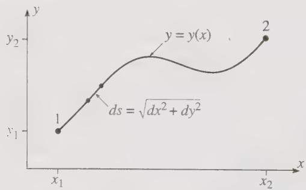  

Figure 6.1 A path joining the two points 1 and 2. The length of the short segment is $ds = \sqrt{dx^{2} + dy^{2}}$ , and the total length of the path is $L = \int_{1}^{2} ds$ .

Before we set up the machinery to solve this new problem, let's consider another example.

**## Fermat's Principle**

A similar problem is to find the path that light will follow between two points. If the refractive index of the medium is constant, then the path is, of course, a straight line, but if the refractive index varies, or if we interpose a mirror or lens, the path is not so obvious. The French mathematician Fermat (1601–1665) discovered that the required path is the path for which the time of travel of the light is minimum. We can illustrate Fermat's principle using Figure 6.1. The time for light to travel a short distance ds is ds/v where v denotes the speed of light in the medium, v = c/n where n is the refractive index. Thus Fermat's principle says that the correct path between points 1 and 2 is the path for which the time

$$

\text {(time of travel)} = \int_ {1} ^ {2} d t = \int_ {1} ^ {2} \frac {d s}{v} = \frac {1}{c} \int_ {1} ^ {2} n d s

$$

is a minimum. If n is constant, then it can be taken outside the integral and the problem reduces to finding the shortest path between points 1 and 2 (and the answer is, of course, a straight line). In general, the refractive index can vary, $n = n(x, y)$ , and our problem is to find the path $y(x)$ for which the integral

$$

\int_ {1} ^ {2} n (x, y) d s = \int_ {x _ {1}} ^ {x _ {2}} n (x, y) \sqrt {1 + y ^ {\prime} (x) ^ {2}} d x\tag{6.3}

$$

is minimum. [In writing the last expression, I substituted (6.1) for ds.]

The integral that has to be minimized in connection with Fermat's principle is very similar to the integral (6.2) giving the length of a path; it is just a little more complicated, since the factor $n(x, y)$ introduces an extra dependence on $x$ and $y$ . Similar integrals arise in many other problems. Sometimes we want the path for which an integral is a maximum, and sometimes we are interested in both maxima and minima. To get some idea of the possibilities, it is helpful to think again about the problem of finding maxima and minima of functions in elementary calculus. There we know that the necessary condition for a maximum or minimum of a function $f(x)$ is that its derivative vanish, $df/dx = 0$ . Unfortunately, this condition is not quite enough to guarantee a maximum or minimum. As you certainly recall from introductory calculus, there are essentially three possibilities, as illustrated in Figure 6.2. A point $x_0$ where $df/dx$ is zero may be a maximum or a minimum or, if $d^2 f/dx^2$ is also zero, it may be neither, as indicated in Figure 6.2(c). When $df/dx = 0$ at a point $x_0$ , but we don't know which of the three possibilities obtains, we say that $x_0$ is a stationary point of the function $f(x)$ , since an infinitesimal displacement of $x$ from $x_0$ leaves $f(x)$ unchanged (because the slope is zero).

The situation for the problems of this chapter is very similar. The method I shall describe in the next section actually finds the path that makes an integral like (6.2) or (6.3) stationary, in the sense that an infinitesimal variation of the path from its correct course doesn't change the value of the integral concerned. If you need to know that the integral is definitely minimum (or definitely maximum, or perhaps neither), you have to check this separately. Incidentally, we are now ready to explain the name of this chapter: Since our concern is how infinitesimal variations of a path change an integral, the subject is called the calculus of variations. For the same reason, the methods we shall develop are called variational methods, and a principle like Fermat's principle is a variational principle.

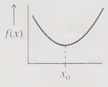  

(a)

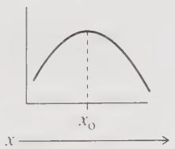  

(b)

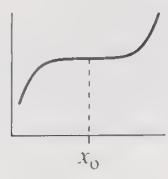  

(c)  

Figure 6.2 If $df / dx = 0$ at $x_0$ , there are three possibilities: (a) If the second derivative is positive, then $f(x)$ has a minimum at $x_0$ . (b) If the second derivative is negative, then $f(x)$ has a maximum. (c) If the second derivative is zero, then there may be a minimum, a maximum, or neither (as shown).

**## 6.2 The Euler-Lagrange Equation**

The two examples of the last section illustrate the general form of the so-called variational problem. We have an integral of the form

$$

S = \int_ {x _ {1}} ^ {x _ {2}} f [ y (x), y ^ {\prime} (x), x ] d x\tag{6.4}

$$

where $y(x)$ is an as-yet unknown curve joining two points $(x_{1},y_{1})$ and $(x_{2},y_{2})$ as in Figure 6.1; that is,

$$

y (x _ {1}) = y _ {1} \qquad \text { and } \qquad y (x _ {2}) = y _ {2}.\tag{6.5}

$$

Among all the possible curves satisfying (6.5) (that is, joining the points 1 and 2), we have to find the one that makes the integral S a minimum (or maximum or at least stationary). To be definite, I shall suppose that we wish to find a minimum. Notice that the function f in (6.4) is a function of three variables $f = f(y, y', x)$ , but because the integral follows the path $y = y(x)$ the integrand $f[y(x), y'(x), x]$ is actually a function of just the one variable x.

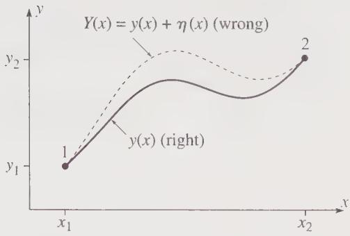  

Figure 6.3 The path $y = y(x)$ between points 1 and 2 is the “right” path, the one for which the integral S of (6.4) is a minimum. Any other path $Y(x)$ is “wrong,” in that it gives a larger value for S.

Let us denote the correct solution to our problem by $y = y(x)$ . Then the integral S in (6.4) evaluated for $y = y(x)$ is less than for any neighboring curve $y = Y(x)$ , as sketched in Figure 6.3. It is convenient to write the “wrong” curve $Y(x)$ as

$$

Y (x) = y (x) + \eta (x)\tag{6.6}

$$

where $\eta(x)$ (Greek “eta”) is just the difference between the wrong $Y(x)$ and the right $y(x)$ . Since $Y(x)$ must pass through the endpoints 1 and 2, $\eta(x)$ must satisfy

$$

\eta (x _ {1}) = \eta (x _ {2}) = 0.\tag{6.7}

$$

There are infinitely many choices for the difference $\eta(x)$ ; for example, we could choose $\eta = (x - x_1)(x_2 - x)$ or $\eta(x) = \sin[\pi(x - x_1) / (x_2 - x_1)]$ .

The integral S taken along the wrong curve $Y(x)$ must be larger than that along the right curve $y(x)$ , no matter how close the former is to the latter. To express this requirement, I shall introduce a parameter $\alpha$ and redefine $Y(x)$ to be

$$

Y (x) = y (x) + \alpha \eta (x).\tag{6.8}

$$

The integral S taken along the curve $Y(x)$ now depends on the parameter $\alpha$ , so I shall call it $S(\alpha)$ . The right curve $y(x)$ is obtained from (6.8) by setting $\alpha = 0$ . Thus the requirement that S is minimum for the right curve $y(x)$ implies that $S(\alpha)$ is a minimum at $\alpha = 0$ . With this result, we have converted our problem to the traditional problem from elementary calculus of making sure that an ordinary function [namely $S(\alpha)$ ] has a minimum at a specified point ( $\alpha = 0$ ). To ensure this, we must just check that the derivative dS/d $\alpha$ is zero when $\alpha = 0$ .

If we write out the integral $S(\alpha)$ in detail, it looks like this:

$$

\begin{array}{l} S (\alpha) = \int_ {x _ {1}} ^ {x _ {2}} f (Y, Y ^ {\prime}, x) d x \\ = \int_ {x _ {1}} ^ {x _ {2}} f (y + \alpha \eta , y ^ {\prime} + \alpha \eta^ {\prime}, x) d x. \end{array}\tag{6.9}

$$

To differentiate (6.9) with respect to $\alpha$ , we note that $\alpha$ appears in the integrand f, so we need to evaluate $\partial f/\partial\alpha$ . Since $\alpha$ appears in two of the arguments of f, this gives two terms, namely (using the chain rule)

$$

\frac {\partial f (y + \alpha \eta , y ^ {\prime} + \alpha \eta^ {\prime} , x)}{\partial \alpha} = \eta \frac {\partial f}{\partial y} + \eta^ {\prime} \frac {\partial f}{\partial y ^ {\prime}},

$$

and for $dS/d\alpha$ (which has to be zero)

$$

\frac {d S}{d \alpha} = \int_ {x _ {1}} ^ {x _ {2}} \frac {\partial f}{\partial \alpha} d x = \int_ {x _ {1}} ^ {x _ {2}} \left(\eta \frac {\partial f}{\partial y} + \eta^ {\prime} \frac {\partial f}{\partial y ^ {\prime}}\right) d x = 0.\tag{6.10}

$$

This condition must be true for any $\eta(x)$ satisfying (6.7); that is, for any choice of the “wrong” path $Y(x) = y(x) + \alpha\eta(x)$ .

To take advantage of the condition (6.10), we need to rewrite the second term on the right using integration by parts $^{1}$ (remember that $\eta'$ means $d\eta/dx$ ):

$$

\int_ {x _ {1}} ^ {x _ {2}} \eta^ {\prime} (x) \frac {\partial f}{\partial y ^ {\prime}} d x = \left[ \eta (x) \frac {\partial f}{\partial y ^ {\prime}} \right] _ {x _ {1}} ^ {x _ {2}} - \int_ {x _ {1}} ^ {x _ {2}} \eta (x) \frac {d}{d x} \left(\frac {\partial f}{\partial y ^ {\prime}}\right) d x.

$$

Because of the condition (6.7), the first term on the right (the “endpoint term”) is zero. Thus $^{2}$

$$

\int_ {x _ {1}} ^ {x _ {2}} \eta^ {\prime} (x) \frac {\partial f}{\partial y ^ {\prime}} d x = - \int_ {x _ {1}} ^ {x _ {2}} \eta (x) \frac {d}{d x} \left(\frac {\partial f}{\partial y ^ {\prime}}\right) d x.\tag{6.11}

$$

Substituting this identity into $(6.10)$ , we find that

$$

\int_ {x _ {1}} ^ {x _ {2}} \eta (x) \left(\frac {\partial f}{\partial y} - \frac {d}{d x} \frac {\partial f}{\partial y ^ {\prime}}\right) d x = 0.\tag{6.12}

$$

This condition must be satisfied for any choice of the function $\eta(x)$ . Therefore, as I shall argue in a moment, the factor in large parentheses must be zero:

$$

\frac {\partial f}{\partial y} - \frac {d}{d x} \frac {\partial f}{\partial y ^ {\prime}} = 0 \quad (\text { Euler   -   Lagrange   Equation })\tag{6.13}

$$

for all $x$ (in the relevant interval $x_1 \leq x \leq x_2$ ). This is the so-called Euler-Lagrange equation (named for the Swiss mathematician Leonhard Euler, 1707-1783, and the Italian-French physicist and mathematician Joseph Lagrange, 1736-1813), which lets us find the path for which the integral S is stationary. Before I illustrate its use, I need to discuss the step from (6.12) to (6.13), which is by no means obvious.

Equation (6.12) has the form $\int\eta(x)g(x)dx=0$ . I would certainly not claim that this condition alone implies that $g(x)=0$ for all x. However, (6.12) holds for any choice of the function $\eta(\dot{x})$ , and if $\int\eta(x)g(x)dx=0$ for any $\eta(x)$ , then we can conclude that $g(x)=0$ for all x. To prove this, we must assume that all functions concerned are continuous, but, as physicists, we would take for granted that this is the case. $^{3}$ Now, to prove the assertion, let us assume the contrary, that $g(x)$ is nonzero in some interval between $x_{1}$ and $x_{2}$ . Then choose a function $\eta(x)$ that has the same sign as $g(x)$ (that is, $\eta$ is positive where g is positive and $\eta$ is negative where g is negative). Then the integrand is continuous, satisfies $\eta(x)g(x)\geq0$ , and is nonzero at least in some interval. Under these conditions $\int\eta(x)g(x)dx$ cannot be zero. This contradiction implies that $g(x)$ is zero for all x.

This completes the proof of the Euler–Lagrange equation. The procedure for using it is this: (1) Set up the problem so that the quantity whose stationary path you seek is expressed as an integral in the standard form

$$

S = \int_ {x _ {1}} ^ {x _ {2}} f [ y (x), y ^ {\prime} (x), x ] d x,\tag{6.14}

$$

where $f[y(x), y'(x), x]$ is the function appropriate to your problem. (2) Write down the Euler–Lagrange equation (6.13) in terms of the function $f[y(x), y'(x), x]$ . (3) Finally, solve (if possible) the differential equation (6.13) for the function $y(x)$ that defines the required stationary path. I shall illustrate this procedure with a couple of examples in the next section.

**## 6.3 Applications of the Euler-Lagrange Equation**

Let us start with the problem that began this chapter, finding the shortest path between two points in a plane.

**## EXAMPLE 6.1 Shortest Path between Two Points**

We saw that the length of a path between points 1 and 2 is given by the integral (6.2) as

$$

L = \int_ {1} ^ {2} d s = \int_ {x _ {1}} ^ {x _ {2}} \sqrt {1 + y ^ {\prime 2}} d x.

$$

This has the standard form (6.14), with the function f given by

$$

f (y, y ^ {\prime}, x) = (1 + y ^ {\prime 2}) ^ {1 / 2}.\tag{6.15}

$$

To use the Euler–Lagrange equation (6.13), we must evaluate the two partial derivatives concerned:

$$

\frac {\partial f}{\partial y} = 0 \quad \text { and } \quad \frac {\partial f}{\partial y ^ {\prime}} = \frac {y ^ {\prime}}{(1 + y ^ {2}) ^ {1 / 2}}.\tag{6.16}

$$

Since $\partial f / \partial y = 0$ , (6.13) implies simply that

$$

{\frac {d}{d x}} {\frac {\partial f}{\partial y ^ {\prime}}} = 0.

$$

In other words, $\partial f / \partial y'$ is a constant, $C$ . According to (6.16), this implies that

$$

y ^ {\prime 2} = C ^ {2} (1 + y ^ {\prime 2}),

$$

or, with a little rearrangement, $y'^{2} = \text{constant}$ . This implies that $y'(x)$ is a constant, which we could call m. Integrating the equation $y'(x) = m$ , we find that $y(x) = mx + b$ , and we have proved that the shortest path between two points is a straight line!

**## A Note on Variables**

So far we have considered problems with two variables, which we have called x and y. Of these, x has been the independent variable, and y the dependent, through the relation $y = y(x)$ . Unfortunately, we are frequently forced — by convenience or tradition — to name the variables differently. For example, in a simple one-dimensional mechanics problem, the independent variable is the time t and the dependent variable is the position $x = x(t)$ . This means you will have to get used to seeing the Euler–Lagrange equation with the variables x and y replaced by an assortment of other variables, such as t and x. In the next example, the two variables are x and y, but the independent variable is y, and the roles of x and y in (6.13) and (6.14) will be exactly reversed.

**## EXAMPLE 6.2 The Brachistochrone**

A famous problem in the calculus of variations is this: Given two points 1 and 2, with 1 higher above the ground, in what shape should we build the track for a frictionless roller coaster so that a car released from point 1 will reach point 2 in the shortest possible time? This problem is called the brachistochrone problem, from the Greek words brachistos meaning “shortest” and chronos meaning “time.” The geometry of the problem is sketched in Figure 6.4, where I have taken point 1 as the origin and I have chosen to measure y vertically down.

The time to travel from 1 to 2 is

$$

\operatorname{time} (1 \rightarrow 2) = \int_ {1} ^ {2} \frac {d s}{v}\tag{6.17}

$$

where the speed at any height y is determined by conservation of energy to be $v = \sqrt{2gy}$ . (Problem 6.8.) Because this gives v as a function of y, it is convenient to take $y$ as our independent variable. That is, we shall write the unknown path as $x = x(y)$ . This means that the distance $ds$ between neighboring points on the path has to be written as

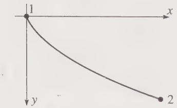  

Figure 6.4 The brachistochrone problem is to find the shape of track on which a roller coaster released from point 1 will reach point 2 in the minimum possible time.

$$

d s = \sqrt {d x ^ {2} + d y ^ {2}} = \sqrt {x ^ {\prime} (y) ^ {2} + 1} d y\tag{6.18}

$$

where a prime now denotes differentiation with respect to y; that is, $x'(y) = dx/dy$ . Thus according to (6.17) the time of interest is

$$

\operatorname{time} (1 \rightarrow 2) = \frac {1}{\sqrt {2 g}} \int_ {0} ^ {y _ {2}} \frac {\sqrt {x ^ {\prime} (y) ^ {2} + 1}}{\sqrt {y}} d y.\tag{6.19}

$$

Equation (6.19) gives the integral whose minimum we have to find. It is of the standard form (6.14), except that the roles of x and y have been interchanged, with the integrand

$$

f (x, x ^ {\prime}, y) = \frac {\sqrt {x ^ {\prime 2} + 1}}{\sqrt {y}}.\tag{6.20}

$$

To find the path that makes the time as small as possible, we have only to apply the Euler–Lagrange equation (again with x and y interchanged) to this function,

$$

{\frac {\partial f}{\partial x}} = {\frac {d}{d y}} {\frac {\partial f}{\partial x ^ {\prime}}}.\tag{6.21}

$$

The function of (6.20) is independent of $x$ , so the derivative $\partial f / \partial x$ is zero, and (6.21) tells us simply that $\partial f / \partial x'$ is a constant. Evaluating this derivative (and squaring it for convenience) we conclude that

$$

\frac {x ^ {\prime 2}}{y \left(1 + x ^ {\prime 2}\right)} = \text { const } = \frac {1}{2 a}\tag{6.22}

$$

where I have named the constant 1/2a for future convenience. This equation is easily solved for $x'$ to give

$$

x ^ {\prime} = \sqrt {\frac {y}{2 a - y}},

$$

whence

$$

x = \int \sqrt {\frac {y}{2 a - y}} d y.\tag{6.23}

$$

This integral can be evaluated by the unlikely looking substitution

$$

y = a (1 - \cos \theta)\tag{6.24}

$$

which gives (as you should check)

$$

\begin{array}{l} x = a \int (1 - \cos \theta) d \theta \\ = a (\theta - \sin \theta) + \text { const. } \end{array}\tag{6.25}

$$

The two equations (6.25) and (6.24) are parametric equations for the required path, giving x and y as functions of the parameter $\theta$ . We have chosen the initial point 1 to have x = y = 0, so we see from (6.24) that the initial value of $\theta$ is zero. This in turn implies that the constant of integration in (6.25) is zero. Thus the final parametric equation for the path is

$$

x = a (\theta - \sin \theta) \quad \mathrm{and} \quad y = a (1 - \cos \theta)\tag{6.26}

$$

with the constant $a$ chosen so the curve passes through the given point $(x_{2}, y_{2})$ .

The curve (6.26) is plotted in Figure 6.5. In that figure I have continued the curve (with dashes) beyond the point 2 to show that the curve that solves the brachistochrone problem happens to be a cycloid — the curve traced out by a point on the rim of a wheel of radius $a$ , rolling along the underside of the $x$ axis (Problem 6.14). Another remarkable feature of this curve is this: If we release the cart from rest at point 2 and let it roll to the bottom of the curve (point 3 in the figure), the time to roll from 2 to 3 is the same whatever the position of 2, anywhere between 1 and 3. This means that the oscillations of a cart rolling back and forth on a cycloid-shaped track are exactly isochronous (period perfectly independent of amplitude), in contrast with the oscillations of a simple pendulum, which are only approximately isochronous, to the extent that the amplitude is small. (See Problem 6.25.) The isochronous property of the cycloid was actually used in the design of some clocks, one of which can be seen in the Victoria and Albert Museum in London.

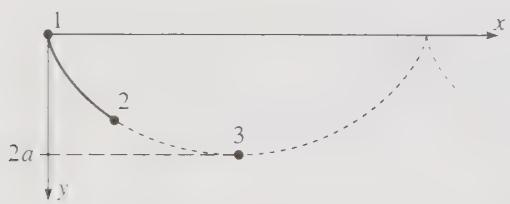  

Figure 6.5 The path for a roller coaster that gives the shortest time between the given points 1 and 2 is part of the cycloid with a vertex at 1 and passing through 2. The cycloid is the curve traced by a point on the rim of a wheel of radius a that rolls along the underside of the x axis. Point 3 is the lowest point on the curve.

**## Maximum and Minimum vs. Stationary**

You have probably noticed that in neither example of this section did I check that the curves that we found actually gave a minimum value to the integral of interest — that the straight line between two points actually makes the path length minimum, not a maximum or just stationary. The Euler–Lagrange equation guarantees only to give a path for which the original integral is stationary. The problem of deciding whether we have a minimum or maximum (or a stationary curve that is neither) is generally very difficult. In a few cases, it is easy to see which is the case. For instance, it really is obvious that a straight line gives the minimum distance between two points in a plane. In the case of the brachistochrone, it is not at all obvious that the path we found does yield a minimum time, though it is in fact true.

To illustrate the variety of possibilities, consider the problem of finding the shortest path, or geodesic, between two points 1 and 2 on the surface of a globe. As you probably know, the answer is the great circle joining the two points. $^{4}$ Using the calculus of variations you can prove relatively easily that a great circle does indeed make the distance stationary: Using spherical polar coordinates, every point on the globe can be identified by the two angles $\theta$ and $\phi$ . If you characterize a path as $\phi = \phi(\theta)$ and set up an integral that gives the distance between 1 and 2 along this path, you can show that the Euler–Lagrange equation for $\phi(\theta)$ requires that the path follow a great circle. (See Problem 6.16 for details.) But you have to think a little carefully before deciding that this necessarily gives a minimum distance, since there are two different great-circle paths connecting any two points 1 and 2 on the globe: For simplicity consider two towns on the equator, Quito (near the Pacific coast of Ecuador) and Macapá (at the mouth of the Amazon on the Atlantic coast of Brazil). The “right” shortest path between these two is, of course, the great-circle path following the equator for about 2000 miles across South America. But a second possibility, which satisfies the Euler–Lagrange equation just as well, is to head west around the equator from Quito, across the Pacific, the African continent, and the Atlantic, arriving in Macapá some 23,000 miles later. You might guess that this path would be a maximum, but it is in fact neither maximum nor minimum: It is easy to construct nearby paths that are shorter, but it is also easy to find others that are longer. In other words, this second great-circle path gives neither a maximum nor a minimum. This second path is, of course, analogous to the horizontal point of inflection in elementary calculus. In this problem, luckily, it is obvious that the first path gives the true minimum. However, it should be clear that, in general, deciding what sort of stationary path the Euler–Lagrange equation has given us can be tricky.

Fortunately for us, these questions are irrelevant for our purposes. We shall find that for the applications in mechanics all that matters is that we have a path which makes a certain integral stationary. It simply doesn't matter whether it gives a maximum, minimum, or neither.

**## 6.4 More than Two Variables**

So far we have considered only problems with just two variables, the independent variable (usually x) and the dependent (usually y). For most applications in mechanics, we shall find that there are several dependent variables, though fortunately still only one independent variable, which is usually the time t. For a simple example where there are two dependent variables, we can go back to the problem of the shortest path between two points. When we found the shortest path between two points 1 and 2, we assumed that the required path could be written in the form $y = y(x)$ . Reasonable as this seems, it is easy to think of paths that cannot be written in this way, such as the path shown in Figure 6.6. If we want to be perfectly sure we have found the shortest path among all possible paths, we must find a method that includes these. The way to do this is to write the path in parametric form as

$$

x = x (u) \quad \mathrm{and} \quad y = y (u),\tag{6.27}

$$

where u is any convenient variable in terms of which the curve can be parameterized (for instance, the distance along the path). The parametric form (6.27) includes all of the curves considered before. [If $y = y(x)$ , just use x for the parameter u.] It also includes curves like that of Figure 6.6 and, in fact, all curves of interest. $^{5}$

The length of a small segment of the path (6.27) is

$$

d s = \sqrt {d x ^ {2} + d y ^ {2}} = \sqrt {x ^ {\prime} (u) ^ {2} + y ^ {\prime} (u) ^ {2}} d u\tag{6.28}

$$

where, as usual, a prime denotes differentiation with respect to the function's argument; that is, $x'(u) = dx / du$ and $y'(u) = dy / du$ . Thus the total path length is

$$

L = \int_ {u _ {1}} ^ {u _ {2}} \sqrt {x ^ {\prime} (u) ^ {2} + y ^ {\prime} (u) ^ {2}} d u,\tag{6.29}

$$

and our job is to find the two functions $x(u)$ and $y(u)$ for which this integral is minimum.

This problem is more complicated than any we have considered before, because there are now two unknown functions $x(u)$ and $y(u)$ . The general problem of this type is this: Given an integral of the form

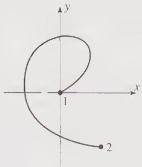  

Figure 6.6 This path between the two points 1 and 2 cannot be written as $y = y(x)$ nor as $x = x(y)$ . It can be written in the parametric form (6.27).

$$

S = \int_ {u _ {1}} ^ {u _ {2}} f [ x (u), y (u), x ^ {\prime} (u), y ^ {\prime} (u), u ] d u\tag{6.30}

$$

between two fixed points $[x(u_{1}), y(u_{1})]$ and $[x(u_{2}), y(u_{2})]$ , find the path $[x(u), y(u)]$ for which the integral S is stationary. The solution to this problem is very similar to the one-variable case, and I shall just sketch it, leaving you to fill in the details. The upshot is that with two dependent variables, we get two Euler–Lagrange equations. To prove this, we proceed very much as before. Let the correct path be given by

$$

x = x (u) \quad \text { and } \quad y = y (u),\tag{6.31}

$$

and then consider a neighboring “wrong” path of the form

$$

x = x (u) + \alpha \xi (u) \quad \text { and } \quad y = y (u) + \beta \eta (u)\tag{6.32}

$$

(where $\xi$ is the Greek letter “xi”). The requirement that the integral S be stationary for the right path (6.31) is equivalent to the requirement that the integral $S(\alpha, \beta)$ , taken along the wrong path (6.32), satisfy

$$

\frac {\partial S}{\partial \alpha} = 0 \quad \text { and } \quad \frac {\partial S}{\partial \beta} = 0\tag{6.33}

$$

when $\alpha = \beta = 0$ . These two conditions are the natural generalization of the condition (6.10) for the one-variable case. By an argument which exactly parallels that leading from (6.10) to (6.13), you can show that these two conditions are equivalent to the two Euler–Lagrange equations (see Problem 6.26):

$$

\frac {\partial f}{\partial x} = \frac {d}{d u} \frac {\partial f}{\partial x ^ {\prime}} \quad \text { and } \quad \frac {\partial f}{\partial y} = \frac {d}{d u} \frac {\partial f}{\partial y ^ {\prime}}.\tag{6.34}

$$

These two equations determine a path for which the integral (6.30) is stationary, and, conversely, if the integral is stationary for some path, that path must satisfy these two equations.

**## EXAMPLE 6.3 The Shortest Path between Two Points Again**

We can now solve completely the problem of the shortest path between two points. (That is, solve it including all possible paths, such as that in Figure 6.6.) From (6.29), we see that for this problem the integrand f is

$$

f (x, x ^ {\prime}, y, y ^ {\prime}, u) = \sqrt {x ^ {\prime 2} + y ^ {\prime 2}}.\tag{6.35}

$$

Since this is independent of $x$ and $y$ , the two derivatives $\partial f / \partial x$ and $\partial f / \partial y$ on the left sides in (6.34) are zero. Therefore, the two Euler-Lagrange equations imply simply that the two derivatives $\partial f / \partial x'$ and $\partial f / \partial y'$ are constants,

$$

\frac {\partial f}{\partial x ^ {\prime}} = \frac {x ^ {\prime}}{\sqrt {x ^ {\prime 2} + y ^ {\prime 2}}} = C _ {1} \quad \text { and } \quad \frac {\partial f}{\partial y ^ {\prime}} = \frac {y ^ {\prime}}{\sqrt {x ^ {\prime 2} + y ^ {\prime 2}}} = C _ {2}.\tag{6.36}

$$

If we divide the second equation by the first and recognize that $y' / x'$ is just the derivative $dy / dx$ , we conclude that

$$

\frac {d y}{d x} = \frac {y ^ {\prime}}{x ^ {\prime}} = \frac {C _ {2}}{C _ {1}} = m,\tag{6.37}

$$

say. It follows that the required path is a straight line, $y = mx + b$ . It is interesting that this proof using a parametric equation is not only better than our previous proof (in that the new proof includes all possible paths), it is also marginally easier.

The generalization of the Euler–Lagrange equation to an arbitrary number of dependent variables is straightforward, and doesn't need to be spelled out in detail. Here I would just like to sketch the way the Euler–Lagrange equations will appear in the Lagrangian formulation of mechanics.

The independent variable in Lagrangian mechanics is the time t. The dependent variables are the coordinates that specify the position, or “configuration,” of a system, and are usually denoted by $q_{1}, q_{2}, \cdots, q_{n}$ . The number n of coordinates depends on the nature of the system. For a single particle moving unconstrained in three dimensions, n is 3, and the three coordinates $q_{1}, q_{2}, q_{3}$ could be just the three Cartesian coordinates x, y, z, or they might be the spherical polar coordinates r, $\theta$ , $\phi$ . For N particles moving freely in three dimensions, n is 3N and the coordinates $q_{1}, \cdots, q_{n}$ could be the 3N Cartesian coordinates $x_{1}, y_{1}, z_{1}, \cdots, x_{N}, y_{N}, z_{N}$ . For a double pendulum (two simple pendulums, with the second suspended from the bob of the first, as in Figure 6.7), there would be two coordinates $q_{1}, q_{2}$ , which could be chosen to be the two angles shown in Figure 6.7. Because the coordinates $q_{1}, \cdots, q_{n}$ can take on so many guises, they are often referred to as generalized coordinates. It is often useful to think of the n generalized coordinates as defining a point in an n-dimensional configuration space, each of whose points labels a unique position, or configuration, of the system.

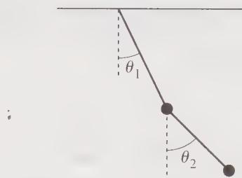  

Figure 6.7 A good choice of generalized coordinates to identify the position of a double pendulum is the pair of angles $\theta_{1}$ and $\theta_{2}$ between the pendulums and the vertical.

The ultimate goal in most problems in Lagrangian mechanics is to find how the coordinates vary with time; that is, to find the n functions $q_{1}(t), \cdots, q_{n}(t)$ . One can regard these n functions as defining a path in the n-dimensional configuration space. This path is, of course, determined by Newton's second law, but we shall find that it can, equivalently, be characterized as the path for which a certain integral is stationary. This means that it must satisfy the corresponding Euler–Lagrange equations (called just Lagrange equations in this context), and it turns out that these Lagrange equations are usually much easier to write down and use than Newton's second law. In particular, unlike Newton's second law, Lagrange's equations take exactly the same simple form in all coordinate systems.

The integral S whose stationary value determines the evolution of the mechanical system is called the action integral. Its integrand is called the Lagrangian L and depends on the n coordinates $q_{1}, q_{2}, \cdots, q_{n}$ , their n time derivatives $\dot{q}_{1}, \dot{q}_{2}, \cdots, \dot{q}_{n}$ and the time t,

$$

\mathcal {L} = \mathcal {L} (q _ {1}, \dot {q} _ {1}, \dots , q _ {n}, \dot {q} _ {n}, t).\tag{6.38}

$$

Notice that since the independent variable is t, the derivatives of the coordinates $q_{i}$ are time derivatives and are denoted, as usual, with dots as $\dot{q}_{i}$ . The requirement that the action integral

$$

S = \int_ {t _ {1}} ^ {t _ {2}} \mathcal {L} (q _ {1}, \dot {q} _ {1}, \dots , q _ {n}, \dot {q} _ {n}, t) d t\tag{6.39}

$$

be stationary implies n Euler–Lagrange equations

$$

\frac {\partial \mathcal {L}}{\partial q _ {1}} = \frac {d}{d t} \frac {\partial \mathcal {L}}{\partial \dot {q} _ {1}}, \quad \frac {\partial \mathcal {L}}{\partial q _ {2}} = \frac {d}{d t} \frac {\partial \mathcal {L}}{\partial \dot {q} _ {2}}, \quad \dots , \quad \text { and } \quad \frac {\partial \mathcal {L}}{\partial q _ {n}} = \frac {d}{d t} \frac {\partial \mathcal {L}}{\partial \dot {q} _ {n}}.\tag{6.40}

$$

These n equations correspond precisely to the two Euler–Lagrange equations in (6.34) and are proved in exactly the same way. If these n equations are satisfied, then the action integral (6.39) is stationary; and if the action integral is stationary, then these n equations are satisfied. In the next chapter, you will see where these equations come from and how to use them.

**## Principal Definitions and Equations of Chapter 6**

**## The Euler–Lagrange Equation**

An integral of the form

$$

S = \int_ {x _ {1}} ^ {x _ {2}} f [ y (x), y ^ {\prime} (x), x ] d x\tag{[Eq. (6.4)]}

$$

taken along a path $y = y(x)$ is stationary with respect to variations of that path if and only if $y(x)$ satisfies the Euler-Lagrange equation

$$

{\frac {\partial f}{\partial y}} - {\frac {d}{d x}} {\frac {\partial f}{\partial y ^ {\prime}}} = 0.\tag{[Eq. (6.13)]}

$$

**## Several Variables**

If there are $n$ dependent variables in the original integral, there are $n$ Euler-Lagrange equations. For instance, an integral of the form

$$

S = \int_ {u _ {1}} ^ {u _ {2}} f [ x (u), y (u), x ^ {\prime} (u), y ^ {\prime} (u), u ] d u,

$$

with two dependent variables $[x(u)$ and $y(u)]$ , is stationary with respect to variations of $x(u)$ and $y(u)$ if and only if these two functions satisfy the two equations

$$

\frac {\partial f}{\partial x} = \frac {d}{d u} \frac {\partial f}{\partial x ^ {\prime}} \quad \text { and } \quad \frac {\partial f}{\partial y} = \frac {d}{d u} \frac {\partial f}{\partial y ^ {\prime}}.\tag{[Eq. (6.34)]}

$$

**## Problems for Chapter 6**

Stars indicate the approximate level of difficulty, from easiest ( $\star$ ) to most difficult ( $\star\star\star$ ).

**## SECTION 6.1 Two Examples**

6.1 \* The shortest path between two points on a curved surface, such as the surface of a sphere, is called a geodesic. To find a geodesic, one has first to set up an integral that gives the length of a path on the surface in question. This will always be similar to the integral (6.2) but may be more complicated (depending on the nature of the surface) and may involve different coordinates than x and y. To illustrate this, use spherical polar coordinates $(r, \theta, \phi)$ to show that the length of a path joining two points on a sphere of radius R is

$$

L = R \int_ {\theta_ {1}} ^ {\theta_ {2}} \sqrt {1 + \sin^ {2} \theta \phi^ {\prime} (\theta) ^ {2}} d \theta\tag{6.41}

$$

if $(\theta_{1},\phi_{1})$ and $(\theta_{2},\phi_{2})$ specify the two points and we assume that the path is expressed as $\phi = \phi (\theta)$ . (You will find how to minimize this length in Problem 6.16.)

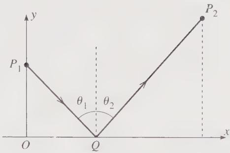  

Figure 6.8 Problem 6.3

6.2 $\star$ Do the same as in Problem 6.1 but find the length $L$ of a path on a cylinder of radius $R$ , using cylindrical polar coordinates $(\rho, \phi, z)$ . Assume that the path is specified in the form $\phi = \phi(z)$ .

6.3 \*\* Consider a ray of light traveling in a vacuum from point $P_1$ to $P_2$ by way of the point $Q$ on a plane mirror, as in Figure 6.8. Show that Fermat's principle implies that, on the actual path followed, $Q$ lies in the same vertical plane as $P_1$ and $P_2$ and obeys the law of reflection, that $\theta_1 = \theta_2$ . [Hints: Let the mirror lie in the $xz$ plane, and let $P_1$ lie on the $y$ axis at $(0, y_1, 0)$ and $P_2$ in the $xy$ plane at $(x_2, y_2, 0)$ . Finally let $Q = (x, 0, z)$ . Calculate the time for the light to traverse the path $P_1QP_2$ and show that it is minimum when $Q$ has $z = 0$ and satisfies the law of reflection.]

6.4\*\* A ray of light travels from point $P_{1}$ in a medium of refractive index $n_{1}$ to $P_{2}$ in a medium of index $n_{2}$ , by way of the point $Q$ on the plane interface between the two media, as in Figure 6.9. Show that Fermat's principle implies that, on the actual path followed, $Q$ lies in the same vertical plane as $P_{1}$ and $P_{2}$ and obeys Snell's law, that $n_{1}\sin \theta_{1} = n_{2}\sin \theta_{2}$ . [Hints: Let the interface be the $xz$ plane, and let $P_{1}$ lie on the $y$ axis at $(0,h_1,0)$ and $P_{2}$ in the $x,y$ plane at $(x_{2}, - h_{2},0)$ . Finally let $Q = (x,0,z)$ . Calculate the time for the light to traverse the path $P_{1}QP_{2}$ and show that it is minimum when $Q$ has $z = 0$ and satisfies Snell's law.]

6.5 \*\*Fermat's principle is often stated as "the travel time of a ray of light, moving from point $A$ to $B$ , is minimum along the actual path." Strictly speaking it should say that the time is stationary, not minimum. In fact one can construct situations for which the time is maximum along the actual path. Here is one: Consider the concave, hemispherical mirror shown in Figure 6.10, with $A$ and $B$ at opposite ends of a diameter. Consider a ray of light traveling in a vacuum from $A$ to $B$ with one reflection at $P$ , in the same vertical plane as $A$ and $B$ . According to the law of reflection, the actual path goes via point

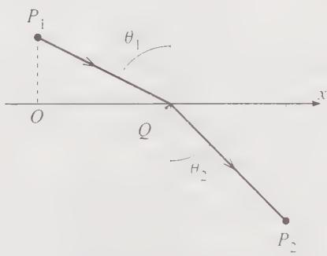  

Figure 6.9 Problem 6.4

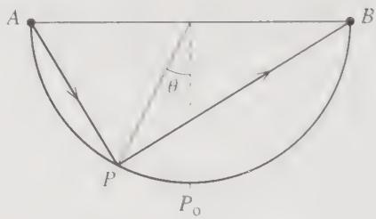  

Figure 6.10 Problem 6.5

$P_{0}$ at the bottom of the hemisphere (P = 0). Find the time of travel along the path APB as a function of P and show that it is maximum at $P = P_{0}$ . This shows the time is maximum with respect to paths of the form APB with just two straight segments. It is easy to see that it is minimum for other kinds of path, so the correct general statement is that it is stationary for arbitrary variations of the path.

6.6 \*\* In many problems in the calculus of variations, you need to know the length $ds$ of a short segment of a curve on a surface, as in the expression (6.1). Make a table giving the appropriate expressions for $ds$ in the following eight situations: (a) A curve given by $y = y(0)$ in a plane, (b) same but $x = x(0)$ , (c) same but $r = r(0)$ , (d) same but $\varphi = \varphi(r)$ ; (e) curve given by $\varphi = \varphi(z)$ on a cylinder of radius $R$ , (f) same but $z = z(0)$ ; (g) curve given by $r = r(0)$ on a sphere of radius $R$ , (h) same but $\varphi = \varphi(z)$ .

**## SECTION 6.3 Applications of the Euler-Lagrange Equation**

6.7 \* Consider a right circular cylinder of radius R centered on the z axis. Find the equation giving $\varphi$ as a function of z for the geodesic (shortest path) on the cylinder between two points with cylindrical polar coordinates $(R, \varphi_{1}, z)$ and $(R, \varphi_{2}, z)$ . Describe the geodesic. Is it unique? By imagining the surface of the cylinder unwrapped and laid out flat, explain why the geodesic has the form it does.

6.8 \* Verify that the speed of the roller coaster car in Example 0.2 page 222 is $\sqrt{2g}$ . (Assume the wheels have negligible mass and neglect friction.)

6.9 \* Find the equation of the path joining the origin O to the point P, L in the xy plane that makes the integral $\int_{O}^{P}(y'^{2} + yy' + y^{2}) dx$ stationary.

6.10 In general the integrand $f(y, y, x)$ whose integral we wish to minimize depends on $x, y,$ and $x$ . There is a considerable simplification if $r$ happens to be independent of $x$ , that is, $f = f(y, x)$ . (This happened in both Examples 0.1 and 0.2, though in the latter the roles of $x$ and $y$ were interchanged.) Prove that when this happens, the Euler-Lagrange equation 10.13 reduces to the statement that

$$

\partial f \partial y ^ {\prime} = \text { const. }\tag{6.42}

$$

Since this is a first-order differential equation for $a$ while the Euler-Lagrange equation is generally second order, this is an important simplification and the result to 42 is sometimes called a first integral of the Euler-Lagrange equation. In Lagrangian mechanics we'll see that this simplification arises when a component of momentum is conserved.

6.11 \*\* Find and describe the path = $\sqrt{3}$ on the integral $\int_{-\sqrt{3}}^{+\infty}\sqrt{1+\sqrt{3}}$ of x is stationary

6.12 \*\* Show that the problem = for a finite integral $\int_{\sqrt{x}}^{x} |x|^{-1 - x^2}$ is stationary is an arcsinh function.

6.13\*\* In relativity theory, velocities can be represented by points in a certain “rapidity space” in which the distance between two neighboring points is $ds = [2/(1 - r^{2})]\sqrt{dr^{2} + r^{2}d\phi^{2}}$ , where r and $\phi$ are polar coordinates, and we consider just a two-dimensional space. (An expression like this for the distance in a non-Euclidean space is often called the metric of the space.) Use the Euler–Lagrange equation to show that the shortest path from the origin to any other point is a straight line.

6.14 \*\* (a) Prove that the brachistochrone curve (6.26) is indeed a cycloid, that is, the curve traced by a point on the circumference of a wheel of radius $a$ rolling along the underside of the $x$ axis. (b) Although the cycloid repeats itself indefinitely in a succession of loops, only one loop is relevant to the brachistochrone problem. Sketch a single loop for three different values of $a$ (all with the same starting point 1) and convince yourself that for any point 2 (with positive coordinates $x_2, y_2$ ) there is exactly one value of $a$ for which the loop goes through the point 2. (c) To find the value of $a$ for a given point $x_2, y_2$ usually requires solution of a transcendental equation. Here are two cases where you can do it more simply: For $x_2 = \pi b$ , $y_2 = 2b$ and again for $x_2 = 2\pi b$ , $y_2 = 0$ find the value of $a$ for which the cycloid goes through the point 2 and find the corresponding minimum times.

6.15 $\star\star$ Consider again the brachistochrone problem of Example 6.2 (page 222) but suppose that the car is launched from point 1 with initial speed $v_{0}$ . Show that the path of minimum time to the fixed point 2 is still a cycloid, but with its cusp (the top point of the curve) a height $v_{0}^{2}/2g$ above point 1.

6.16 \*\* Use the result (6.41) of Problem 6.1 to prove that the geodesic (shortest path) between two given points on a sphere is a great circle. [Hint: The integrand $f(\phi, \phi', \theta)$ in (6.41) is independent of $\phi$ , so the Euler-Lagrange equation reduces to $\partial f / \partial \phi' = c$ , a constant. This gives you $\phi'$ as a function of $\theta$ . You can avoid doing the final integral by the following trick: There is no loss of generality in choosing your $z$ axis to pass through the point 1. Show that with this choice the constant $c$ is necessarily zero, and describe the corresponding geodesics.]

6.17 \*\* Find the geodesics on the cone whose equation in cylindrical polar coordinates is $z = \lambda \rho$ . [Let the required curve have the form $\phi = \phi(\rho)$ .] Check your result for the case that $\lambda \to 0$ .

6.18 \*\* Show that the shortest path between two given points in a plane is a straight line, using plane polar coordinates.

6.19 $\star\star$ A surface of revolution is generated as follows: Two fixed points $(x_{1}, y_{1})$ and $(x_{2}, y_{2})$ in the $x, y$ plane are joined by a curve $y = y(x)$ . [Actually you'll make life easier if you start out writing this as $x = x(y)$ .] The whole curve is now rotated about the $x$ axis to generate a surface. Show that the curve for which the area of the surface is stationary has the form $y = y_{0} \cosh[(x - x_{0})/y_{0}]$ , where $x_{0}$ and $y_{0}$ are constants. (This is often called the soap-bubble problem, since the resulting surface is usually the shape of a soap bubble held by two coaxial rings of radii $y_{1}$ and $y_{2}$ .)

6.20 \*\* If you haven't done it, take a look at Problem 6.10. Here is a second situation in which you can find a "first integral" of the Euler-Lagrange equation: Argue that if it happens that the integrand $f(y, y', x)$ does not depend explicitly on $x$ , that is, $f = f(y, y')$ , then

$$

\frac {d f}{d x} = \frac {\partial f}{\partial y} y ^ {\prime} + \frac {\partial f}{\partial y ^ {\prime}} y ^ {\prime \prime}.

$$

$$

\frac {d f}{d x} = \frac {d}{d x} \left(y ^ {\prime} \frac {\partial f}{\partial y ^ {\prime}}\right).

$$

Use the Euler-Lagrange equation to replace of by on the right, and hence show that

This gives you the first integral

$$

f - y ^ {\prime} \frac {\partial f}{\partial y ^ {\prime}} = \text { const. }\tag{6.43}

$$

This can simplify several calculations. (See Problems 6.21 and 6.22 for examples.) In Lagrangian mechanics, where the independent variable is the time t, the corresponding result is that if the Lagrangian function is independent of t, then energy is conserved. (See Section 7.8.)

6.21 \*\* In Example 6.2 (page 222) we found the brachistochrone by exchanging the variables $x$ and $y$ . Here is a method that avoids that exchange: Write the time as in Equation (6.19) but using $x$ as the variable of integration. Your integrand should have the form $f(y, y', x) = \sqrt{(y'^2 + 1)/y}$ . Since this is independent of $x$ , you can invoke the "first integral" (6.43) of Problem 6.20. Show that this differential equation leads you to the same integral for $x$ as in Equation (6.23) and hence to the same curve as before.

6.22 \*\*\* You are given a string of fixed length $l$ with one end fastened at the origin $O$ , and you are to place the string in the $xy$ plane with its other end on the $x$ axis in such a way as to enclose the maximum area between the string and the $x$ axis. Show that the required shape is a semicircle. The area enclosed is of course $f y dx$ , but show that you can rewrite this in the form $\int_0^l f ds$ , where $s$ denotes the distance measured along the string from $O$ , where $f = y\sqrt{1 - y'^2}$ , and $y'$ denotes $dy / ds$ . Since $f$ does not involve the independent variable $s$ explicitly, you can exploit the "first integral" (6.43) of Problem 6.20.

6.23 \*\*\* An aircraft whose airspeed is $v_{0}$ has to fly from town $O$ (at the origin) to town $P$ , which is a distance $D$ due east. There is a steady gentle wind shear, such that $\mathbf{v}_{\mathrm{wind}} = Vy\hat{\mathbf{x}}$ , where $x$ and $y$ are measured east and north respectively. Find the path, $y = y(x)$ , which the plane should follow to minimize its flight time, as follows: (a) Find the plane's ground speed in terms of $v_{0}$ , $V$ , $\phi$ (the angle by which the plane heads to the north of east), and the plane's position. (b) Write down the time of flight as an integral of the form $\int_{0}^{D} f dx$ . Show that if we assume that $y'$ and $\phi$ both remain small (as is certainly reasonable if the wind speed is not too large), then the integrand $f$ takes the approximate form $f = (1 + \frac{1}{2}y'^2)/(1 + ky)$ (times an uninteresting constant) where $k = V/v_{0}$ . (c) Write down the Euler-Lagrange equation that determines the best path. To solve it, make the intelligent guess that $y(x) = \lambda x(D - x)$ , which clearly passes through the two towns. Show that it satisfies the Euler-Lagrange equation, provided $\lambda = (\sqrt{4 + 2k^2D^2} - 2)/(kD^2)$ . How far north does this path take the plane, if $D = 2000$ miles, $v_{0} = 500$ mph, and the wind shear is $V = 0.5$ mph/mi? How much time does the plane save by following this path? [You'll probably want to use a computer to do this integral.]

6.24 \*\*\* Consider a medium in which the refractive index $n$ is inversely proportional to $r^2$ ; that is, $n = a / r^2$ , where $r$ is the distance from the origin. Use Fermat's principle, that the integral (6.3) is stationary, to find the path of a ray of light travelling in a plane containing the origin. [Hint: Use two-dimensional polar coordinates and write the path as $\phi = \phi(r)$ . The Fermat integral should have the form $\int f(\phi, \phi', r) dr$ , where $f(\phi, \phi', r)$ is actually independent of $\phi$ . The Euler-Lagrange equation therefore reduces to $\partial f / \partial \phi' = \text{const}$ . You can solve this for $\phi'$ and then integrate to give $\phi$ as a function of $r$ . Rewrite this to give $r$ as a function of $\phi$ and show that the resulting path is a circle through the origin. Discuss the progress of the light around the circle.]

6.25 \*\*\* Consider a single loop of the cycloid (6.26) with a fixed value of $a$ , as shown in Figure 6.11. A car is released from rest at a point $P_{0}$ anywhere on the track between $O$ and the lowest point $P$ (that is, $P_{0}$ has parameter $0 < \theta_{0} < \pi$ . Show that the time for the cart to roll from $P_{0}$ to P is given by the integral

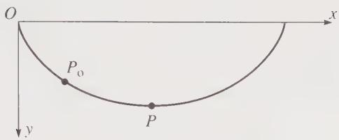  

Figure 6.11 Problem 6.25

$$

\operatorname{time} \left(P _ {0} \rightarrow P\right) = \sqrt {\frac {a}{g}} \int_ {\theta_ {0}} ^ {\pi} \sqrt {\frac {1 - \cos \theta}{\cos \theta_ {0} - \cos \theta}} d \theta

$$

and prove that this time is equal to $\pi\sqrt{a/g}$ . Since this is independent of the position of $P_{0}$ , the cart takes the same time to roll from $P_{0}$ to P, whether $P_{0}$ is at O, or anywhere between O and P, even infinitesimally close to P. Explain qualitatively how this surprising result can possibly be true. [Hint: To do the mathematics, you have to make some cunning changes of variables. One route is this: Write $\theta = \pi - 2\alpha$ and then use the relevant trig identities to replace the cosines of $\theta$ by sines of $\alpha$ . Now substitute $\sin\alpha = u$ and do the remaining integral.]

**## SECTION 6.4 More than Two Variables**

6.26 $\star \star$ Give in detail the argument that leads from the stationary property of the integral (6.30) to the two Euler-Lagrange equations (6.34).

6.27 $\star \star$ Prove that the shortest path between two points in three dimensions is a straight line. Write the path in the parametric form

$$

x = x (u), \qquad y = y (u), \qquad \text { and } \qquad z = z (u)

$$

and then use the three Euler–Lagrange equations corresponding to (6.34).