# Two-Body Central-Force Problems

In this chapter, I shall discuss the motion of two bodies each of which exerts a conservative, central force on the other but which are subject to no other, “external,” forces. There are many examples of this problem: the two stars of a binary star system, a planet orbiting the sun, the moon orbiting the earth, the electron and proton in a hydrogen atom, the two atoms of a diatomic molecule. In most cases the true situation is more complicated. For example, even if we are interested in just one planet orbiting the sun, we cannot completely neglect the effects of all the other planets; likewise, the moon–earth system is subject to the external force of the sun. Nevertheless, in all cases, it is an excellent starting approximation to treat the two bodies of interest as being isolated from all outside influences.

You may also object that the examples of the hydrogen atom and the diatomic molecule do not belong in classical mechanics, since all such atomic-scale systems must really be treated by quantum mechanics. However, many of the ideas I shall develop in this chapter (the important idea of reduced mass, for instance) play a crucial role in the quantum mechanical two-body problem, and it is probably fair to say that the material covered here is an essential prerequisite for the corresponding quantum material.

## 8.1 The Problem

Let us consider two objects, with masses $m_{1}$ and $m_{2}$ . For the purposes of this chapter, I shall assume the objects are small enough to be considered as point particles, whose positions (relative to the origin O of some inertial reference frame) I shall denote by $r_{1}$ and $r_{2}$ . The only forces are the forces $F_{12}$ and $F_{21}$ of their mutual interaction, which I shall assume is conservative and central. Thus the forces can be derived from a potential energy $U(\mathbf{r}_{1}, \mathbf{r}_{2})$ . In the case of two astronomical bodies (the earth and the sun, for instance) the force is the gravitational force $Gm_{1}m_{2} / |\mathbf{r}_1 - \mathbf{r}_2|^2$ , with the corresponding potential energy (as we saw in Chapter 4)

$$
U (\mathbf {r} _ {1}, \mathbf {r} _ {2}) = - \frac {G m _ {1} m _ {2}}{| \mathbf {r} _ {1} - \mathbf {r} _ {2} |}.\tag{8.1}
$$

For the electron and proton in a hydrogen atom, the potential energy is the Coulomb PE of the two charges (e for the proton and -e for the electron),

$$
U (\mathbf {r} _ {1}, \mathbf {r} _ {2}) = - \frac {k e ^ {2}}{| \mathbf {r} _ {1} - \mathbf {r} _ {2} |},\tag{8.2}
$$

where k denotes the Coulomb force constant, $k = 1/4\pi \epsilon_{0}$ .

In both of these examples, U depends only on the difference $(\mathbf{r}_{1}-\mathbf{r}_{2})$ , not on $r_{1}$ and $r_{2}$ separately. As we saw in Section 4.9, this is no accident: Any isolated system is translationally invariant, and if $U(\mathbf{r}_{1},\mathbf{r}_{2})$ is translationally invariant it can only depend on $(\mathbf{r}_{1}-\mathbf{r}_{2})$ . In the present case there is a further simplification: As we saw in Section 4.8, if a conservative force is central, then U is independent of the direction of $(\mathbf{r}_{1}-\mathbf{r}_{2})$ . That is, it only depends on the magnitude $|r_{1}-r_{2}|$ , and we can write

$$
U (\mathbf {r} _ {1}, \mathbf {r} _ {2}) = U (| \mathbf {r} _ {1} - \mathbf {r} _ {2} |)\tag{8.3}
$$

as is the case in the examples (8.1) and (8.2).

To take advantage of the property (8.3), it is convenient to introduce the new variable

$$
\mathbf {r} = \mathbf {r} _ {1} - \mathbf {r} _ {2}.\tag{8.4}
$$

As shown in Figure 8.1, this is just the position of body 1 relative to body 2, and I shall refer to r as the relative position. The result of the previous paragraph can be rephrased to say that the potential energy U depends only on the magnitude r of the relative position r,

$$
U = U (r).\tag{8.5}
$$

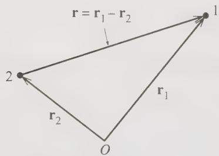  
Figure 8.1 The relative position $r = r_{1} - r_{2}$ is the position of body 1 relative to body 2.

We can now state the mathematical problem that we have to solve. We want to find the possible motions of two bodies (the moon and the earth or an electron and a proton), whose Lagrangian is

$$
\mathcal {L} = \frac {1}{2} m _ {1} \dot {\mathbf {r}} _ {1} ^ {2} + \frac {1}{2} m _ {2} \dot {\mathbf {r}} _ {2} ^ {2} - U (r).\tag{8.6}
$$

Of course, I could equally have stated the problem in Newtonian terms, and I shall in fact feel free to move back and forth between the Lagrangian and Newtonian formalisms according to which seems the more convenient. For the present, the Lagrangian formalism is the more transparent.

## 8.2 CM and Relative Coordinates; Reduced Mass

Our first task is to decide what generalized coordinates to use to solve our problem. There is already a strong suggestion that we should use the relative position r as one of them (or as three of them, depending on how you count coordinates), because the potential energy $U(r)$ takes such a simple form in terms of r. The question is then, what to choose for the other (vector) variable. The best choice turns out to be the familiar center of mass (or CM) position. R, of the two bodies, defined as in Chapter 3 to be

$$
\mathbf {R} = \frac {m _ {1} \mathbf {r} _ {1} + m _ {2} \mathbf {r} _ {2}}{m _ {1} + m _ {2}} = \frac {m _ {1} \mathbf {r} _ {1} + m _ {2} \mathbf {r} _ {2}}{M},\tag{8.7}
$$

where as before M denotes the total mass of the two bodies:

$$
M = m _ {1} + m _ {2}.
$$

As we saw in Chapter 3, the CM of two particles lies on the line joining them, as shown in Figure 8.2. The distances of the center of mass from the two masses $m_1$ and $m_2$ are in the ratio $m_1 - m_2$ . In particular, if $m_1$ is much greater than $m_2$ , then the CM is very close to body 2. (In Figure 8.2, the ratio $m_1 - m_2$ is about 1/3, so the CM is a quarter of the way from $m_2$ to $m_1$ .)

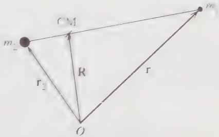  
Figure 8.2 The center of mass of the two bodies lies at the position $\mathbf{R} = (m_1\mathbf{r}_1 + m_2\mathbf{r}_2) / M$ on the line joining the two bodies.

We saw in Section 3.3 that the total momentum of the two bodies is the same as if the total mass $M = m_{1} + m_{2}$ were concentrated at the CM and were following the CM as it moves:

$$
\mathbf {P} = M \dot {\mathbf {R}}.\tag{8.8}
$$

This result has important simplifying consequences: We know, of course, that the total momentum is constant. Therefore, according to (8.8), $\dot{\mathbf{R}}$ is constant; and this means we can choose an inertial reference frame in which the CM is at rest. This CM frame is an especially convenient frame in which to analyze the motion, as we shall see.

I am going to use the CM position R and the relative position r as generalized coordinates for our discussion of the motion of our two bodies. In terms of these coordinates, we already know that the potential energy takes the simple form $U = U(r)$ . To express the kinetic energy in these terms, we need to write the old variables $r_{1}$ and $r_{2}$ in terms of the new R and r. It is a straightforward exercise to show that (see Figure 8.2)

$$
\mathbf {r} _ {1} = \mathbf {R} + \frac {m _ {2}}{M} \mathbf {r} \quad \text { and } \quad \mathbf {r} _ {2} = \mathbf {R} - \frac {m _ {1}}{M} \mathbf {r}.\tag{8.9}
$$

Thus the kinetic energy is

$$
\begin{array}{l} T = \frac {1}{2} \left(m _ {1} \dot {\mathbf {r}} _ {1} ^ {2} + m _ {2} \dot {\mathbf {r}} _ {2} ^ {2}\right) \\ = \frac {1}{2} \left(m _ {1} \left[ \dot {\mathbf {R}} + \frac {m _ {2}}{M} \dot {\mathbf {r}} \right] ^ {2} + m _ {2} \left[ \dot {\mathbf {R}} - \frac {m _ {1}}{M} \dot {\mathbf {r}} \right] ^ {2}\right) \\ = \frac {1}{2} \left(M \dot {\mathbf {R}} ^ {2} + \frac {m _ {1} m _ {2}}{M} \dot {\mathbf {r}} ^ {2}\right). \end{array}\tag{8.10}
$$

The result (8.10) simplifies further if we introduce the parameter

$$
\mu = \frac {m _ {1} m _ {2}}{M} \equiv \frac {m _ {1} m _ {2}}{m _ {1} + m _ {2}} \quad [ \text { reduced   mass } ]\tag{8.11}
$$

which has the dimensions of mass and is called the reduced mass. You can easily check that $\mu$ is always less than both $m_{1}$ and $m_{2}$ (hence the name). If $m_{1} \ll m_{2}$ , then $\mu$ is very close to $m_{1}$ . Thus the reduced mass for the earth–sun system is almost exactly the mass of the earth; the reduced mass of the electron and proton in hydrogen is almost exactly the mass of the electron. On the other hand, if $m_{1} = m_{2}$ , then obviously $\mu = \frac{1}{2}m_{1}$ .

Returning to (8.10), we can rewrite the kinetic energy in terms of $\mu$ as

$$
T = \frac {1}{2} M \dot {\mathbf {R}} ^ {2} + \frac {1}{2} \mu \dot {\mathbf {r}} ^ {2}.\tag{8.12}
$$

This remarkable result shows that the kinetic energy is the same as that of two “fictitious” particles, one of mass M moving with the speed of the CM, and the other of mass $\mu$ (the reduced mass) moving with the speed of the relative position r. Even more significant is the corresponding result for the Lagrangian:

$$
\begin{array}{r l} \mathcal {L} = T - U & = \frac {1}{2} M \dot {\mathbf {R}} ^ {2} + \left(\frac {1}{2} \mu \dot {\mathbf {r}} ^ {2} - U (r)\right) \\ & = \mathcal {L} _ {\mathrm{cm}} + \mathcal {L} _ {\mathrm{rel}}. \end{array}\tag{8.13}
$$

We see that by using the CM and relative positions as our generalized coordinates, we have split the Lagrangian into two separate pieces, one of which involves only the CM coordinate R and the other only the relative coordinate r. This will mean that we can solve for the motions of R and r as two separate problems, which will greatly simplify matters.

## 8.3 The Equations of Motion

With the Lagrangian (8.13), we can write down the equations of motion of our two-body system. Because L is independent of R, the R equation (really three equations, one each for X, Y, and Z) is especially simple,

$$
M \ddot {\mathbf {R}} = 0 \qquad \text { or } \qquad \dot {\mathbf {R}} = \text { const. }\tag{8.14}
$$

We can explain this result in several ways: First (as we already knew), it is a direct consequence of conservation of total momentum. Alternatively, we can view it as reflecting that $\mathcal{L}$ is independent of $\mathbf{R}$ , or, in the terminology introduced in Section 7.6, the CM coordinate $\mathbf{R}$ is "ignorable." More specifically, $\mathcal{L}_{\mathrm{cm}} = \frac{1}{2} M\dot{\mathbf{R}}^2$ (which is the only part of $\mathcal{L}$ that involves $\mathbf{R}$ ) has the form of the Lagrangian of a free particle of mass $M$ and position $\mathbf{R}$ . Naturally, therefore (Newton's first law), $\mathbf{R}$ moves with constant velocity.

The Lagrange equation for the relative coordinate r is a little less simple but equally beautiful: $L_{rel}$ , the only part of L that involves r, is mathematically indistinguishable from the Lagrangian for a single particle of mass $\mu$ and position r, with potential energy $U(r)$ . Thus the Lagrange equation corresponding to r is just (check it and see!)

$$
\mu \ddot {\mathbf {r}} = - \nabla U (\mathbf {r}).\tag{8.15}
$$

To solve for the relative motion, we have only to solve Newton's second law for a single particle of mass equal to the reduced mass $\mu$ and position r, with potential energy $U(r)$ .

## The CM Reference Frame

Our problem becomes even easier to think about if we make a clever choice of reference frame. Specifically, because $\dot{R} = const$ , we can choose an inertial reference frame, the so-called CM frame, in which the CM is at rest and the total momentum is zero. In this frame, $\dot{\mathbf{R}} = 0$ and the CM part of the Lagrangian is zero ( $\mathcal{L}_{\mathrm{cm}} = 0$ ). Thus in the CM frame

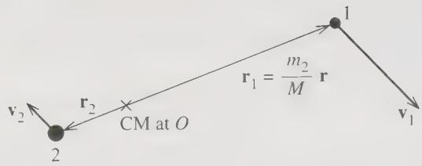  
Figure 8.3 In the CM frame the center of mass is stationary at the origin. The relative position $\mathbf{r}$ is the position of particle 1 relative to particle 2; therefore, the position of particle 1 relative to the origin is $\mathbf{r}_1 = (m_2 / M)\mathbf{r}$ .

$$
\mathcal {L} = \mathcal {L} _ {\mathrm{rel}} = \frac {1}{2} \mu \dot {\mathbf {r}} ^ {2} - U (r)\tag{8.16}
$$

and the problem really is reduced to a one-body problem. This dramatic simplification illustrates the curious terminology of the “ignorable coordinate.” Recall that a coordinate $q_{i}$ is said to be ignorable if $\partial L/\partial q_{i}=0$ . We see that, in the present case at least, the motion associated with the ignorable coordinate R really is something that we can ignore.

It is worth taking a moment to consider what the motion looks like in the CM frame, as shown in Figure 8.3. The CM is stationary, and we naturally take it to be the origin. Both particles are moving, but with equal and opposite momenta. If $m_2$ is much greater than $m_1$ (as is often the case), the CM is close to $m_2$ and particle 2 has a small velocity. (In the figure, $m_2 = 3m_1$ and hence $v_2 = \frac{1}{3}v_1$ .) It is important to note that the relative position $\mathbf{r}$ is the position of particle 1 relative to particle 2, and is not the actual position of either particle. As shown in the picture, the position of particle 1 is actually $\mathbf{r}_1 = (m_2 / M)\mathbf{r}$ . However, if $m_2 \gg m_1$ , then the CM is very close to particle 2, which is almost stationary, and $\mathbf{r}_1 \approx \mathbf{r}$ ; that is, $\mathbf{r}$ is very nearly the same thing as $\mathbf{r}_1$ .

The equation of motion in the CM frame is derived from the Lagrangian $L_{rel}$ of (8.16) and is just Equation (8.15). This is precisely the same as the equation for a single particle of mass equal to the reduced mass $\mu$ , in the fixed central force field of the potential energy $U(r)$ . In the equations of this chapter, the repeated appearance of the mass $\mu$ will serve to remind you that the equations apply to the relative motion of two bodies. However, you may find it easier to visualize a single body (of mass $\mu$ ) orbiting about a fixed force center. In particular, if $m_{2} \gg m_{1}$ , these two problems are for practical purposes exactly the same. Moreover, if your interest actually is in a single body, of mass m say, orbiting a fixed force center, then you can use all of the same equations, simply replacing $\mu$ with m. In any event, any solution for the relative coordinate $\mathbf{r}(t)$ always gives us the motion of particle 1 relative to particle 2. Equivalently, using the relations of Figure 8.3, knowledge of $\mathbf{r}(t)$ tells us the motion of particle 1 (or particle 2) relative to the CM.

## Conservation of Angular Momentum

We already know that the total angular momentum of our two particles is conserved. Like so many other things, this condition takes an especially simple form in the CM frame. In any frame, the total angular momentum is

$$
\begin{array}{r l} \mathbf {L} & = \mathbf {r} _ {1} \times \mathbf {p} _ {1} + \mathbf {r} _ {2} \times \mathbf {p} _ {2}. \\ & = m _ {1} \mathbf {r} _ {1} \times \dot {\mathbf {r}} _ {1} + m _ {2} \mathbf {r} _ {2} \times \dot {\mathbf {r}} _ {2}. \end{array}\tag{8.17}
$$

In the CM frame, we see from (8.9) (with R = 0) that

$$
\mathbf {r} _ {1} = \frac {m _ {2}}{M} \mathbf {r} \quad \text { and } \quad \mathbf {r} _ {2} = - \frac {m _ {1}}{M} \mathbf {r}.\tag{8.18}
$$

Substituting into $(8.17)$ , we see that the angular momentum in the CM frame is

$$
\begin{array}{r l} \mathbf {L} & = \frac {m _ {1} m _ {2}}{M ^ {2}} (m _ {2} \mathbf {r} \times \dot {\mathbf {r}} + m _ {1} \mathbf {r} \times \dot {\mathbf {r}}) \\ & = \mathbf {r} \times \mu \dot {\mathbf {r}} \end{array}\tag{8.19}
$$

where I have replaced $m_{1}m_{2}/M$ by the reduced mass $\mu$ .

The most remarkable thing about this result is that the total angular momentum in the CM frame is exactly the same as the angular momentum of a single particle with mass $\mu$ and position r. For our present purposes the important point is that, because angular momentum is conserved, we see that the vector $r \times \dot{r}$ is constant. In particular, the direction of $r \times \dot{r}$ is constant, which implies that the two vectors r and $\dot{r}$ remain in a fixed plane. That is, in the CM frame, the whole motion remains in a fixed plane, which we can take to be the xy plane. In other words, in the CM frame, the two-body problem with central conservative forces is reduced to a two-dimensional problem.

## The Two Equations of Motion

To set up the equations of motion for the remaining two-dimensional problem, we need to choose coordinates in the plane of the motion. The obvious choice is to use the polar coordinates $r$ and $\phi$ , in terms of which the Lagrangian (8.16) is

$$
\mathcal {L} = \frac {1}{2} \mu (\dot {r} ^ {2} + r ^ {2} \dot {\phi} ^ {2}) - U (r).\tag{8.20}
$$

Since this Lagrangian is independent of $\phi$ , the coordinate $\phi$ is ignorable, and the Lagrange equation corresponding to $\phi$ is just

$$
\frac {\partial \mathcal {L}}{\partial \dot {\phi}} = \mu r ^ {2} \dot {\phi} = \text { const } = \ell \quad [ \phi \text {   equation } ].\tag{8.21}
$$

Since $\mu r^{2}\dot{\phi}$ is the angular momentum $\ell$ (strictly, the z component $\ell_{z}$ ), the $\phi$ equation is just a statement of conservation of angular momentum.

The Lagrange equation corresponding to r (often called the radial equation) is

$$
\frac {\partial \mathcal {L}}{\partial r} = \frac {d}{d t} \frac {\partial \mathcal {L}}{\partial \dot {r}},
$$

or

$$
\mu r \dot {\phi} ^ {2} - \frac {d U}{d r} = \mu \ddot {r} \quad [ r \text {   equation } ].\tag{8.22}
$$

As we already saw in Example 7.2 [Equations (7.19) and (7.20)], if we move the centripetal term $\mu r\dot{\phi}^2$ over to the right, this is just the radial component of $\mathbf{F} = ma$ (or rather, $\mathbf{F} = \mu \mathbf{a}$ , since $\mu$ has replaced $m$ ).

## 8.4 The Equivalent One-Dimensional Problem

The two equations of motion that we have to solve are the $\phi$ equation (8.21) and radial equation (8.22). The constant $\ell$ (the angular momentum) in the $\phi$ equation is determined by the initial conditions, and our main use for the $\phi$ equation is to solve it for $\dot{\phi}$ ,

$$
\dot {\phi} = \frac {\ell}{\mu r ^ {2}},\tag{8.23}
$$

which will let us eliminate $\dot{\phi}$ from the radial equation in favor of the constant $\ell$ . The radial equation can be rewritten as

$$
\mu \ddot {r} = - \frac {d U}{d r} + \mu r \dot {\phi} ^ {2} = - \frac {d U}{d r} + F _ {\mathrm{cf}}\tag{8.24}
$$

which has the form of Newton's second law for a particle in one dimension with mass $\mu$ and position r, subject to the actual force -dU/dr plus a "fictitious" outward centrifugal force $^{1}$

$$
F _ {\mathrm{cf}} = \mu r \dot {\phi} ^ {2}.\tag{8.25}
$$

In other words, the particle's radial motion is exactly the same as if the particle were moving in one dimension, subject to the actual force -dU/dr plus the centrifugal force $F_{cf}$ .

We have now reduced the problem of the relative motion of two bodies to a single one-dimensional problem, as expressed by (8.24). Before we discuss what the solutions are going to look like, it is helpful to rewrite the centrifugal force, using the $\phi$ equation (8.23) to eliminate $\dot{\phi}$ in favor of the constant $\ell$ ,

$$
F _ {\mathrm{cf}} = \frac {\ell^ {2}}{\mu r ^ {3}}.\tag{8.26}
$$

Even better, we can now express the centrifugal force in terms of a centrifugal potential energy,

$$
F _ {\mathrm{cf}} = - \frac {d}{d r} \left(\frac {\ell^ {2}}{2 \mu r ^ {2}}\right) = - \frac {d U _ {\mathrm{cf}}}{d r},\tag{8.27}
$$

where the centrifugal potential energy $U_{cf}$ is defined as

$$
U _ {\mathrm{cf}} (r) = \frac {\ell^ {2}}{2 \mu r ^ {2}}.\tag{8.28}
$$

Returning to (8.24), we can now rewrite the radial equation in terms of $U_{cf}$ as

$$
\mu \ddot {r} = - \frac {d}{d r} [ U (r) + U _ {\mathrm{cf}} (r) ] = - \frac {d}{d r} U _ {\mathrm{eff}} (r),\tag{8.29}
$$

where the effective potential energy $U_{\mathrm{eff}}(r)$ is the sum of the actual potential energy $U(r)$ and the centrifugal $U_{\mathrm{cf}}(r)$ :

$$
U _ {\mathrm{eff}} (r) = U (r) + U _ {\mathrm{cf}} (r) = U (r) + \frac {\ell^ {2}}{2 \mu r ^ {2}}.\tag{8.30}
$$

According to (8.29), the radial motion of the particle is exactly the same as if the particle were moving in one dimension with an effective potential energy $U_{eff} = U + U_{cf}$ .

## EXAMPLE 8.1 Effective Potential Energy for a Comet

Write down the actual and effective potential energies for a comet (or planet) moving in the gravitational field of the sun. Sketch the three potential energies involved and use the graph of $U_{\mathrm{eff}}(r)$ to describe the motion of r. Since planetary motion was first described mathematically by the German astronomer Johannes Kepler, 1571–1630, this problem of the motion of a planet or comet around the sun (or any two bodies interacting via an inverse-square force) is often called the Kepler problem.

The actual gravitational potential energy of the comet is given by the well-known formula

$$
U (r) = - \frac {G m _ {1} m _ {2}}{r}\tag{8.31}
$$

where G is the universal gravitational constant, and $m_{1}$ and $m_{2}$ are the masses of the comet and the sun. The centrifugal potential energy is given by (8.28), so the total effective potential energy is

$$
U _ {\mathrm{eff}} (r) = - \frac {G m _ {1} m _ {2}}{r} + \frac {\ell^ {2}}{2 \mu r ^ {2}}.\tag{8.32}
$$

The general behavior of this effective potential energy is easily seen (Figure 8.4). When $r$ is large, the centrifugal term $\ell^2 / 2\mu r^2$ is negligible compared to the gravitational term $-Gm_1m_2 / r$ , and the effective PE, $U_{\mathrm{eff}}(r)$ , is negative and sloping up as r increases. According to (8.29), the acceleration of r is down this slope. [The roller coaster car accelerates down the track defined by $U_{\mathrm{eff}}(r)$ .] Thus when a comet is far from the sun, $\ddot{r}$ is always inward.

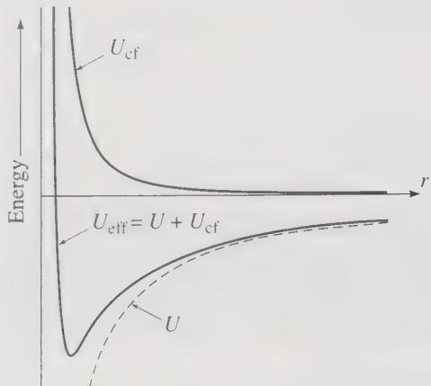  
Figure 8.4 The effective potential energy $U_{\mathrm{eff}}(r)$ that governs the radial motion of a comet is the sum of the actual gravitational potential energy $U(r) = -Gm_{1}m_{2}/r$ and the centrifugal term $U_{cf} = \ell^{2}/2\mu r^{2}$ . For large r, the dominant effect is the attractive gravitational force; for small r, it is the repulsive centrifugal force.

When r is small, the centrifugal term $\ell^{2}/2\mu r^{2}$ dominates the gravitational term $-Gm_{1}m_{2}/r$ (unless $\ell=0$ ), and near r=0, $U_{\mathrm{eff}}(r)$ is positive and slopes downward. Thus, as a comet gets closer to the sun, $\ddot{r}$ eventually becomes outward, and the comet starts to move away from the sun again. The one exception to this statement is when the angular momentum is exactly zero, $\ell=0$ , in which case (8.23) implies that $\dot{\phi}=0$ ; that is, the comet is moving exactly radially, along a line of constant $\phi$ , and must at some time hit the sun.

## Conservation of Energy

To find the details of the orbit we must look more closely at the radial equation (8.29). If we multiply both sides of that equation by $\dot{r}$ , we find that

$$
\frac {d}{d t} \left(\frac {1}{2} \mu \dot {r} ^ {2}\right) = - \frac {d}{d t} U _ {\mathrm{eff}} (r).\tag{8.33}
$$

In other words,

$$
\frac {1}{2} \mu \dot {r} ^ {2} + U _ {\mathrm{eff}} (r) = \mathrm{const.}\tag{8.34}
$$

This result is, in fact, just conservation of energy: If we write out $U_{\mathrm{eff}}$ as $U + \varepsilon^2 - 2\mu r^2$ and replace $\ell$ by $\mu r^2\dot{\phi}$ , we see that

$$
\begin{array}{c} \frac {1}{2} \mu \dot {r} ^ {2} + U _ {\mathrm{eff}} (r) = \frac {1}{2} \mu \dot {r} ^ {2} + \frac {1}{2} \mu r ^ {2} \dot {\phi} ^ {2} + U (r) \\ = E. \end{array}\tag{8.35}
$$

This completes the rewriting of the two-dimensional problem of the relative motion as an equivalent one-dimensional problem involving just the radial motion. We see that the total energy (which we knew all along is constant) can be thought of as the one-dimensional kinetic energy of the radial motion, plus the effective one-dimensional potential energy $U_{eff}$ , since the latter includes the actual potential energy U and the kinetic energy $\frac{1}{2}\mu r^{2}\dot{\phi}^{2}$ of the angular motion. This means that all of our experience with one-dimensional problems, both in terms of forces and in terms of energy, can be immediately transferred to the two-body central-force problem.

## EXAMPLE 8.2 Energy Considerations for a Comet or Planet

Examine again the comet (or planet) of Example 8.1 and, by considering its total energy E, find the equation that determines the maximum and minimum distances of the comet from the sun, if E > 0 and, again, if E < 0.

In the energy equation (8.35) the term $\frac{1}{2}\mu\dot{r}^{2}$ on the left is always greater than or equal to zero. Therefore, the comet's motion is confined to those regions where $E \geq U_{eff}$ . To see what this implies, I have redrawn in Figure 8.5 the graph of $U_{eff}$ from Figure 8.4. Let us consider first the case that the comet's energy is greater than zero. In the figure I have drawn a dashed horizontal line at height E, labeled E > 0. A comet with this energy can move anywhere that this line is above the curve of $U_{\mathrm{eff}}(r)$ , but nowhere that the line is below the curve. This means simply that the comet cannot move anywhere inside the turning point labeled $r_{min}$ , determined by the condition

$$
U _ {\mathrm{eff}} (r _ {\mathrm{min}}) = E.\tag{8.36}
$$

If the comet is initially moving in, toward the sun, then it will continue to do so until it reaches $r_{min}$ , where $\dot{r}=0$ instantaneously. It then moves outward, and, since there are no other points at which $\dot{r}$ can vanish, it eventually moves off to infinity, and the orbit is unbounded.

If instead E < 0, then the line drawn at height E (labeled E < 0) meets the curve of $U_{\mathrm{eff}}(r)$ at the two turning points labeled $r_{min}$ and $r_{max}$ , and a comet with

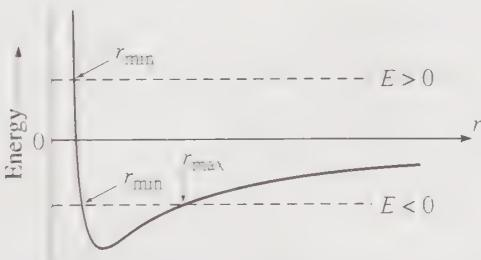  
Figure 8.5 Plot of the effective potential energy $U_{\mathrm{eff}}(r)$ against r for a comet. For a given energy E, the comet can only go where $E \geq U_{\mathrm{eff}}(r)$ . For E > 0 this means it cannot go inside the turning point at $r_{min}$ where $U_{eff} = E$ . For E < 0 it is confined between the two turning points labeled $r_{min}$ and $r_{max}$ .

E < 0 is trapped between these two values of r. If it is moving away from the sun ( $\dot{r} > 0$ ) it continues to do so until it reaches $r_{max}$ , where $\dot{r}$ vanishes and reverses sign. The comet then moves inward until it reaches $r_{min}$ , where $\dot{r}$ reverses again. Therefore, the comet oscillates in and out between $r_{min}$ and $r_{max}$ . For obvious reasons, this type of orbit is called a bounded orbit. $^{2}$

Finally, if E is equal to the minimum value of $U_{\mathrm{eff}}(r)$ (for a given value of the angular momentum $\ell$ ), the two turning points $r_{min}$ and $r_{max}$ coalesce, and the comet is trapped at a fixed radius and moves in a circular orbit.

In this example, I considered just the case of an inverse-square force, but many two-body problems have the same qualitative features. For example, the motion of the two atoms in a diatomic molecule is governed by an effective potential that was sketched in Figure 4.12 and looks very like the gravitational curve of Figure 8.5. Thus all of our qualitative conclusions apply to the diatomic molecule and many other two-body problems.

In thinking about the radial motion of the two-body problem, you must not entirely forget the angular motion. According to (8.23), $\dot{\phi} = \ell/\mu r^{2}$ , and $\phi$ is always changing, always with the same sign (continually increasing or continually decreasing). For example, as a comet with positive energy approaches the sun, the angle $\phi$ changes, at a rate that increases as r gets smaller; as the comet moves away, $\phi$ continues to change in the same direction, but at a rate that decreases as r gets larger. Thus the actual orbit of a positive-energy comet looks something like Figure 8.6. For the case of an inverse-square force (like gravity), the orbit of Figure 8.6 is actually a hyperbola, as we shall prove shortly, but the unbounded orbits (that is, orbits with E > 0) are qualitatively similar for many different force laws.

For the bounded orbits $(E < 0)$ , we have seen that r oscillates between the two extreme values $r_{min}$ and $r_{max}$ , while $\phi$ continually increases (or decreases, but let's suppose the comet is orbiting counter-clockwise, so that $\phi$ is increasing). In the case of the inverse-square force, we shall see that the period of the radial oscillations happens to equal the time for $\phi$ to make exactly one complete revolution. Therefore, the motion repeats itself exactly once per revolution, as in Figure 8.7(a). (We shall also see that, for any inverse-square force, the bounded orbits are actually ellipses.) For most other force laws, the period of the radial motion is different from the time to make one revolution, and in most cases the orbit is not even closed (that is, it never returns to its initial conditions). $^{3}$ Figure 8.7(b) shows an orbit for which r goes from $r_{min}$ to $r_{max}$ and back to $r_{min}$ in the time that the angle $\phi$ advances by about $330^{\circ}$ , and the orbit certainly does not close on itself after one revolution.

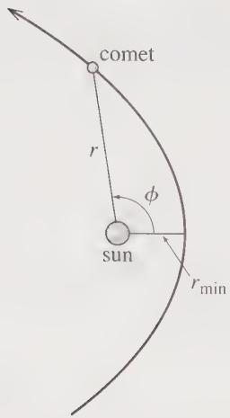  
Figure 8.6 Typical unbounded orbit for a positive-energy comet. Initially r decreases from infinity to $r_{min}$ and then goes back out to infinity. Meanwhile the angle $\phi$ is continually increasing.

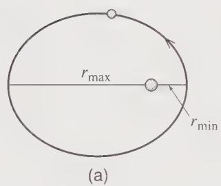

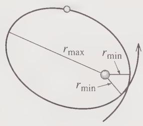  
(b)  
Figure 8.7 (a) The bounded orbits for any inverse-square force have the unusual property that r goes from $r_{min}$ to $r_{max}$ and back to $r_{min}$ in exactly the time that $\phi$ goes from 0 to 360°. Therefore the orbit repeats itself every revolution. (b) For most other force laws, the period of oscillation of r is different from the time in which $\phi$ advances by 360°, and the orbit does not close on itself after one revolution. In this example, r completes one cycle from $r_{min}$ to $r_{max}$ and back to $r_{min}$ while $\phi$ advances by about 330°.

## 8.5 The Equation of the Orbit

The radial equation (8.29) determines r as a function of t, but for many purposes we would like to know r as a function of $\phi$ . For example, the function $r = r(\phi)$ will tell us the shape of the orbit more directly. Thus we would like to rewrite the radial equation as a differential equation for $r$ in terms of $\phi$ . There are two tricks for doing this, but let me first write the radial equation in terms of forces:

$$
\mu \ddot {r} = F (r) + \frac {\ell^ {2}}{\mu r ^ {3}}\tag{8.37}
$$

where $F(r)$ is the actual central force, F = -dU/dr, and the second term is the centrifugal force.

The first trick to rewriting this equation in terms of $\phi$ is to make the substitution

$$
u = \frac {1}{r} \qquad \mathrm{or} \qquad r = \frac {1}{u}\tag{8.38}
$$

and the second is to rewrite the differential operator $d / dt$ in terms of $d / d\phi$ using the chain rule:

$$
\frac {d}{d t} = \frac {d \phi}{d t} \frac {d}{d \phi} = \dot {\phi} \frac {d}{d \phi} = \frac {\ell}{\mu r ^ {2}} \frac {d}{d \phi} = \frac {\ell u ^ {2}}{\mu} \frac {d}{d \phi}.\tag{8.39}
$$

(The third equality follows because $\ell = \mu r^{2}\dot{\phi}$ , and the last results from the change of variables u = 1/r.)

Using the identity (8.39) we can rewrite $\ddot{r}$ on the left of the radial equation. First

$$
\dot {r} = \frac {d}{d t} (r) = \frac {\ell u ^ {2}}{\mu} \frac {d}{d \phi} \left(\frac {1}{u}\right) = - \frac {\ell}{\mu} \frac {d u}{d \phi}
$$

and hence

$$
\ddot {r} = \frac {d}{d t} (\dot {r}) = \frac {\ell u ^ {2}}{\mu} \frac {d}{d \phi} \left(- \frac {\ell}{\mu} \frac {d u}{d \phi}\right) = - \frac {\ell^ {2} u ^ {2}}{\mu^ {2}} \frac {d ^ {2} u}{d \phi^ {2}}.\tag{8.40}
$$

Substituting back into the radial equation (8.37) we find

$$
- \frac {\ell^ {2} u ^ {2}}{\mu} \frac {d ^ {2} u}{d \phi^ {2}} = F + \frac {\ell^ {2} u ^ {3}}{\mu}
$$

or

$$
u ^ {\prime \prime} (\phi) = - u (\phi) - \frac {\mu}{\ell^ {2} u (\phi) ^ {2}} F.\tag{8.41}
$$

For any given central force F, this transformed radial equation is a differential equation for the new variable $u(\phi)$ . If we can solve it, then we can immediately write down r as $r = 1/u$ . In the next section, we shall solve it for the case of an inverse-square force and show that the resulting orbits are conic sections, that is, ellipses, parabolas, or hyperbolas. First, here is a simpler example.

## EXAMPLE 8.3 The Radial Equation for a Free Particle

Solve the transformed radial equation (8.41) for a free particle (that is, a particle subject to no forces) and confirm that the resulting orbit is the expected straight line.

This example is probably one of the hardest ways of showing that a free particle moves along a straight line. Nevertheless, it is a nice check that the transformed radial equation makes sense. In the absence of forces, (8.41) is just

$$
u ^ {\prime \prime} (\phi) = - u (\phi)
$$

whose general solution we know to be

$$
u (\phi) = A \cos (\phi - \delta),\tag{8.42}
$$

where A and $\delta$ are arbitrary constants. Therefore, (renaming the constant $A = 1/r_{0}$ )

$$
r (\phi) = \frac {1}{u (\phi)} = \frac {r _ {0}}{\cos (\phi - \delta)}.\tag{8.43}
$$

This unpromising-looking equation is in fact the equation of a straight line in polar coordinates, as you can see from Figure 8.8. In that picture Q is a fixed point with polar coordinates $(r_{\mathrm{o}}, \delta)$ , and the line in question is the line through Q perpendicular to OQ. It is easy to see that the point P with polar coordinates $(r, \phi)$ lies on this line if and only if $r \cos(\phi - \delta) = r_{\mathrm{o}}$ . In other words, Equation (8.43) is the equation of this straight line.

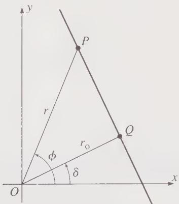  
Figure 8.8 The fixed point Q has polar coordinates $(r_{0}, \delta)$ relative to the origin O. The point P with polar coordinates $(r, \phi)$ lies on the line through Q perpendicular to OQ if and only if $r \cos(\phi - \delta) = r_{0}$ . That is, the equation of this line is (8.43).

In the next section, I shall use the same transformed radial equation (8.41) to solve a much less trivial problem, finding the path of a comet or any other body held in orbit by an inverse-square force.

## 8.6 The Kepler Orbits

Let us now return to the Kepler problem, the problem of finding the possible orbits of a comet or any other object subject to an inverse-square force. The two important examples of this problem are the motion of comets or planets around the sun (or earth satellites around the earth), in which case the force is the gravitational force $-Gm_{1}m_{2}/r^{2}$ , and the orbital motion of two opposite charges $q_{1}$ and $q_{2}$ , in which case the force is the Coulomb force $kq_{1}q_{2}/r^{2}$ . To include both cases and to simplify the equations, I shall write the force as (remember that u = 1/r)

$$
F (r) = - \frac {\gamma}{r ^ {2}} = - \gamma u ^ {2},\tag{8.44}
$$

where $\gamma$ is the “force constant,” equal to $Gm_{1}m_{2}$ in the gravitational case. $^{4}$

Thanks to our elaborate preparations, we can now solve the main problem very easily. Inserting the force (8.44) into the transformed radial equation (8.41), we find that $u(\phi)$ must satisfy

$$
u ^ {\prime \prime} (\phi) = - u (\phi) + \gamma \mu / \ell^ {2}.\tag{8.45}
$$

Notice that it is a unique feature of the inverse-square force that the last term in this equation is a constant, since only in this case does the $u^{2}$ of the force cancel the $1/u^{2}$ in (8.41). Because this last term is constant, we can solve (8.45) very easily: If we substitute

$$
w (\phi) = u (\phi) - \gamma \mu / \ell^ {2},
$$

the equation becomes

$$
w ^ {\prime \prime} (\phi) = - w (\phi),
$$

which has the general solution

$$
w (\phi) = A \cos (\phi - \delta),\tag{8.46}
$$

where A is a positive constant and $\delta$ is a constant that we can take to be zero by a suitable choice of the direction $\phi = 0$ . Thus the general solution for $u(\phi)$ can be written as

$$
u (\phi) = \frac {\gamma \mu}{\ell^ {2}} + A \cos \phi = \frac {\gamma \mu}{\ell^ {2}} (1 + \epsilon \cos \phi)\tag{8.47}
$$

where $\epsilon$ is just a new name for the dimensionless positive constant $A\ell^2 /\gamma \mu$ . Since $u = 1 / r$ , the constant $\gamma \mu /\ell^2$ on the right has the dimensions [1/length], and I shall introduce the length

$$
c = \frac {\ell^ {2}}{\gamma \mu}\tag{8.48}
$$

in terms of which our solution becomes

$$
{\frac {1}{r (\phi)}} = {\frac {1}{c}} (1 + \epsilon \cos \phi)
$$

or

$$
r (\phi) = \frac {c}{1 + \epsilon \cos \phi}.\tag{8.49}
$$

This is our solution for r as a function of $\phi$ , in terms of the undetermined positive constant $\epsilon$ and the length $c = \ell^{2}/\gamma\mu$ (which is $\ell^{2}/Gm_{1}m_{2}\mu$ in the gravitational problem). I shall now explore its properties, first for the bounded orbits and then for the unbounded.

## The Bounded Orbits

The behavior of the orbit $r(\phi)$ in (8.49) is controlled by the as-yet undetermined positive constant $\epsilon$ . A glance at (8.49) shows this behavior is very different according as $\epsilon < 1$ or $\epsilon \geq 1$ . If $\epsilon < 1$ , the denominator of (8.49) never vanishes, and $r(\phi)$ remains bounded for all $\phi$ . If $\epsilon \geq 1$ the denominator vanishes at some angle, and $r(\phi)$ approaches infinity as $\phi$ approaches that angle. Evidently the value $\epsilon = 1$ is the boundary between the bounded and unbounded orbits. I shall show shortly that this boundary corresponds exactly to the boundary between E < 0 and $E \geq 0$ discussed before. Meanwhile, let us start with the case that the constant $\epsilon$ is less than 1. With $\epsilon < 1$ , the denominator of $r(\phi)$ in (8.49) oscillates as shown in Figure 8.9 between the values $1 \pm \epsilon$ . Therefore, $r(\phi)$ oscillates between

$$
r _ {\min} = \frac {c}{1 + \epsilon} \quad \text { and } \quad r _ {\max} = \frac {c}{1 - \epsilon}\tag{8.50}
$$

with $r = r_{min}$ at the so-called perihelion when $\phi = 0$ , and $r = r_{max}$ at the aphelion when $\phi = \pi$ . Since $r(\phi)$ is obviously periodic in $\phi$ with period $2\pi$ , it follows that $r(2\pi) = r(0)$ and the orbit closes on itself after just one revolution. Thus the general appearance of the orbit is as in Figure 8.10.

While the orbit shown in Figure 8.10 certainly looks like an ellipse, I have not yet proved that it really is. However, it is a reasonably easy exercise (see Problem 8.16) to rewrite (8.49) in Cartesian coordinates and cast it in the form

$$
\frac {(x + d) ^ {2}}{a ^ {2}} + \frac {y ^ {2}}{b ^ {2}} = 1\tag{8.51}
$$

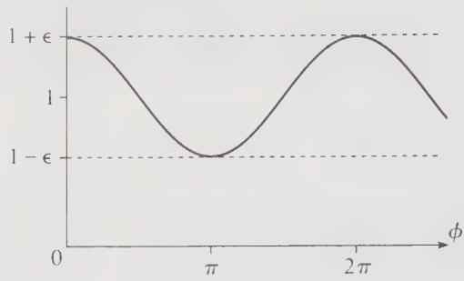  
Figure 8.9 The denominator $1 + \epsilon \cos \phi$ in Equation (8.49) for $r(\phi)$ oscillates between $1 + \epsilon$ and $1 - \epsilon$ , and is periodic with period $2\pi$ .

where (as you can easily check)

$$
a = \frac {c}{1 - \epsilon^ {2}}, \quad b = \frac {c}{\sqrt {1 - \epsilon^ {2}}}, \quad \text { and } \quad d = a \epsilon .\tag{8.52}
$$

Equation (8.51) is the standard equation of an ellipse with semimajor and semiminor axes a and b, except that where we expect to see x we have $x + d$ . This difference reflects that our origin, the sun, is not at the center of the ellipse, but at a distance d from it, as shown in Figure 8.10.

We can now identify the constant $\epsilon$ , which started life as an undetermined constant of integration in (8.47). According to (8.52) the ratio of the major to minor axes is

$$
{\frac {b}{a}} = \sqrt {1 - \epsilon^ {2}}.\tag{8.53}
$$

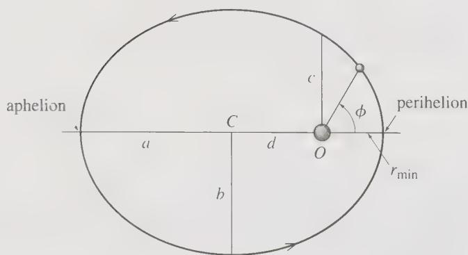  
Figure 8.10 The bounded orbits of a comet or planet as given by Equation (8.49) are ellipses. The sun is at the origin O, which is one focus of the ellipse (not the center C). The distances a and b are called the semimajor and semiminor axes. The parameter $c = \ell^{2}/\gamma\mu$ introduced in (8.48) is the value of r when $\phi = 90^{\circ}$ . The points where the comet is closest and farthest from the sun are called the perihelion and aphelion.

Although you almost certainly don't remember it, this equation is the definition (or one possible definition) of the eccentricity of the ellipse. That is, this equation tells us that the constant $\epsilon$ is the eccentricity. Notice that if $\epsilon = 0$ , then $b = a$ and the ellipse is a circle: if $\epsilon \to 1$ , then $b \to 0$ and the ellipse becomes very thin and elongated.

Having identified the constant $\epsilon$ as the eccentricity, we can now identify the position of the sun in relation to the ellipse. According to (8.52) the distance from the center $C$ to the sun at $O$ is $d = a\epsilon$ , and (though again you may not remember it) $a\epsilon$ is the distance from the center to either focus of the ellipse. Thus the position of the sun is actually one of the ellipse's two focuses, and we have now proved Kepler's first law, that the planets (and comets whose orbits are bounded) follow orbits that are ellipses with the sun at one focus.

## EXAMPLE 8.4 Halley's Comet

Halley's comet. named for the English astronomer Edmund Halley (1656–1742), follows a very eccentric orbit with $\epsilon = 0.967$ . At closest approach (the perihelion) the comet is 0.59 AU from the sun, fairly close to the orbit of Mercury. (The AU or astronomical unit is the mean distance of the earth from the sun, about $1.5 \times 10^{8}$ km.) What is the comet's greatest distance from the sun, that is, the distance of the aphelion?

The given distance is $r_{min} = 0.59$ AU, and, according to (8.50), $r_{\max}/r_{\min} = (1 + \epsilon)/(1 - \epsilon)$ . Therefore

$$
r _ {\max} = \frac {1 + \epsilon}{1 - \epsilon} r _ {\min} = \frac {1 . 9 6 7}{0 . 0 3 3} r _ {\min} = 6 0 r _ {\min} = 3 5 \mathrm{AU}.
$$

This means that at its greatest distance Halley's comet is outside the orbit of Neptune.

## The Orbital Period; Kepler's Third Law

We can now find the period of the elliptical orbits of the comets and planets. According to Kepler's second law (Section 3.4), the rate at which a line from the sun to a comet or planet sweeps out area is

$$
{\frac {d A}{d t}} = {\frac {\ell}{2 \mu}}.
$$

Since the total area of an ellipse is $A = \pi ab$ , the period is

$$
\tau = \frac {A}{d A / d t} = \frac {2 \pi a b \mu}{\ell}.
$$

If we square both sides and use (8.53) to replace $b^2$ by $a^2(1 - e^2)$ , this becomes

$$
\tau^ {2} = 4 \pi^ {2} \frac {a ^ {4} (1 - \epsilon^ {2}) \mu^ {2}}{\ell^ {2}} = 4 \pi^ {2} \frac {a ^ {3} c \mu^ {2}}{\ell^ {2}}.
$$

where in the last equality I used (8.52) to replace $a(1-\epsilon^{2})$ by c. Since the length c was defined in (8.48) as $\ell^{2}/\gamma\mu$ , this implies that

$$
\tau^ {2} = 4 \pi^ {2} \frac {a ^ {3} \mu}{\gamma}.\tag{8.54}
$$

Finally, $\gamma$ is the constant in the inverse-square force law $F = -\gamma/r^{2}$ , and, for the gravitational force, $\gamma = Gm_{1}m_{2} = G\mu M$ where M is the total mass, $M = m_{1} + m_{2}$ . (Notice the handy identity that $m_{1}m_{2} = \mu M$ .) In our case $m_{2} = M_{s}$ , the mass of the sun, which is very much greater than $m_{1}$ , the mass of the comet or planet. Thus, to an excellent approximation, $M \approx M_{s}$ , and

$$
\gamma = G m _ {1} m _ {2} \approx G \mu M _ {\mathrm{s}}.
$$

Therefore, the factor of $\mu$ in (8.54) cancels, and we find that

$$
\tau^ {2} = \frac {4 \pi^ {2}}{G M _ {\mathrm{s}}} a ^ {3}.\tag{8.55}
$$

This is Kepler's third law: Because the mass of the comet (or planet) has canceled out, the law says that for all bodies orbiting the sun, the square of the period is proportional to the cube of the semimajor axis. (For circular orbits, we can replace $a^3$ by $r^3$ .) The law applies equally to the satellites of any large body. For example, all satellites of the earth, including the moon, obey the same law [with $M$ , replaced by the earth's mass $M_e$ in (8.55)], and the same applies to all the moons of Jupiter.

## EXAMPLE 8.5 Period of a Low-Orbit Earth Satellite

Use Kepler's third law to estimate the period of a satellite in a circular orbit a few tens of miles above the earth's surface.

The period is given by (8.55) with $M_{\mathrm{s}}$ replaced by $M_{\mathrm{e}}$ . Since the orbit is circular, we can replace $a$ by $r$ , and since the orbit is close to the earth's surface, $r \approx R_{\mathrm{e}}$ , the radius of the earth. Therefore

$$
\tau^ {2} = \frac {4 \pi^ {2}}{G M _ {\mathrm{e}}} R _ {\mathrm{e}} ^ {3}.
$$

This simplifies if we recall that $GM_{\mathrm{e}} / R_{\mathrm{e}}^{2} = g$ , the acceleration of gravity on the earth's surface, and we find that

$$
\tau = 2 \pi \sqrt {\frac {R _ {\mathrm{e}}}{g}} = 2 \pi \sqrt {\frac {6 . 3 8 \times 1 0 ^ {6} \mathrm{m}}{9 . 8 \mathrm{m} / \mathrm{s} ^ {2}}} = 5 0 7 0 \mathrm{s} \approx 8 5 \mathrm{min},\tag{8.56}
$$

in agreement with the well-known observation that low-orbit satellites circle the earth in about one and a half hours.

## Relation between Energy and Eccentricity

Finally, we can relate the eccentricity $\epsilon$ of the orbit to the energy $E$ of the comet or other orbiting body. The simplest way to do this is to remember that, at its distance of closest approach $r_{\mathrm{min}}$ , the comet's energy is equal to the effective potential energy $U_{\mathrm{eff}}$ [Equation (8.36)],

$$
\begin{array}{c} E = U _ {\mathrm{eff}} (r _ {\min}) = - \frac {\gamma}{r _ {\min}} + \frac {\ell^ {2}}{2 \mu r _ {\min} ^ {2}} \\ = \frac {1}{2 r _ {\min}} \left(\frac {\ell^ {2}}{\mu r _ {\min}} - 2 \gamma\right). \end{array}\tag{8.57}
$$

Now we know from (8.50) that $r_{\min} = c/(1 + \epsilon)$ , and from its definition (8.48) that $c = \ell^{2}/\gamma\mu$ . Therefore

$$
r _ {\mathrm{min}} = \frac {\ell^ {2}}{\gamma \mu (1 + \epsilon)}
$$

and, substituting into (8.57),

$$
\begin{array}{c} E = \frac {\gamma \mu (1 + \epsilon)}{2 \ell^ {2}} [ \gamma (1 + \epsilon) - 2 \gamma ] \\ = \frac {\gamma^ {2} \mu}{2 \ell^ {2}} (\epsilon^ {2} - 1). \end{array}\tag{8.58}
$$

The calculations leading to (8.58) are equally valid for bounded and unbounded orbits, and they imply the following expected correlations: Negative energies $E < 0$ correspond to eccentricities $\epsilon < 1$ , which in turn correspond to bounded orbits. Positive energies $E > 0$ correspond to eccentricities $\epsilon > 1$ , which in turn correspond to unbounded orbits. Equation (8.58) is a useful relation between the mechanical properties E and $\ell$ and the geometrical property $\epsilon$ . It implies some interesting connections. For example, for a given value of the angular momentum $\ell$ , the orbit of lowest possible energy is the circular orbit with $\epsilon = 0$ (a connection which has an important counterpart in quantum mechanics).

## 8.7 The Unbounded Kepler Orbits

In the previous section, we found the general Kepler orbit, as given by (8.49),

$$
r (\phi) = \frac {c}{1 + \epsilon \cos \phi},\tag{8.59}
$$

and examined in detail the bounded orbits — those for which $\epsilon < 1$ or, equivalently, as we have seen, E < 0. In this section, I shall sketch the corresponding analysis of the unbounded orbits, with $\epsilon \geq 1$ and $E \geq 0$ .

The boundary between the bounded and unbounded orbits comes when $\epsilon = 1$ or $E = 0$ . With $\epsilon = 1$ , the denominator of (8.59) vanishes when $\phi = \pm \pi$ . Therefore, $r(\phi) \to \infty$ as $\phi \to \pm\pi$ . That is, if $\epsilon = 1$ , the orbit is unbounded and goes off to infinity as the comet approaches $\phi = \pm\pi$ . Some elementary algebra, parallel to what led to (8.51), shows that with $\epsilon = 1$ the Cartesian version of (8.59) is

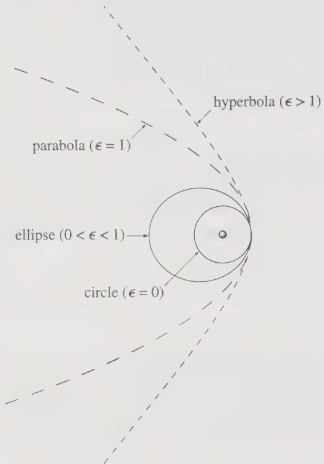  
Figure 8.11 Four different Kepler orbits for a comet: a circle, an ellipse, a parabola, and a hyperbola. For clarity, the four orbits were chosen with the same values for $r_{min}$ and with the closest approaches all in the same direction.

$$
y ^ {2} = c ^ {2} - 2 c x\tag{8.60}
$$

which is the equation of a parabola. This orbit is shown (with the long dashes) in Figure 8.11.

If $\epsilon > 1$ (or $E > 0$ ), the denominator of (8.59) vanishes at a value $\phi_{\mathrm{max}}$ determined by the condition

$$
\epsilon \cos (\phi_ {\max}) = - 1.
$$

Thus $r(\phi) \to \infty$ when $\phi \to \pm \phi_{\mathrm{max}}$ and the orbit is confined to the range of angles $-\phi_{\mathrm{max}} < \phi < \phi_{\mathrm{max}}$ . This gives the orbit the general appearance sketched in Figure 8.6. With $\epsilon > 1$ the Cartesian form of (8.59) is (Problem 8.30)

$$
\frac {(x - \delta) ^ {2}}{\alpha^ {2}} - \frac {y ^ {2}}{\beta^ {2}} = 1,\tag{8.61}
$$

where you can easily identify the constants $\alpha$ , $\beta$ , and $\delta$ (Problem 8.30). This is the equation of a hyperbola, and we have proved that, as anticipated, the positive energy Kepler orbits are hyperbolas. One such orbit is shown (with the smaller dashes) in Figure 8.11.

## Summary of Kepler Orbits

Our results for the Kepler orbits can be summarized as follows: All of the possible orbits are given by Equation (8.59),

$$
r (\phi) = \frac {c}{1 + \epsilon \cos \phi},\tag{8.62}
$$

and are characterized by the two constants of integration $^{5}$ $\epsilon$ and c. The dimensionless constant $\epsilon$ is related to the comet's energy by (8.58),

$$
E = \frac {\gamma^ {2} \mu}{2 \ell^ {2}} (\epsilon^ {2} - 1).\tag{8.63}
$$

It is, as we have seen, the eccentricity of the orbit that determines the orbit's shape as follows:

$$
\begin{array}{c c c} \text {eccentricity} & \text {energy} & \text {orbit} \\ \hline \epsilon = 0 & E <   0 & \text {circle} \\ 0 <   \epsilon <   1 & E <   0 & \text {ellipse} \\ \epsilon = 1 & E = 0 & \text {parabola} \\ \epsilon > 1 & E > 0 & \text {hyperbola} \end{array}
$$

You can see from (8.62) that the constant $c$ is a scale factor that determines the size of the orbit. It has the dimensions of length and is the distance from sun to comet when $\phi = \pi / 2$ . It is equal to $\ell^2 / \gamma \mu$ or, since $\gamma$ is the force constant $Gm_1m_2$ ,

$$
c = \frac {\ell^ {2}}{G m _ {1} m _ {2} \mu},\tag{8.64}
$$

where $m_{1}$ is the mass of the comet, $m_{2}$ that of the sun, and $\mu$ is the reduced mass $\mu = m_{1}m_{2}/(m_{1} + m_{2})$ , which is exceedingly close to $m_{1}$ since $m_{2}$ is so large.

## 8.8 Changes of Orbit

In this final section, I shall discuss how a satellite can change from one orbit to another. For example, a spacecraft wishing to visit Venus may want to transfer from a circular orbit close to the earth and centered on the sun to an elliptical orbit that will carry it to the orbit of Venus. Another example, and the one we shall discuss here, is an earth satellite wishing to change from one orbit about the earth to another, perhaps from a circular orbit to an elliptical orbit that will carry it to a higher altitude. The analysis of earth orbits is the same as that of orbits around the sun, except that the mass $M_{s}$ of the sun must be replaced by the mass $M_{e}$ of the earth, and the closest and furthest points from earth are called the perigee and apogee (instead of perihelion and aphelion for the sun). We shall confine attention to bounded, elliptical orbits, for which the most general form is

$$
r (\phi) = \frac {c}{1 + \epsilon \cos (\phi - \delta)}.\tag{8.65}
$$

(As long as we were interested in just one orbit, we could choose our $x$ axis so that the angle $\delta$ was zero. If we're interested in two arbitrary orbits, we cannot get rid of $\delta$ in this way — anyway not for both.)

Let us suppose that our spacecraft is initially in a orbit of the form (8.65) with energy $E_{1}$ , angular momentum $\ell_{1}$ and orbital parameters $c_{1}, \epsilon_{1}$ , and $\delta_{1}$ . A common way to change orbits is for the spacecraft to fire its rockets vigorously for a brief time. To a good approximation we can treat this procedure as an impulse that occurs at a unique angle $\phi_{0}$ , and causes an instantaneous change of velocity by a known amount. From the known change in velocity, we can calculate the new energy $E_{2}$ and angular momentum $\ell_{2}$ . From (8.48) we can calculate the new value of $c_{2}$ , and from (8.58) the new eccentricity $\epsilon_{2}$ . Finally, because the new orbit must join onto the old one at the angle $\phi_{0}$ , that is, $r_{1}(\phi_{0}) = r_{2}(\phi_{0})$ , we can find $\delta_{2}$ from the equation

$$
\frac {c _ {1}}{1 + \epsilon_ {1} \cos (\phi_ {\mathrm{o}} - \delta_ {1})} = \frac {c _ {2}}{1 + \epsilon_ {2} \cos (\phi_ {\mathrm{o}} - \delta_ {2})}.\tag{8.66}
$$

This calculation, though straightforward in principle, is tedious, and not especially illuminating, in practice. To simplify the calculations and to better reveal the important features, I shall treat just one important special case.

## A Tangential Thrust at Perigee

Let us consider a satellite that transfers from one orbit to another by firing its rockets in the tangential direction, forward or backward, when it is at the perigee of its initial orbit. By choice of our x axis, we can arrange that this occurs in the direction $\phi = 0$ , so that $\phi_{o} = 0$ and $\delta_{1} = 0$ . Moreover, because the rockets are fired in the tangential direction, the velocity just after firing is still in the same direction, which is perpendicular to the radius from earth to the satellite. Therefore, the position at which the rockets are fired is also the perigee for the final orbit, $^{6}$ and $\delta_{2} = 0$ as well. Thus the equation (8.66) that assures the continuity of the orbit reduces to

$$
\frac {c _ {1}}{1 + \epsilon_ {1}} = \frac {c _ {2}}{1 + \epsilon_ {2}}.\tag{8.67}
$$

Let us denote by $\lambda$ the ratio of the satellite's speeds just before and just after the firing of the rockets, $v_{2} = \lambda v_{1}$ . I shall call $\lambda$ the thrust factor; if $\lambda > 1$ , then the thrust was forward and the satellite sped up; if $0 < \lambda < 1$ , then the thrust was backward and the satellite slowed down. (In principle, $\lambda$ could be negative, but this would represent a reversal of direction, an unlikely maneuver that I shan't consider.)

At perigee the angular momentum is just $\ell = \mu rv$ . The value of r does not change during the impulse, and I shall assume that the firing of the rockets changes the satellite's mass by a negligible amount. Under these assumptions, the angular momentum changes by the same factor as the speed:

$$
\ell_ {2} = \lambda \ell_ {1}.\tag{8.68}
$$

According to (8.48), the parameter $c$ is proportional to $\ell^2$ . Therefore, the new value of $c$ is

$$
c _ {2} = \lambda^ {2} c _ {1}.\tag{8.69}
$$

Substituting into (8.67) and solving for $\epsilon_{2}$ , we find for the new eccentricity

$$
\epsilon_ {2} = \lambda^ {2} \epsilon_ {1} + (\lambda^ {2} - 1).\tag{8.70}
$$

Equation (8.70) contains almost all the interesting information about the new orbit. For example, if $\lambda > 1$ (a forward thrust), it is easy to see that the new orbit has $\epsilon_{2} > \epsilon_{1}$ . Thus the new orbit has the same perigee as the old one, but has greater eccentricity and so lies outside the old orbit, as shown by the outer dashed curve in Figure 8.12(a). If we make $\lambda$ large enough, then the new eccentricity becomes greater than 1; in this case the new orbit is actually a hyperbola, and our spacecraft escapes from the earth.

If we choose the thrust factor $\lambda < 1$ (a backward thrust), then the new eccentricity is less than the old, $\epsilon_{2} < \epsilon_{1}$ , and the new orbit lies inside the old, as shown by the inner dashed curve in Figure 8.12(b). As we make $\lambda$ steadily smaller, eventually $\epsilon_{2}$ vanishes; that is, if we fire the rockets backward with just the right impulse, we can move the satellite into a circular orbit. If we choose $\lambda$ still smaller, then $\epsilon_{2}$ becomes negative. What does this signify? The parameter $\epsilon$ started out as a positive constant, but the orbital equation $r = c/(1 + \epsilon \cos \phi)$ makes perfectly good sense with $\epsilon < 0$ .

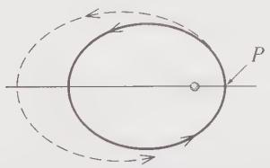

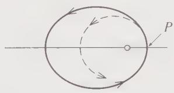  
(a) Forward thrust  
(b) Backward thrust  
Figure 8.12 Changing orbits. The satellite's original orbit is shown as the solid curve, and the rockets are fired when the satellite is at the perigee $P$ . (a) A forward impulse moves the satellite to the larger dashed elliptical orbit. (b) A backward impulse moves the satellite to the smaller dashed elliptical orbit.

The only difference is that the direction $\phi = 0$ is now the direction of maximum r and $\phi = \pi$ is that of minimum r; that is, the apogee and perigee have exchanged places. By administering a large enough backward thrust at P (the old orbit's perigee), we have transferred the satellite to a smaller orbit for which P is now the apogee.

## EXAMPLE 8.6 Changing between Circular Orbits

A satellite's crew in a circular orbit of radius $R_{1}$ wishes to transfer to a circular orbit of radius $2R_{1}$ . It does this using two successive boosts, as shown in Figure 8.13. First it boosts itself at point $P$ into an elliptical transfer orbit 2, just large enough to take it out to the required radius. Second, on reaching the required radius (at $P'$ , the apogee of the transfer orbit) it boosts itself into the desired circular orbit 3. By what factor must it increase its speed in each of these two boosts? That is, what are the required thrust factors $\lambda$ and $\lambda'$ ? By what factor does the satellite's speed increase as a result of the whole maneuver?

The initial circular orbit has $c_{1}=R_{1}$ and eccentricity $\epsilon_{1}=0$ . The final orbit is to have radius $R_{3}=2R_{1}$ . According to (8.69), the transfer orbit has $c_{2}=\lambda^{2}R_{1}$ and, according to (8.70), $\epsilon_{2}=(\lambda^{2}-1)$ , where $\lambda$ is the thrust factor of the first boost, at P. By the time the satellite reaches the point $P'$ , we want it to be at radius $R_{3}$ . Since $P'$ is the apogee of the transfer orbit, this requires that

$$
R _ {3} = \frac {c _ {2}}{1 - \epsilon_ {2}} = \frac {\lambda^ {2} R _ {1}}{1 - (\lambda^ {2} - 1)} = \frac {\lambda^ {2} R _ {1}}{2 - \lambda^ {2}}\tag{8.71}
$$

which is easily solved for $\lambda$ to give

$$
\lambda = \sqrt {\frac {2 R _ {3}}{R _ {1} + R _ {3}}} = \sqrt {\frac {4}{3}} \approx 1. 1 5.\tag{8.72}
$$

The satellite must boost its speed by about 15% to move into the required transfer orbit.

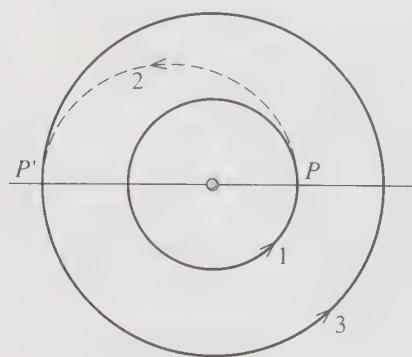  
Figure 8.13 Two successive boosts, at P and $P'$ , transfer a satellite from the smaller circular orbit 1 to a transfer orbit 2 and thence to the final circular orbit 3.

The second transfer occurs at $P'$ , the apogee of the transfer orbit. In Problem 8.33 you can show that the second thrust factor is

$$
\lambda^ {\prime} = \sqrt {\frac {R _ {1} + R _ {3}}{2 R _ {1}}} = \sqrt {\frac {3}{2}} \approx 1. 2 2;\tag{8.73}
$$

that is, we need to boost the speed by 22% to move from the transfer orbit to the final circular orbit.

It would be tempting to think that the overall change in speed, moving from the initial to the final orbit, was just the product $\lambda \lambda^{\prime}$ of the two thrust factors, but this overlooks that the satellite's speed also changes as it moves around the transfer orbit. By conservation of angular momentum, it is easy to see that the speeds at the two ends of the transfer orbit satisfy $v_{2}(\mathrm{apo})R_{3} = v_{2}(\mathrm{per})R_{1}$ . Therefore, the overall gain in speed is given by

$$
\begin{array}{l} v _ {3} = \lambda^ {\prime} \cdot \frac {v _ {2} (\mathrm{apo})}{v _ {2} (\mathrm{per})} \cdot \lambda \cdot v _ {1} \\ = \sqrt {\frac {R _ {1} + R _ {3}}{2 R _ {1}}} \cdot \frac {R _ {1}}{R _ {3}} \cdot \sqrt {\frac {2 R _ {3}}{R _ {1} + R _ {3}}} \cdot v _ {1} = \sqrt {\frac {R _ {1}}{R _ {3}}} \cdot v _ {1}. \end{array}\tag{8.74}
$$

In the present case, $R_{3}=2R_{1}$ and hence $v_{3}=v_{1}/\sqrt{2}$ . That is, the final speed is actually less than the initial by a factor of $\sqrt{2}$ . This result [and more generally the result (8.74)] could have been anticipated. It is easy to show (Problem 8.32) that for circular orbits $v\propto1/\sqrt{R}$ . Thus doubling the radius necessarily required that the speed be reduced by a factor of $\sqrt{2}$ .

## Principal Definitions and Equations of Chapter 8

## The Relative Coordinate and Reduced Mass

When rewritten in terms of the relative coordinate

$$
\mathbf {r} = \mathbf {r} _ {1} - \mathbf {r} _ {2}\tag{[Eq. (8.4)]}
$$

and the CM coordinate R, the two-body problem is reduced to the problem of two independent particles, a free particle with mass $M = m_{1} + m_{2}$ and position R, and a particle with mass equal to the reduced mass

$$
\mu = \frac {m _ {1} m _ {2}}{m _ {1} + m _ {2}},\tag{[Eq. (8.11)]}
$$

position r, and potential energy $U(r)$ .

## The Equivalent One-Dimensional Problem

The motion of the relative coordinate, with given angular momentum $\ell$ , is equivalent to the motion of a particle in one (radial) dimension, with mass $\mu$ , position r (with $0 < r < \infty$ ), and effective potential energy

$$
U _ {\mathrm{eff}} (r) = U (r) + U _ {\mathrm{cf}} (r) = U (r) + \frac {\ell^ {2}}{2 \mu r ^ {2}}\tag{[Eq. (8.30)]}
$$

where $U_{cf}$ is called the centrifugal potential energy.

## The Transformed Radial Equation

With the change of variables from $r$ to $u = 1 / r$ and elimination of $t$ in favor of $\phi$ , the equation of the one-dimensional radial motion becomes

$$
u ^ {\prime \prime} (\phi) = - u (\phi) - \frac {\mu}{\ell^ {2} u (\phi) ^ {2}} F.\tag{[Eq. (8.41)]}
$$

## The Kepler Orbits

For a planet or comet, the force is $F = Gm_{1}m_{2} / r^{2} = \gamma /r^{2}$ , and the solution of (8.41) is

$$
r (\phi) = \frac {c}{1 + \epsilon \cos \phi}\tag{[Eq. (8.49)]}
$$

where $c = \ell^{2}/\gamma\mu$ and $\epsilon$ is related to the energy by

$$
E = \frac {\gamma^ {2} \mu}{2 \ell^ {2}} (\epsilon^ {2} - 1).\tag{[Eq. (8.58)]}
$$

This Kepler orbit is an ellipse, parabola, or hyperbola, according as the eccentricity $\epsilon$ is less than, equal to, or greater than 1.

## Problems for Chapter 8

Stars indicate the approximate level of difficulty, from easiest (★) to most difficult (★★★).

## SECTION 8.2 CM and Relative Coordinates; Reduced Mass

8.1 ★ Verify that the positions of two particles can be written in terms of the CM and relative positions as $r_{1} = R + m_{2}r/M$ and $r_{2} = R - m_{1}r/M$ . Hence confirm that the total KE of the two particles can be expressed as $T = \frac{1}{2}M\dot{R}^{2} + \frac{1}{2}\mu\dot{r}^{2}$ , where $\mu$ denotes the reduced mass $\mu = m_{1}m_{2}/M$ .

8.2 $\star\star$ Although the main topic of this chapter is the motion of two particles subject to no external forces, many of the ideas [for example, the splitting of the Lagrangian $\mathcal{L}$ into two independent pieces $\mathcal{L} = \mathcal{L}_{\mathrm{cm}} + \mathcal{L}_{\mathrm{rel}}$ as in Equation (8.13)] extend easily to more general situations. To illustrate this, consider the following: Two masses $m_{1}$ and $m_{2}$ move in a uniform gravitational field $\mathbf{g}$ and interact via a potential energy $U(r)$ . (a) Show that the Lagrangian can be decomposed as in (8.13). (b) Write down Lagrange's equations for the three CM coordinates X, Y, Z and describe the motion of the CM. Write down the three Lagrange equations for the relative coordinates and show clearly that the motion of r is the same as that of a single particle of mass equal to the reduced mass $\mu$ , with position r and potential energy $U(r)$ .

8.3\*\* Two particles of masses $m_1$ and $m_2$ are joined by a massless spring of natural length $L$ and force constant $k$ . Initially, $m_2$ is resting on a table and I am holding $m_1$ vertically above $m_2$ at a height $L$ . At time $t = 0$ , I project $m_1$ vertically upward with initial velocity $v_0$ . Find the positions of the two masses at any subsequent time $t$ (before either mass returns to the table) and describe the motion. [Hints: See Problem 8.2. Assume that $v_0$ is small enough that the two masses never collide.]

## SECTION 8.3 The Equations of Motion

8.4 $\star$ Using the Lagrangian (8.13) write down the three Lagrange equations for the relative coordinates $x, y, z$ and show clearly that the motion of the relative position $\mathbf{r}$ is the same as that of a single particle with position $\mathbf{r}$ , potential energy $U(r)$ , and mass equal to the reduced mass $\mu$ .

8.5 \* The momentum p conjugate to the relative position r is defined with components $p_{1} = \partial L / \partial \dot{x}$ and so on. Prove that $p = \mu \dot{r}$ . Prove also that in the CM frame, p is the same as $p_{1}$ the momentum of particle 1 (and also $-p_{2}$ ).

8.6★ Show that in the CM frame, the angular momentum $\ell_{1}$ of particle 1 is related to the total angular momentum L by $\ell_{1}=(m_{2}/M)L$ and likewise $\ell_{2}=(m_{1}/M)L$ . Since L is conserved, this shows that the same is true of $\ell_{1}$ and $\ell_{2}$ separately in the CM frame.

8.7\*\* (a) Using elementary Newtonian mechanics find the period of a mass $m_1$ in a circular orbit of radius $r$ around a fixed mass $m_2$ . (b) Using the separation into CM and relative motions, find the corresponding period for the case that $m_2$ is not fixed and the masses circle each other a constant distance $r$ apart. Discuss the limit of this result if $m_2 \to \infty$ . (c) What would be the orbital period if the earth were replaced by a star of mass equal to the solar mass, in a circular orbit, with the distance between the sun and star equal to the present earth–sun distance? (The mass of the sun is more than 300,000 times that of the earth.)

8.8 \*\* Two masses $m_1$ and $m_2$ move in a plane and interact by a potential energy $U(r) = \frac{1}{2} kr^2$ . Write down their Lagrangian in terms of the CM and relative positions $\mathbf{R}$ and $\mathbf{r}$ , and find the equations of motion for the coordinates $X, Y$ and $x, y$ . Describe the motion and find the frequency of the relative motion.

8.9\*\* Consider two particles of equal masses, $m_1 = m_2$ , attached to each other by a light straight spring (force constant $k$ , natural length $L$ ) and free to slide over a frictionless horizontal table. (a) Write down the Lagrangian in terms of the coordinates $\mathbf{r}_1$ and $\mathbf{r}_2$ , and rewrite it in terms of the CM and relative positions. R and r, using polar coordinates $(r, \phi)$ for r. (b) Write down and solve the Lagrange equations for the CM coordinates X, Y. (c) Write down the Lagrange equations for $r$ and $\phi$ . Solve these for the two special cases that $r$ remains constant and that $\phi$ remains constant. Describe the corresponding motions. In particular, show that the frequency of oscillations in the second case is $\omega = \sqrt{2k / m_1}$ .

8.10 \*\* Two particles of equal masses $m_1 = m_2$ move on a frictionless horizontal surface in the vicinity of a fixed force center, with potential energies $U_1 = \frac{1}{2} kr_1^2$ and $U_2 = \frac{1}{2} kr_2^2$ . In addition, they interact with each other via a potential energy $U_{12} = \frac{1}{2}\alpha kr^2$ , where $r$ is the distance between them and $\alpha$ and $k$ are positive constants. (a) Find the Lagrangian in terms of the CM position $\mathbf{R}$ and the relative position $\mathbf{r} = \mathbf{r}_1 - \mathbf{r}_2$ . (b) Write down and solve the Lagrange equations for the CM and relative coordinates $X, Y$ and $x, y$ . Describe the motion.

8.11\*\* Consider two particles interacting by a Hooke's law potential energy, $U = \frac{1}{2} kr^2$ , where $\mathbf{r}$ is their relative position $\mathbf{r} = \mathbf{r}_1 - \mathbf{r}_2$ , and subject to no external forces. Show that $\mathbf{r}(t)$ describes an ellipse. Hence show that both particles move on similar ellipses around their common CM. [This is surprisingly awkward. Perhaps the simplest procedure is to choose the $xy$ plane as the plane of the orbit and then solve the equation of motion (8.15) for $x$ and $y$ . Your solution will have the form $x = A\cos \omega t + B\sin \omega t$ , with a similar expression for $y$ . If you solve these for $\sin \omega t$ and $\cos \omega t$ and remember that $\sin^2 +\cos^2 = 1$ , you can put the orbital equation in the form $ax^{2} + 2bxy + cy^{2} = k$ where $k$ is a positive constant. Now invoke the standard result that if $a$ and $c$ are positive and $ac > b^2$ , this equation defines an ellipse.]

## SECTION 8.4 The Equivalent One-Dimensional Problem

8.12\*\* (a) By examining the effective potential energy (8.32) find the radius at which a planet (or comet) with angular momentum $\ell$ can orbit the sun in a circular orbit with fixed radius. [Look at $dU_{\mathrm{eff}} / dr.$ ] (b) Show that this circular orbit is stable, in the sense that a small radial nudge will cause only small radial oscillations. [Look at $d^2 U_{\mathrm{eff}} / dr^2$ .] Show that the period of these oscillations is equal to the planet's orbital period.

8.13 \*\*\* Two particles whose reduced mass is $\mu$ interact via a potential energy $U = \frac{1}{2} kr^2$ , where $r$ is the distance between them. (a) Make a sketch showing $U(r)$ , the centrifugal potential energy $U_{\mathrm{cf}}(r)$ , and the effective potential energy $U_{\mathrm{eff}}(r)$ . (Treat the angular momentum $\ell$ as a known, fixed constant.) (b) Find the "equilibrium" separation $r_0$ , the distance at which the two particles can circle each other with constant $r$ . [Hint: This requires that $dU_{\mathrm{eff}} / dr$ be zero.] (c) By making a Taylor expansion of $U_{\mathrm{eff}}(r)$ about the equilibrium point $r_0$ and neglecting all terms in $(r - r_0)^3$ and higher, find the frequency of small oscillations about the circular orbit if the particles are disturbed a little from the separation $r_0$ .

8.14 \*\*\* Consider a particle of reduced mass $\mu$ orbiting in a central force with $U = kr^{n}$ where kn > 0. (a) Explain what the condition kn > 0 tells us about the force. Sketch the effective potential energy $U_{eff}$ for the cases that n = 2, -1, and -3. (b) Find the radius at which the particle (with given angular momentum t) can orbit at a fixed radius. For what values of n is this circular orbit stable? Do your sketches confirm this conclusion? (c) For the stable case, show that the period of small oscillations about the circular orbit is $\tau_{osc} = \tau_{orb}/\sqrt{n + 2}$ . Argue that if $\sqrt{n + 2}$ is a rational number, these orbits are closed. Sketch them for the cases that n = 2, -1, and 7.

## SECTION 8.6 The Kepler Orbits

8.15\* In deriving Kepler's third law (8.55) we made an approximation based on the fact that the sun's mass $M_{\mathrm{c}}$ is much greater than that of the planet $m$ . Show that the law should actually read $\tau^2 = [4\pi^2 / G(M_{\mathrm{c}} + m)]a^3$ , and hence that the "constant" of proportionality is actually a little different for different planets. Given that the mass of the heaviest planet (Jupiter) is about $2\times 10^{27}\mathrm{kg}$ , while $M_{\mathrm{c}}$ is about $2\times 10^{30}\mathrm{kg}$ (and some planets have masses several orders of magnitude less than Jupiter), by what percent would you expect the "constant" in Kepler's third law to vary among the planets?

8.16\*\* We have proved in (8.49) that any Kepler orbit can be written in the form $r(\phi) = c / (1 + \epsilon \cos \phi)$ , where $c > 0$ and $\epsilon \geq 0$ . For the case that $0 \leq \epsilon < 1$ , rewrite this equation in rectangular coordinates $(x, y)$ and prove that the equation can be cast in the form (8.51), which is the equation of an ellipse. Verify the values of the constants given in (8.52).

8.17 $\star \star$ If you did Problem 4.41 you met the virial theorem for a circular orbit of a particle in a central force with $U = kr^n$ . Here is a more general form of the theorem that applies to any periodic orbit of a particle. (a) Find the time derivative of the quantity $G = \mathbf{r} \cdot \mathbf{p}$ and, by integrating from time 0 to $t$ , show that

$$
\frac {G (t) - G (0)}{t} = 2 \langle T \rangle + \langle \mathbf {F} \cdot \mathbf {r} \rangle
$$

where $\mathbf{F}$ is the net force on the particle and $\langle f\rangle$ denotes the average over time of any quantity $f$ . (b) Explain why, if the particle's orbit is periodic and if we make $t$ sufficiently large, we can make the left-hand side of this equation as small as we please. That is, the left side approaches zero as $t\to \infty$ . (c) Use this result to prove that if $\mathbf{F}$ comes from the potential energy $U = kr^{n}$ , then $\langle T\rangle = n\langle U\rangle /2$ , if now $\langle f\rangle$ denotes the time average over a very long time.

8.18 $\star\star$ An earth satellite is observed at perigee to be $250\mathrm{km}$ above the earth's surface and traveling at about $8500\mathrm{m/s}$ . Find the eccentricity of its orbit and its height above the earth at apogee. [Hint: The earth's radius is $R_{\mathrm{e}} \approx 6.4 \times 10^{6}\mathrm{m}$ . You will also need to know $GM_{\mathrm{e}}$ , but you can find this if you remember that $GM_{\mathrm{e}} / R_{\mathrm{e}}^{2} = g$ .]

8.19 \*\* The height of a satellite at perigee is 300 km above the earth's surface and it is 3000 km at apogee. Find the orbit's eccentricity. If we take the orbit to define the $xy$ plane and the major axis in the $x$ direction with the earth at the origin, what is the satellite's height when it crosses the $y$ axis? [See the hint for Problem 8.18.]

8.20 \*\* Consider a comet which passes through its aphelion at a distance $r_{\mathrm{max}}$ from the sun. Imagine that, keeping $r_{\mathrm{max}}$ fixed, we somehow make the angular momentum $\ell$ smaller and smaller, though not actually zero; that is, we let $\ell \to 0$ . Use equations (8.48) and (8.50) to show that in this limit the eccentricity $\epsilon$ of the elliptical orbit approaches 1 and that the distance of closest approach $r_{\mathrm{min}}$ approaches zero. Describe the orbit with $r_{\mathrm{max}}$ fixed but $\ell$ very small. What is the semimajor axis $a$ ?

8.21 \*\*\* (a) If you haven't already done so, do Problem 8.20. (b) Use Kepler's third law (8.55) to find the period of this orbit in terms of $r_{\mathrm{max}}$ (and $G$ and $M_s$ ). (c) Now consider the extreme case that the comet is released from rest at a distance $r_{\mathrm{max}}$ from the sun. (In this case $\ell$ is actually zero.) Use the technique described in connection with (4.58) to find how long the comet takes to reach the sun. (Take the sun's radius to be zero.) (d) Assuming the comet can somehow pass freely through the sun, describe its overall motion and find its period. (e) Compare your answers in parts (b) and (d).

8.22 \*\*\* A particle of mass $m$ moves with angular momentum $\ell$ about a fixed force center with $F(r) = k / r^3$ where $k$ can be positive or negative. (a) Sketch the effective potential energy $U_{\mathrm{eff}}$ for various values of $k$ and describe the various possible kinds of orbit. (b) Write down and solve the transformed radial equation (8.41), and use your solutions to confirm your predictions in part (a).

8.23 \*\*\* A particle of mass m moves with angular momentum ℓ in the field of a fixed force center with

$$
F (r) = - \frac {k}{r ^ {2}} + \frac {\lambda}{r ^ {3}}
$$

where $k$ and $\lambda$ are positive. (a) Write down the transformed radial equation (8.41) and prove that the orbit has the form

$$
r (\phi) = \frac {c}{1 + \epsilon \cos (\beta \phi)}
$$

where $c, \beta$ , and $\epsilon$ are positive constants. (b) Find $c$ and $\beta$ in terms of the given parameters, and describe the orbit for the case that $0 < \epsilon < 1$ . (c) For what values of $\beta$ is the orbit closed? What happens to your results as $\lambda \to 0$ ?

8.24 \*\*\* Consider the particle of Problem 8.23, but suppose that the constant $\lambda$ is negative. Write down the transformed radial equation (8.41) and describe the orbits of low angular momentum (specifically, $\ell^2 < -\lambda m$ ).

8.25 \*\*\* [Computer] Consider a particle with mass m and angular momentum $\ell$ in the field of a central force $F = -k/r^{5/2}$ . To simplify your equations, choose units for which $m = \ell = k = 1$ . (a) Find the value $r_{0}$ of r at which $U_{eff}$ is minimum and make a plot of $U_{\mathrm{eff}}(r)$ for $0 < r \leq 5r_{0}$ . (Choose your scale so that your plot shows the interesting part of the curve.) (b) Assuming now that the particle has energy E = -0.1, find an accurate value of $r_{min}$ , the particle's distance of closest approach to the force center. (This will require the use of a computer program to solve the relevant equation numerically.) (c) Assuming that the particle is at $r = r_{min}$ when $\phi = 0$ , use a computer program (such as "NDSolve" in Mathematica) to solve the transformed radial equation (8.41) and find the orbit in the form $r = r(\phi)$ for $0 \leq \phi \leq 7\pi$ . Plot the orbit. Does it appear to be closed?

8.26 \*\*\* Show that the validity of Kepler's first two laws for any body orbiting the sun implies that the force (assumed conservative) of the sun on any body is central and proportional to $1/r^{2}$ .

8.27 \*\*\* At time $t_0$ , a comet is observed at radius $r_0$ traveling with speed $v_0$ at an acute angle $\alpha$ to the line from the comet to the sun. Put the sun at the origin $O$ , with the comet on the $x$ axis (at $t_0$ ) and its orbit in the $xy$ plane, and then show how you could calculate the parameters of the orbital equation in the form $r = c / [1 + \epsilon \cos(\phi - \delta)]$ . Do so for the case that $r_0 = 1.0 \times 10^{11} \mathrm{~m}$ , $v_0 = 45 \mathrm{~km/s}$ , and $\alpha = 50$ degrees. [The sun's mass is about $2.0 \times 10^{30} \mathrm{~kg}$ , and $G = 6.7 \times 10^{-11} \mathrm{~N} \cdot \mathrm{m}^2/\mathrm{s}^2$ .]

## SECTION 8.7 The Unbounded Kepler Orbits

8.28 \* For a given earth satellite with given angular momentum $\ell$ , show that the distance of closest approach $r_{min}$ on a parabolic orbit is half the radius of the circular orbit.

8.29 \*\* What would become of the earth's orbit (which you may consider to be a circle) if half of the sun's mass were suddenly to disappear? Would the earth remain bound to the sun? [Hints: Consider what happens to the earth's KE and PE at the moment of the great disappearance. The virial theorem for the circular orbit (Problem 4.41) helps with this one.] Treat the sun (or what remains of it) as fixed.

8.30 \*\* The general Kepler orbit is given in polar coordinates by (8.49). Rewrite this in Cartesian coordinates for the cases that $\epsilon = 1$ and $\epsilon > 1$ . Show that if $\epsilon = 1$ , you get the parabola (8.60), and if $\epsilon > 1$ , the hyperbola (8.61). For the latter, identify the constants $\alpha, \beta$ , and $\delta$ in terms of $c$ and $\epsilon$ .

8.31 \*\*\* Consider the motion of two particles subject to a repulsive inverse-square force (for example, two positive charges). Show that this system has no states with $E < 0$ (as measured in the CM frame), and that in all states with $E > 0$ , the relative motion follows a hyperbola. Sketch a typical orbit. [Hint: You can follow closely the analysis of Sections 8.6 and 8.7 except that you must reverse the force; probably the simplest way to do this is to change the sign of $\gamma$ in (8.44) and all subsequent equations (so that $F(r) = +\gamma / r^2$ ) and then keep $\gamma$ itself positive. Assume $\ell \neq 0$ .]

## SECTION 8.8 Changes of Orbit

8.32 ★ Prove that for circular orbits around a given gravitational force center (such as the sun) the speed of the orbiting body is inversely proportional to the square root of the orbital radius.

8.33 \*\* Figure 8.13 shows a space vehicle boosting from a circular orbit 1 at $P$ to a transfer orbit 2 and then from the transfer orbit at $P'$ to the final circular orbit 3. Example 8.6 derived in detail the thrust factor required for the boost at $P$ . Show similarly that the thrust factor required at $P'$ is $\lambda' = \sqrt{(R_1 + R_3)/2R_1}$ . [Your argument should parallel closely that of Example 8.6, but you must account for the fact that $P'$ is the apogee (not perigee) of the transfer orbit. For example, the plus signs in (8.67) should be minus signs here.]

8.34 \*\* Suppose that we decide to send a spacecraft to Neptune, using the simple transfer described in Example 8.6 (page 318). The craft starts in a circular orbit close to the earth (radius 1 AU or astronomical unit) and is to end up in a circular orbit near Neptune (radius about 30 AU). Use Kepler's third law to show that the transfer will take about 31 years. (In practice we can do a lot better than this by arranging that the craft gets a gravitational boost as it passes Jupiter.)

8.35 \*\*\* A spacecraft in a circular orbit wishes to transfer to another circular orbit of quarter the radius by means of a tangential thrust to move into an elliptical orbit and a second tangential thrust at the opposite end of the ellipse to move into the desired circular orbit. (The picture looks like Figure 8.13 but run backwards.) Find the thrust factors required and show that the speed in the final orbit is two times greater than the initial speed.

The image provided is completely blank and contains no text or visible content. Therefore, there is no OCR result to output.