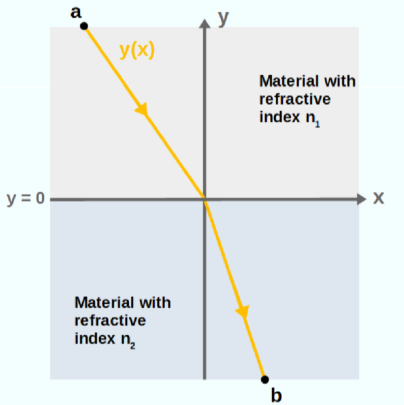
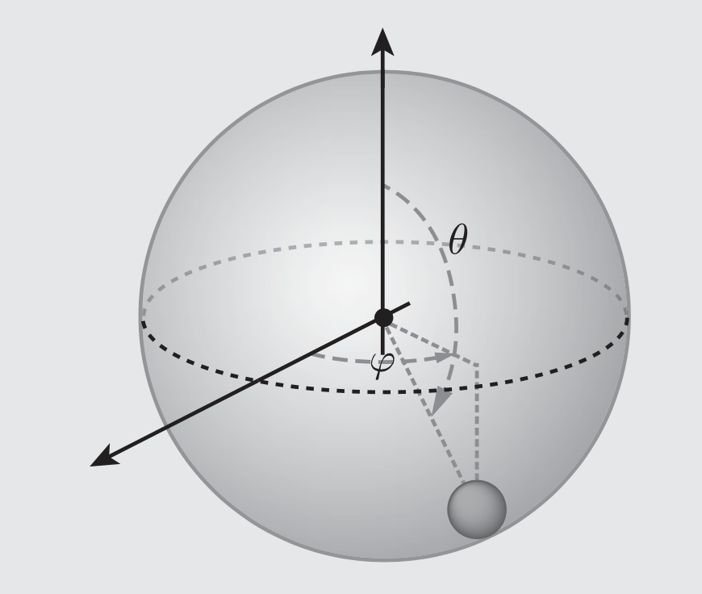

# Problem Set 2
---

**Total Points: 110 points**  
**Deadline: 9:00 pm, October 12nd, 2026**

All answers must be **handwritten**, then scanned or photographed, and submitted via Canvas.

**Late submissions will incur a penalty of 5 points per day. Submissions more than 3 days late will not be accepted.**

---

## Fermat's principle [25 points]

One of the most foundational principles in optics known as Fermat's principle, which states: "The path taken by a light ray between any two points is the path that minimizes the travel time between the points."

(a) Derive an expression for the total travel time of a light ray moving from point $a$ to point $b$, $T=\int_a^b dt$. Then, apply Fermat's Principle and use the calculus of variations to derive Snell's Law: $\frac{\sin \theta_1}{\sin \theta_2}=\frac{n_2}{n_1}$. [10 points]

(b) Suppose the refractive index of a material varies with vertical position $y$ as $n(y) = L/y$, where $L$ is a constant. Using Fermat's Principle, derive the path that a light ray takes when traveling from point $a$ to point $b$. [15 points]

---

## Problems from *Classical Mechanics* of John R. Taylor [4 $\times$ 10 points + 15 points + 20 points]

**Chapter 6:** 6.5, 6.6, 6.12, 6.13

**Chapter 6:** 6.1, 6.16

**Chapter 6:** 6.23

---

## Spherical pendulum [10 points]

A ball of mass $m$ swings on the end of an unstretchable string of length $R$ in the presence of a uniform gravitational field $g$. This is often called the "spherical pendulum," because the ball moves as though it were sliding on the frictionless surface of a spherical bowl. It is important to note that:
(i) It can move horizontally around a vertical axis passing through the point of support, corresponding to changes in its azimuthal angle $\phi$. (On earth's surface this would correspond to a change in longitude.) (ii) It can also move in the polar direction, as described by the angle $\theta$. (On earth's surface this would correspond to a change in latitude.)
Please find its equations of motion (a second-order differential equation for the polar angle $\theta$ as a function of time). You do not need to solve the equation of motion.

---
