# User Guide: wuthesis LaTeX Template

## 1. Getting Started

To begin drafting your document, locate the primary source files in the root directory. You will edit these files to add your specific content:

- **For a Proposal (开题报告):** Open and modify `proposal.tex`. This file is pre-configured for thesis proposals.
- **For a Thesis （毕业论文）:** Open and modify `thesis.tex`. This is the master file for your dissertation or master's thesis.

---

## 2. Managing References

Bibliography management is handled via BibTeX. Ensure all your citations are properly formatted in the corresponding database files:

- **Proposal Citations:** Add your BibTeX entries to `proposal.bib`.
- **Thesis Citations:** Add your BibTeX entries to `thesis.bib`.

---

## 3. Compilation Instructions

The template is compatible with standard LaTeX distributions. Below are specific instructions for common editing environments.

---

### Option A: Overleaf

> [!NOTE]
> By preliminary test, it is very easy to exceed the compile limit for the `.tex` file here in Overleaf for a free trial account. It is best if you have a Pro account or compile the document directly in a local environment (switch to Option B or Option C).

1. **Import the .zip**

   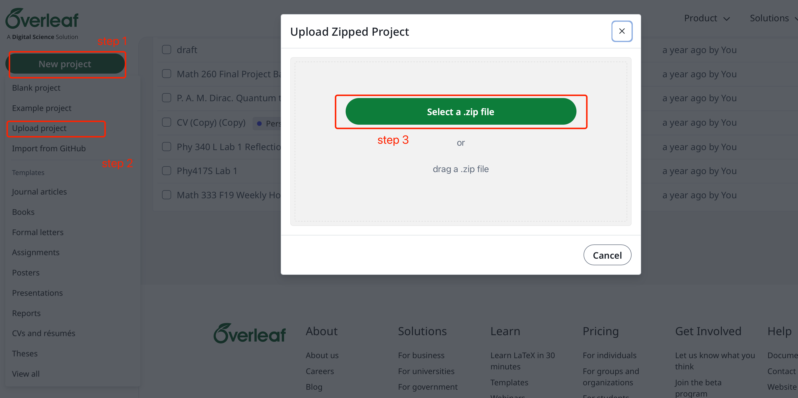

2. **Choose the correct Compiler**

   Since we are using `.tex` especially designed to include Chinese, to properly compile the file, we need to first change the compiler.

   - Go to setting:

     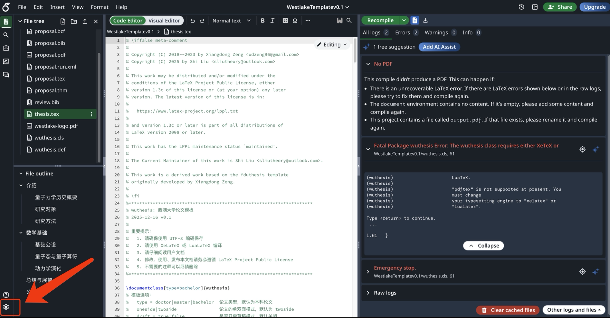

   - Go to Compiler, Select Compiler to be **XeLaTeX** (default is `pdfLaTeX`):

     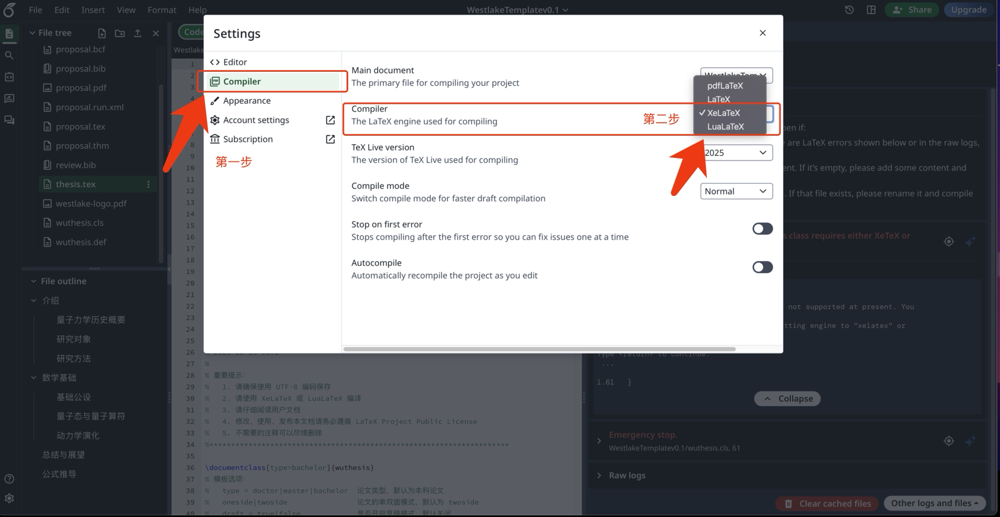

---

### Option B: Visual Studio Code (VS Code) Recommended

- Download the correct version of TeX according to your system at [https://www.latex-project.org/get/](https://www.latex-project.org/get/) (if you have never done this before):

  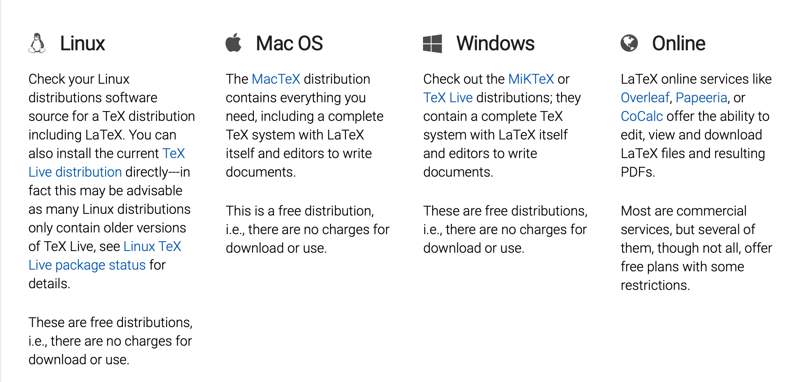

- Use a compiler (like TeXShop on Mac) as you wish, or if you are using VS Code, an easy way is to compile `.tex` in VS Code by first downloading the Extension **LaTeX Workshop**:

  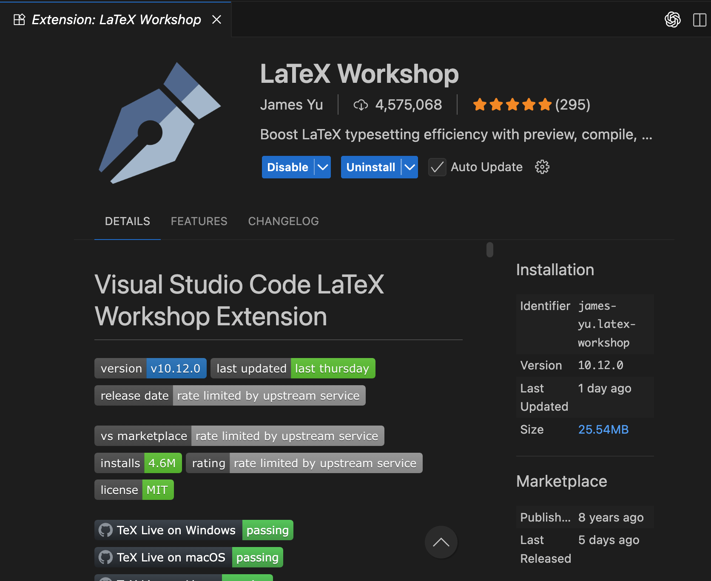

- Decompress the `.zip` and import into VS Code:

  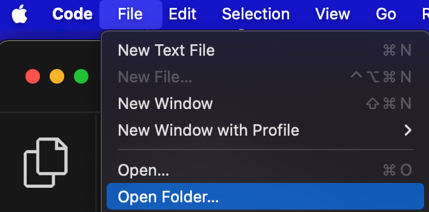

#### Q1: How to get proposal.tex compiled into proposal.pdf

- Manage your references in the `.bib` file in the folder:

  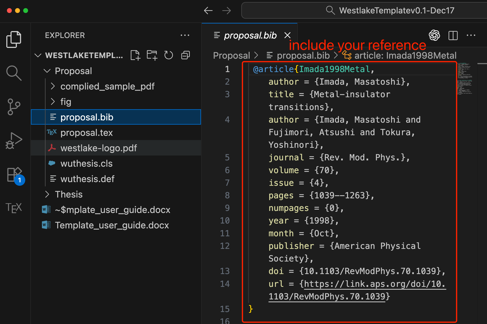

- Compile by calling the following lines (one by one) in terminal:

  ```bash
  xelatex proposal
  ```

  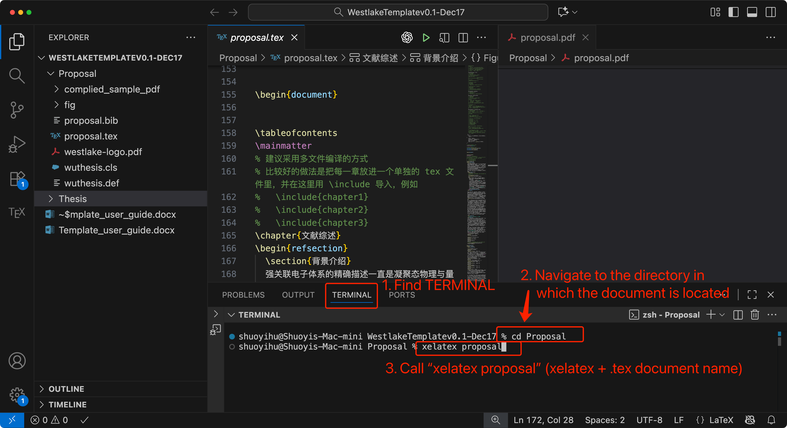

  ```bash
  biber proposal
  ```

  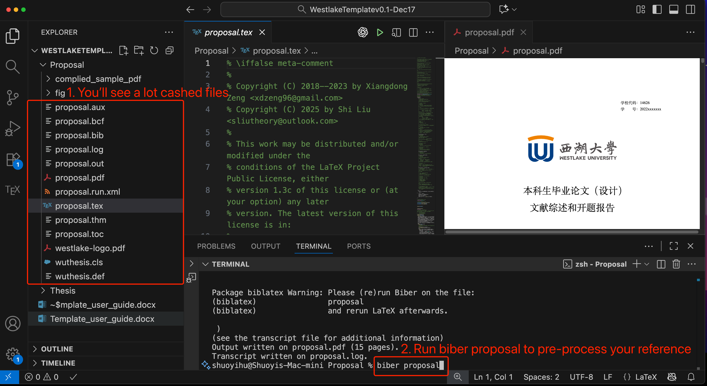

  ```bash
  xelatex proposal
  ```

  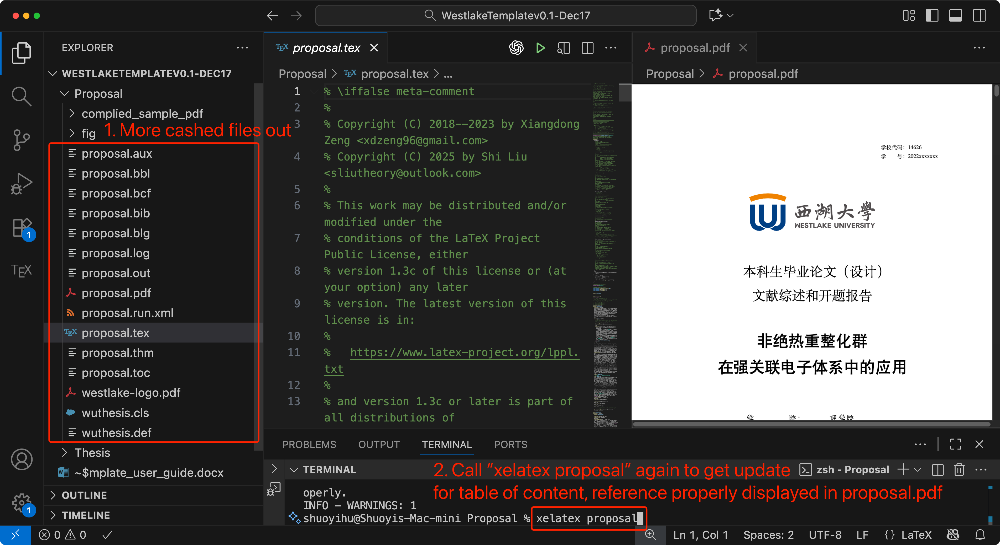

- You’ll see the compiled `.pdf` file. Each time you need an update, call those three commands above again.

#### Q2: How to get thesis.tex compiled into thesis.pdf

**Summary:** Similar to compiling `proposal.tex`, manage your reference in `thesis.bib`, and call three commands in TERMINAL one by one. Only difference is that you need to change **`biber proposal`** to **`bibtex thesis`**. (Short reason if you wish to know: in proposal we have two local references, one after the literature review section, the other after the real proposal section, to reach that goal we use another engine for reference management, resulting in this change).

- Manage your references in the `.bib` file in the folder:

  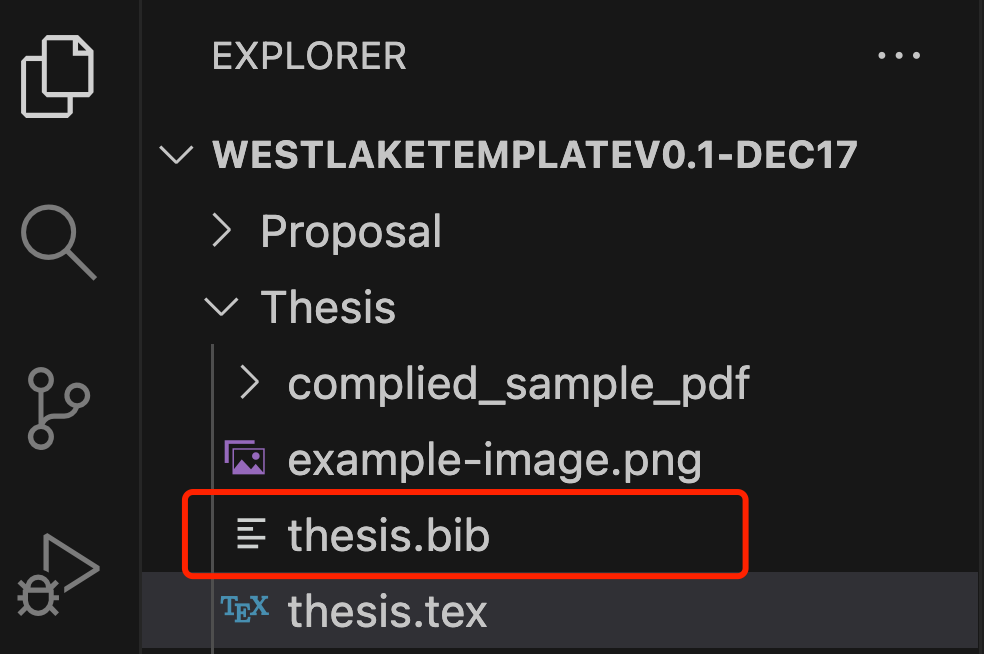

- Go to the proper Thesis folder in terminal:
  - Call `cd ..` to go back to parent folder
  - Call `cd Thesis` to go to the target Thesis folder

  

- Compile by calling the following lines (one by one) in terminal:

  ```bash
  xelatex thesis
  ```

  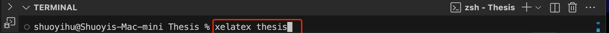

  ```bash
  bibtex thesis
  ```

  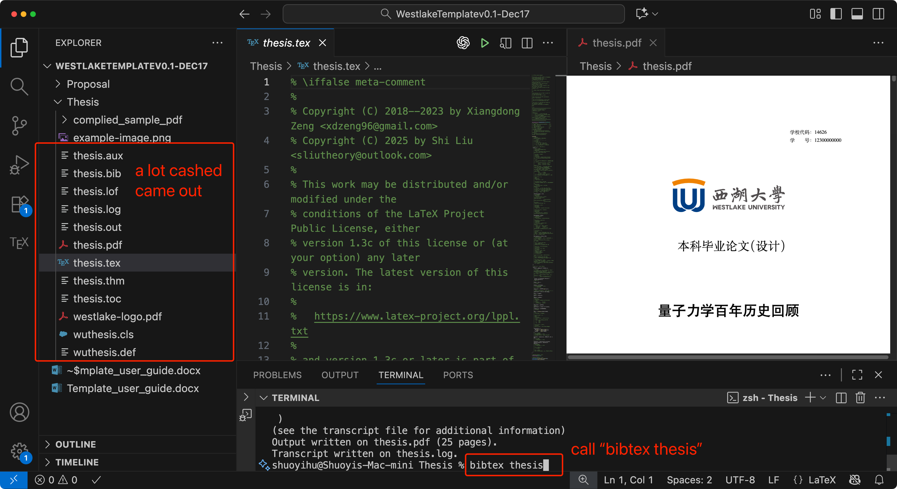

  ```bash
  xelatex thesis
  ```

  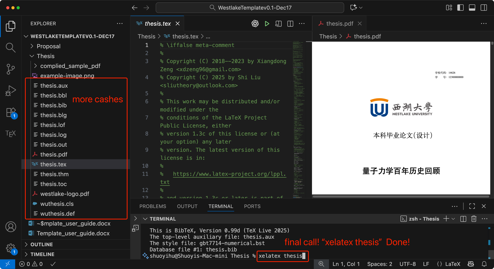

- Enjoy your masterpiece, or improve your work to make it a masterpiece by calling those three commands above again when you need an update.

---

### Option C: TeXShop or Command Line

Here we assume you know the default way to compile your `.tex` to `.pdf`.

However, there are several special settings required:

1. **Change your compiler to XeLaTeX** (since we have a lot of Chinese Characters in the document):
   - Example: for TeXShop, go to **Settings** -> **Typeset**:

     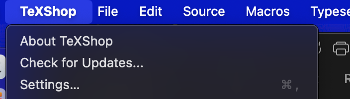

     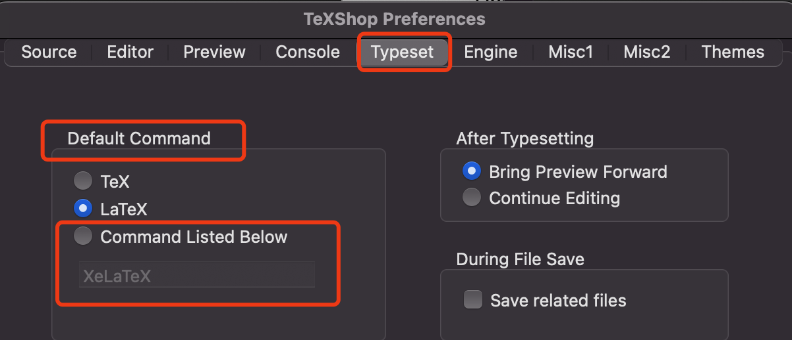

   - In **Default Command**, select **Command Listed Below** and set **XeLaTeX**.

2. **Configure BibTeX Engine:**
   - When you’re compiling your proposal, change your BibTeX Engine under **Settings** -> **Engine** to **`biber`**. (For compiling `thesis.tex` you should use `bibtex` by default) (Short reason if you wish to know: in proposal we have two local references, one after the literature review section, the other after the real proposal section, to reach that goal we use another engine for reference management, resulting in this change):

     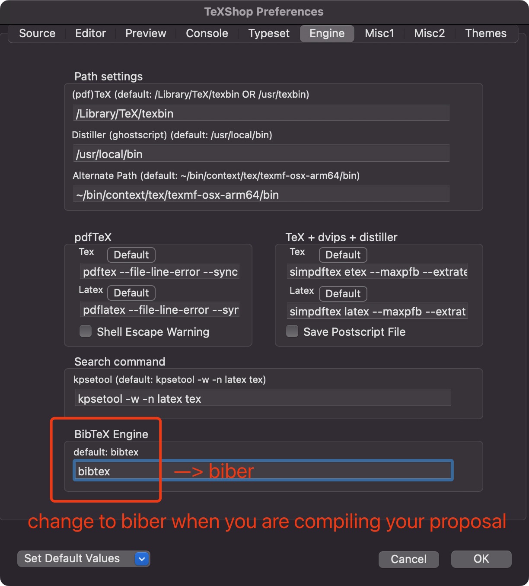
